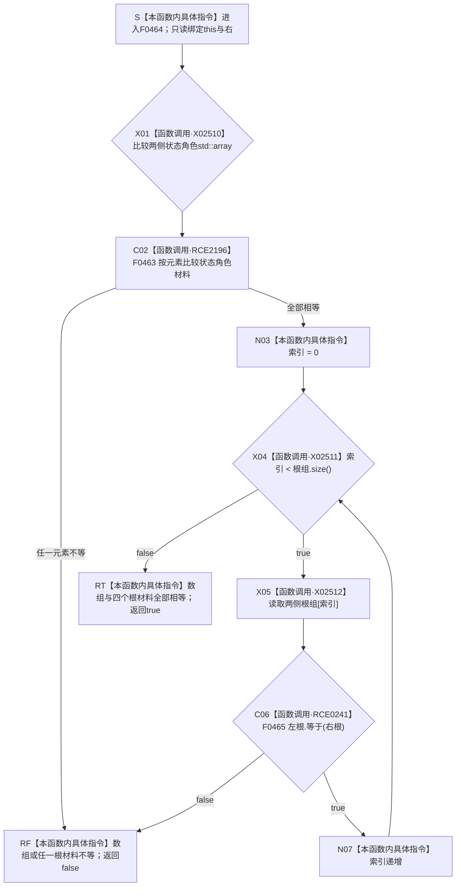

# CF-L6-0298 `概念活动重建视图::等于` 现状流程图

图类型：现状流程图
代码版本：`04b66401f3aed237bb89bf885a63e2b3d0a877dc`
源码 blob：`a4090a7643aa12c41f2830eb5f51593aabde7488`
覆盖文件：`海中鱼巣/领域/概念活动状态.数据.h:143-149`
唯一根函数：F0464
完整签名：`bool 海中鱼巣::概念活动重建视图::等于(const 海中鱼巣::概念活动重建视图& 右) const noexcept`
参数：`右` 与隐式 `this` 均为只读借用
返回结果：状态角色数组不等时返回 `false`；否则按索引比较四个根材料，首个不等返回 `false`，全部相等返回 `true`
已登记调用方：F0250 经 E0969
已登记直接项目函数：F0465 经 RCE0241，调用点第 146 行
直接项目函数：F0463 经 RCE2196 作为 `std::array<概念活动状态角色材料,3>` 的元素比较；F0465 经 RCE0241 比较根材料
外部边界：X02510 状态角色数组等值比较；X02511 `根组.size()`；X02512 两次数组下标访问
逐行映射表：`流程图/代码流程图/L6/CF-L6-0298_概念活动重建视图等于_逐行代码映射表.md`
结构读取与写入：只读两侧数组，不写机器事实
循环：索引从 0 到 3；每轮调用一次 F0465，首个 false 立即返回
异常：根函数声明 `noexcept`；当前被调 F0465 也为 `noexcept`
验证输出：143—149 共 7 行完整映射；1 个项目入边、2 个项目出边、3 个外部边界
依据：`规范/0050_项目通用机器逻辑与禁止性规则总纲_20260721.md`、`规范/0600_代码函数流程图应用与维护规范.md`
不得作为施工许可：是
不得宣称：两个重建视图相等证明任一材料完整、来自当前权威结构或概念活动复核通过

## 流程图

## 已登记调用方与被调方

| 稳定边 | 调用位置 | 参数 / 结果绑定 | 状态 |
| --- | --- | --- | --- |
| E0969 | F0250 `概念活动材料::等于` / 第 189 行 | 两侧 `重建视图`；接收布尔值 | 已登记 |
| RCE0241 | F0464 第 146 行 | 两侧 `根组[索引]` 绑定到 F0465；接收根材料相等布尔值 | 已登记 |
| RCE2196 | F0464 第 144 行 | `状态角色组` 数组的元素比较解析到 F0463 | 已登记 |

## 聚合关系闭合核对

- 第 144 行的数组静态元素类型为 `概念活动状态角色材料`；RCE2196 登记按元素调用 F0463。
- 第 144—146 行的 `std::array` 比较、`size()` 和 `operator[]` 分别登记为 X02510、X02511、X02512。
