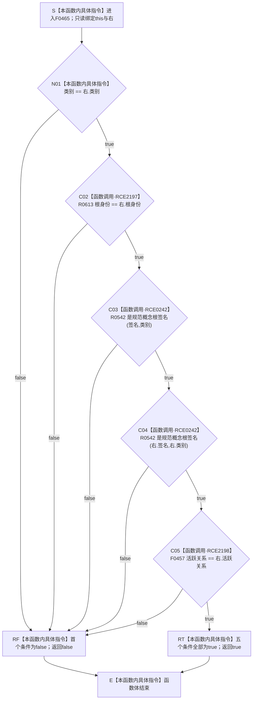

# CF-L6-0299 `概念活动根材料::等于` 现状流程图

图类型：现状流程图
代码版本：`04b66401f3aed237bb89bf885a63e2b3d0a877dc`
源码 blob：`a4090a7643aa12c41f2830eb5f51593aabde7488`
覆盖文件：`海中鱼巣/领域/概念活动状态.数据.h:115-120`
唯一根函数：F0465
完整签名：`bool 海中鱼巣::概念活动根材料::等于(const 海中鱼巣::概念活动根材料& 右) const noexcept`
参数：`右` 与隐式 `this` 均为只读借用
返回结果：按短路顺序比较类别、根身份、两侧规范概念根签名和活跃关系；首个 false 返回 `false`，全部为 true 返回 `true`
已登记调用方：F0250 经 E0970；F0251 经 E0975；F0464 经 RCE0241
已登记直接项目函数：R0542 经 RCE0242，在第 117、118 行调用两次
直接项目函数：R0613 经 RCE2197 比较根身份；R0542 经 RCE0242 复核两侧签名；F0457 经 RCE2198 比较活跃关系
外部边界：无；类别使用内建枚举比较
逐行映射表：`流程图/代码流程图/L6/CF-L6-0299_概念活动根材料等于_逐行代码映射表.md`
结构读取与写入：只读两侧根材料，不写机器事实
异常：根函数及 R0542 均为 `noexcept`；R0613、F0457 静态签名未声明 `noexcept`，若异常越出则根函数终止
验证输出：115—120 共 6 行完整映射；3 个项目入边、3 个项目出边
依据：`规范/0050_项目通用机器逻辑与禁止性规则总纲_20260721.md`、`规范/0600_代码函数流程图应用与维护规范.md`
不得作为施工许可：是
不得宣称：两个根材料相等证明根身份、签名或关系完整，或证明概念活动根结构已复核

## 流程图

## 已登记调用方

| 调用边 | 调用方 / 位置 | 当前用途 |
| --- | --- | --- |
| E0970 | F0250 `概念活动材料::等于` / 第 191 行 | 循环比较两侧材料根组 |
| E0975 | F0251 `概念活动材料::完整` / 第 169 行 | 比较材料根组与重建视图根组 |
| RCE0241 | F0464 `概念活动重建视图::等于` / 第 146 行 | 循环比较两侧重建根组 |

## 聚合关系闭合核对

- 第 116 行 `根身份 == 右.根身份` 已登记为 RCE2197→R0613。
- 第 119 行 `活跃关系 == 右.活跃关系` 已登记为 RCE2198→F0457。
- 第 117、118 行对 R0542 的两次调用保持合并登记为 RCE0242。
