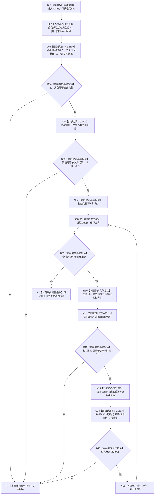

# CF-L6-0300 `概念活动重建视图::完整()` 现状流程图

图类型：现状流程图
代码版本：`04b66401f3aed237bb89bf885a63e2b3d0a877dc`
源码 blob：`a4090a7643aa12c41f2830eb5f51593aabde7488`
覆盖文件：`海中鱼巣/领域/概念活动状态.数据.h:127-141`
唯一根函数：F0466
完整签名：`bool 海中鱼巣::概念活动重建视图::完整() const noexcept`
参数：无显式参数；隐式 `this` 是调用期有效的 const `概念活动重建视图` 非拥有借用
返回结果：三个状态角色均完整并依次处于活跃、冷却、退役阶段，且四个根材料的类别与数组序号匹配并相对活跃角色完整时返回 `true`；任一复核失败立即返回 `false`
调用图：`流程图/主程序可达调用关系/01_main可达项目调用边表.md`
逐行映射表：`流程图/代码流程图/L6/CF-L6-0300_概念活动重建视图完整_逐行代码映射表.md`
输入契约 / 调用语境表：本文“返回语境”
非成功返回二分审查表：本文“返回语境”
偏差清单：无；本文只冻结当前代码事实
依据提交 / 结构化消息：当前提交、F0466、RCE1683、RCE2199、X01093—X01095 与源码第 127—141 行交叉复核
验证输出：15 行定义完整映射；2 个项目出边；3 个外部边界；0 个未解析动态调用
不得作为施工许可：是
不得宣称：返回 `true` 证明重建视图已经写入、发布或成为权威运行状态；返回 `false` 唯一定位某个失败字段

## 函数合同

```text
根函数：F0466 概念活动重建视图::完整
归属模块 / 文件 / 层级：头文件内联定义 / 海中鱼巣/领域/概念活动状态.数据.h / L6
现有或待新增：现有
完整签名：bool 海中鱼巣::概念活动重建视图::完整() const noexcept
参数：无显式参数；只读借用隐式 this
返回结果：bool 完整性复核结果
被调函数流程图：
- F0467 概念活动状态角色材料::完整：流程图/代码流程图/L6/CF-L6-0301_概念活动状态角色材料完整_现状流程图.md
- R0538 概念活动根材料::完整(const 概念活动状态角色材料&)：活动队列待绘制
```

## 流程图



## 节点合同

| 节点 | 类型 | 参数 / 输入绑定 | 结果 / 输出绑定 | 事实读写 | 后继条件 |
| --- | --- | --- | --- | --- | --- |
| N01 | 本函数内具体指令 | 隐式 `this` | 进入只读复核 | 无写入 | 无条件 |
| X02 | 外部边界 | const `状态角色组` 与下标 0、1、2 | 三个 const 角色引用 | 只读数组 | 逐项转交 C03 |
| C03 | 函数调用 | 三个 const 角色分别作为 F0467 接收者 | 三个 bool | 只读角色材料 | 任一 false 短路 |
| B04 | 本函数内具体指令 | 三个完整性结果 | 是否全部完整 | 无 | 布尔分支 |
| X05 | 外部边界 | const 状态角色数组与三个下标 | 三个阶段 | 只读角色材料 | 转交 B06 |
| B06 | 本函数内具体指令 | 三个阶段 | 是否为固定阶段序列 | 无 | 布尔分支 |
| N07 | 本函数内具体指令 | 常量 0 | 局部循环索引 | 仅局部变量 | 进入循环 |
| X08 | 外部边界 | const `根组` | 固定数组大小 | 无 | 转交 B09 |
| B09 | 本函数内具体指令 | 索引、数组大小 | 是否继续 | 无 | 循环或返回 |
| N10 | 本函数内具体指令 | 索引 + 1 | 预期类别 | 仅局部变量 | 转交 B12 |
| X11 | 外部边界 | const `根组`、索引 | 当前根 const 引用 | 只读根材料 | 转交 B12/C14 |
| B12 | 本函数内具体指令 | 当前类别、预期类别 | 是否相等 | 无 | 布尔分支 |
| X13 | 外部边界 | const `状态角色组`、下标 0 | 活跃角色 const 引用 | 只读角色材料 | 转交 C14 |
| C14 | 函数调用 | 当前根、活跃角色 | R0538 返回值 → 根完整 | 只读根和角色 | 转交 B15 |
| B15 | 本函数内具体指令 | 根完整 | 分支 | 无 | false 返回；true 自增 |
| N16 | 本函数内具体指令 | 当前索引 | 索引 + 1 | 仅局部变量 | 回到循环上界 |
| RF / RT | 本函数内具体指令 | 复核结果 | 返回 false / true | 无 | 函数结束 |

## 返回语境

| 条件 | 返回 | 二分口径 | 结构变化 |
| --- | --- | --- | --- |
| 任一状态角色不完整或阶段顺序不符 | `false` | 值式视图完整性查询的逻辑内返回 | 无 |
| 任一根类别与数组位置不符或 R0538 返回 false | `false` | 值式视图完整性查询的逻辑内返回 | 无 |
| 三个角色及四个根全部通过 | `true` | 正常返回 | 无 |

## 当前边界

- RCE2199 合并登记 `概念活动状态.数据.h:128-129` 对 F0467 的三次直接调用，并保留 `||` 的从左到右短路条件。
- X01093、X01095 分别登记 const 状态角色数组与 const 根数组的 `operator[]` 重载。
- 本函数只复核值式材料，不改变状态角色组、根组或任何仓库事实。
