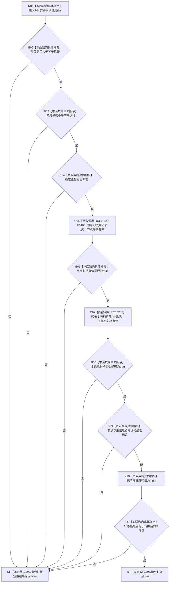

# CF-L6-0301 `概念活动状态角色材料::完整()` 现状流程图

图类型：现状流程图
代码版本：`04b66401f3aed237bb89bf885a63e2b3d0a877dc`
源码 blob：`a4090a7643aa12c41f2830eb5f51593aabde7488`
覆盖文件：`海中鱼巣/领域/概念活动状态.数据.h:62-68`
唯一根函数：F0467
完整签名：`bool 海中鱼巣::概念活动状态角色材料::完整() const noexcept`
参数：无显式参数；隐式 `this` 是调用期有效的 const `概念活动状态角色材料` 非拥有借用
返回结果：阶段位于活跃至退役闭区间、稳定主键非零、节点与主信息句柄有效且同仓、状态值等于阶段数值时返回 `true`；任一条件不成立时短路返回 `false`
调用图：`流程图/主程序可达调用关系/01_main可达项目调用边表.md`
逐行映射表：`流程图/代码流程图/L6/CF-L6-0301_概念活动状态角色材料完整_逐行代码映射表.md`
输入契约 / 调用语境表：本文“返回语境”
非成功返回二分审查表：本文“返回语境”
偏差清单：无；本文只冻结当前代码事实
依据提交 / 结构化消息：当前提交、F0467、RCE0244、RCE0245 与源码第 62—68 行交叉复核
验证输出：7 行定义完整映射；2 个项目出边；0 个外部边界；0 个未解析调用
不得作为施工许可：是
不得宣称：返回 `true` 证明句柄仍可从仓库读回或概念活动状态已经发布

## 函数合同

```text
根函数：F0467 概念活动状态角色材料::完整
归属模块 / 文件 / 层级：头文件内联定义 / 海中鱼巣/领域/概念活动状态.数据.h / L6
现有或待新增：现有
完整签名：bool 海中鱼巣::概念活动状态角色材料::完整() const noexcept
参数：无显式参数；只读借用隐式 this
返回结果：bool 值式材料完整性结果
被调函数流程图：
- F0163 句柄有效(const 节点句柄&)：流程图/代码流程图/L5/CF-L5-0044_节点句柄有效_现状流程图.md
- F0565 句柄有效(const 主信息句柄&)：活动队列待绘制
```

## 流程图



## 节点合同

| 节点 | 类型 | 参数 / 输入绑定 | 结果 / 输出绑定 | 事实读写 | 后继条件 |
| --- | --- | --- | --- | --- | --- |
| N01 | 本函数内具体指令 | 隐式 `this` | 进入值式复核 | 无写入 | 无条件 |
| B02 / B03 | 本函数内具体指令 | `阶段` | 是否位于允许闭区间 | 无 | false 短路 |
| B04 | 本函数内具体指令 | `稳定主键` | 是否非零 | 无 | false 短路 |
| C05 | 函数调用 | `状态节点` → F0163 句柄参数 | 节点句柄有效 | 只读句柄字段 | 转交 B06 |
| C07 | 函数调用 | `主信息` → F0565 句柄参数 | 主信息句柄有效 | 只读句柄字段 | 转交 B08 |
| B09 | 本函数内具体指令 | 两个句柄的仓库编号 | 是否相等 | 无 | false 短路 |
| N10 | 本函数内具体指令 | 阶段枚举 | `std::int64_t` 值 | 仅临时值 | 转交 B11 |
| B11 | 本函数内具体指令 | 状态值、阶段数值 | 是否相等 | 无 | 布尔分支 |
| RT / RF | 本函数内具体指令 | 合取结果 | 返回 true / false | 无 | 函数结束 |

## 返回语境

| 条件 | 返回 | 二分口径 | 结构变化 |
| --- | --- | --- | --- |
| 任一字段范围、句柄形态、同仓或状态值复核失败 | `false` | 值式材料完整性查询的逻辑内返回 | 无 |
| 全部条件成立 | `true` | 正常返回；不包含仓库读回验证 | 无 |

## 关键边界

- 第 63—67 行是同一个从左到右求值的 `&&` 表达式；任一 false 会阻止后续调用或字段读取。
- F0163 与 F0565 只验证句柄值式形态；本函数没有仓库引用，不能证明句柄当前存在。
- 本函数不修改状态角色材料或任何机器结构。
