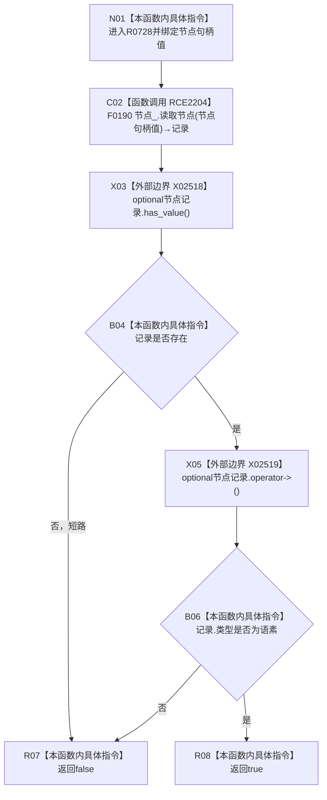

# CF-L6-0302 语素服务节点是语素入口无令牌重载现状流程图

图类型：现状流程图
代码版本：`5c5dbc536a250b080bf6045bf4c4e556730b1b7d`
源码 blob：`1355a1afd544cd44c14ee904246e9cb0778fb39b`
覆盖文件：`海中鱼巣/领域/语素服务.h:252-255`
唯一根函数：R0728
完整签名：`bool 海中鱼巣::语素服务::节点是语素入口(海中鱼巣::节点句柄 节点句柄值) const`
参数：`节点句柄值` 按值传入；只借用 `this`
返回结果：节点记录存在且类型为 `节点类型::语素` 时返回 true，否则返回 false
调用图：`流程图/主程序可达调用关系/01_main可达项目调用边表.md`
逐行映射表：`流程图/代码流程图/L6/CF-L6-0302_语素服务节点是语素入口无令牌重载_逐行代码映射表.md`
依据提交 / 结构化消息：当前提交、R0728、RCE2204、X02518—X02519 与源码 252—255 行交叉复核
验证输出：4 行定义完整映射；1 个项目出边；2 个外部边界；0 个未解析调用
不得作为施工许可：是
不得宣称：返回 true 证明后续关系存在、节点持续有效或能力完成

本函数只读节点仓库；`has_value()` 先于 `operator->()`，空记录和类型不符均作为当前谓词 false 返回。
