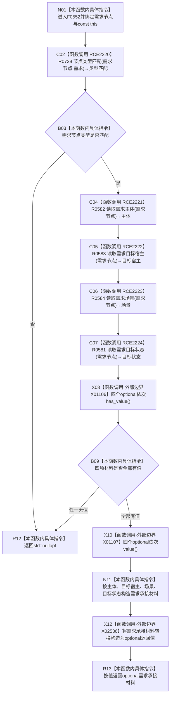

# CF-L6-0303 需求服务读取需求承接材料现状流程图

图类型：现状流程图
代码版本：`14d539ed7ad8af87f35fb0752eed420bbe443316`
源码 blob：`e41b0c665b360232e55ede728f2a4d561c5c9d32`
覆盖文件：`海中鱼巣/领域/需求服务.h:560-575`
唯一根函数：F0552
完整签名：`std::optional<海中鱼巣::需求承接材料> 海中鱼巣::需求服务::读取需求承接材料(海中鱼巣::节点句柄 需求节点) const`
参数：`需求节点` 按值传入；隐式 const `this` 为调用期间有效的非拥有借用
返回结果：需求节点类型正确且主体、目标宿主、场景、目标状态四项均有值时返回完整 `需求承接材料`；否则返回 `std::nullopt`
已登记调用方：F0551 经 E1247；R0286 经 RCE0916
直接项目函数：RCE2220→R0729、RCE2221→R0582、RCE2222→R0583、RCE2223→R0584、RCE2224→R0581
外部边界：X01106 `optional<节点句柄>::has_value()` 四次；X01107 `optional<节点句柄>::value()` 四次；X02536 `optional<需求承接材料>` 转换构造
未解析项目调用：0
调用图：`流程图/主程序可达调用关系/01_main可达项目调用边表.md`
逐行映射表：`流程图/代码流程图/L6/CF-L6-0303_需求服务读取需求承接材料_逐行代码映射表.md`
偏差清单：无；本文只冻结当前代码事实
依据提交 / 结构化消息：当前提交、F0552、E1247、RCE0916、R0729、R0581—R0584、RCE2220—RCE2224、X01106—X01107、X02536 与源码 560—575 行交叉复核
结构读取与写入：只读需求节点及其四项承接材料；不修改节点、关系、需求或索引
逻辑内返回：入口不是需求节点或四项材料任一缺失时返回空 optional
内部错误：本函数无写后异常分支
生命周期与资源释放：四个 optional 为局部值；返回材料按值离开
异常：未捕获；被调读取与 optional 操作异常沿调用栈传播
并发 / 幂等：只读组合投影；不保证多次独立读取构成事务快照
验证输出：560—575 行完整映射；2 条项目入边、5 条项目出边、3 个外部边界、0 个未解析调用
不得作为施工许可：是
不得宣称：材料有值证明需求可执行、任务已授权或业务闭环完成

## 函数合同

```text
根函数：F0552 需求服务::读取需求承接材料
归属模块 / 文件 / 层级：头文件内联定义 / 海中鱼巣/领域/需求服务.h / L6
现有或待新增：现有 const 成员函数
参数：需求节点按值；const this 非拥有借用
返回结果：optional 需求承接材料或 nullopt
被调函数流程图：R0729、R0581—R0584 均在当前待绘队列，尚无已发布单函数图
```

## 流程图



## 节点合同

| 节点 | 类型 | 输入绑定 | 输出绑定 | 事实读写 | 后继 |
| --- | --- | --- | --- | --- | --- |
| N01 | 本函数内具体指令 | 需求节点、const `this` | 进入只读查询 | 无 | C02 |
| C02 / B03 | 函数调用 / 本函数内具体指令 | 需求节点、需求类型 | bool | 只读节点类型 | false→R12；true→C04 |
| C04—C07 | 函数调用 | 同一需求节点 | 四个 optional 句柄 | 只读需求目标关系 | X08 |
| X08 / B09 | 函数调用 / 本函数内具体指令 | 四个 optional | 完整性 bool | 无新增写入 | 缺失→R12；完整→X10 |
| X10 / N11 / X12 | 函数调用 / 本函数内具体指令 | 四个 optional | optional 完整承接材料 | 无新增写入 | R13 |
| R12 / R13 | 本函数内具体指令 | 失败或完整材料 | optional 返回值 | 无 | 结束 |

## 当前边界

- X01106 聚合第 568—571 行四个 `has_value()`；X01107 聚合第 574 行四个 `value()`。
- 四项读取逐次发生，当前函数没有显式事务令牌；图不把它们写成同一发布代次快照。
- 第 574 行从聚合材料形成 optional 返回值的转换构造登记为 X02536。
