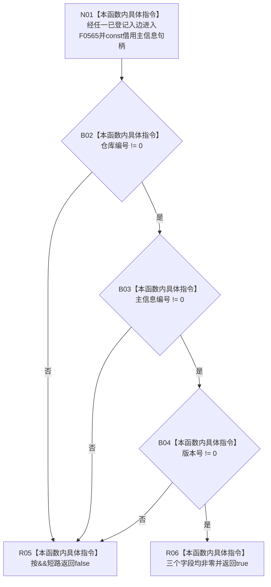

# CF-L6-0304 主信息句柄有效现状流程图

图类型：现状流程图
代码版本：`14d539ed7ad8af87f35fb0752eed420bbe443316`
源码 blob：`5e48828f7fca6cb83a314852fed9a8c84d9fdd98`
覆盖文件：`海中鱼巣/核心/句柄.h:131-133`
唯一根函数：F0565
完整签名：`bool 海中鱼巣::句柄有效(const 海中鱼巣::主信息句柄& 句柄)`
参数：`句柄` 为调用期间有效的 const 非拥有借用
返回结果：仓库编号、主信息编号和版本号均非零时返回 true；按 `&&` 左到右短路，任一字段为零时返回 false
已登记调用方：E1304、RCE0245、RCE0358、RCE0362、RCE0885、RCE1088、RCE1236、RCE1280、RCE1460、RCE1706、RCE1967、RCE1969、RCE1972、RCE2030、RCE2032、RCE2077、RCE2122
直接项目函数：无
外部边界：无
未解析项目调用：0
调用图：`流程图/主程序可达调用关系/01_main可达项目调用边表.md`
逐行映射表：`流程图/代码流程图/L6/CF-L6-0304_主信息句柄有效_逐行代码映射表.md`
偏差清单：无；本文只冻结当前代码事实
依据提交 / 结构化消息：当前提交、F0565、17 条项目入边与源码 131—133 行交叉复核
结构读取与写入：只读句柄的三个整数标识字段；不读取仓库记录，不写机器结构
逻辑内返回：任一字段为零返回 false；三个字段均非零返回 true
内部错误：本函数没有内部错误分支
生命周期与资源释放：只在调用期间借用 const 句柄
异常：三个整数比较不抛出异常
并发 / 幂等：纯值读取；同一参数值重复调用结果相同
验证输出：131—133 行完整映射；17 条项目入边、0 个项目出边、0 个外部边界、0 个未解析调用
不得作为施工许可：是
不得宣称：返回 true 证明对应主信息记录存在、版本当前、可读、可写或业务事实成立

## 流程图

## 节点合同

| 节点 | 类型 | 输入绑定 | 输出绑定 | 事实读写 | 后继 |
| --- | --- | --- | --- | --- | --- |
| N01 | 本函数内具体指令 | const 主信息句柄借用 | 进入字段判断 | 无 | B02 |
| B02 | 本函数内具体指令 | `句柄.仓库编号` | 非零 bool | 只读值字段 | false→R05；true→B03 |
| B03 | 本函数内具体指令 | `句柄.主信息编号` | 非零 bool | 只读值字段 | false→R05；true→B04 |
| B04 | 本函数内具体指令 | `句柄.版本号` | 非零 bool | 只读值字段 | false→R05；true→R06 |
| R05 / R06 | 本函数内具体指令 | 短路失败或全部通过条件 | false 或 true | 无 | 结束 |

## 当前边界

- 第 132 行的三个比较严格按 `&&` 左到右短路；后续字段仅在此前字段非零时读取。
- 本函数仅判断句柄值形态，不访问主信息仓库，不证明记录存在、版本当前或调用方具有任何权限。
