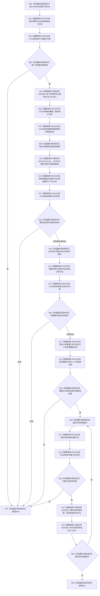

# CF-L6-0305 关系仓库性能基线隔离关系夹具添加固定结构现状流程图

图类型：现状流程图
代码版本：`a582776d1bd78ab88d972e32fbaece594eb43512`
源码 blob：`34c34bffcd80f78e28345292deb69aca2eabf38d`
覆盖文件：`海中鱼巣/核心/自检.关系仓库性能基线.ixx:458-508`
唯一根函数：F0566
完整签名：`bool 海中鱼巣::关系仓库性能基线内部::隔离关系夹具::添加固定结构()`
参数：无显式参数；隐式可写 `this` 为调用期间有效的非拥有借用
返回结果：全部固定关系及四份并发写材料形成时返回 `true`；任一关系创建或句柄校验失败时返回 `false`
已登记调用方：F0273 经 E1307
直接项目函数：RCE0258→F0568、RCE0259→F0168、RCE2259→F0167
外部边界：X01109—X01112 数组范围循环迭代；X02564 数组迭代器解引用；X02565 节点组下标读取；X02566 并发写材料组 `push_back`
未解析项目调用：0
调用图：`流程图/主程序可达调用关系/01_main可达项目调用边表.md`
逐行映射表：`流程图/代码流程图/L6/CF-L6-0305_关系仓库性能基线隔离关系夹具添加固定结构_逐行代码映射表.md`
偏差清单：无；本文只冻结当前性能自检代码事实
结构读取与写入：读取节点组；通过 F0568 写关系仓库、引用键组和参考表；写普通父第二次挂载拒绝标志、三个待变更关系句柄及并发写材料组
逻辑内返回：任一必需关系句柄无效时返回 `false`
内部错误：本函数不捕获被调函数或容器操作异常
生命周期与资源释放：局部句柄、固定数组、循环变量和材料临时值在相应作用域结束时释放
异常：未捕获；项目调用和标准容器操作异常沿调用栈传播
并发 / 幂等：夹具构造阶段的串行写入；重复调用会再次尝试创建同组关系，不承诺幂等
验证输出：458—508 行完整映射；1 条项目入边、3 条项目出边、7 个外部边界、0 个未解析调用
不得作为施工许可：是
不得宣称：自检夹具数据形成证明生产关系数据、并发能力或业务闭环完成

## 函数合同

```text
根函数：F0566 隔离关系夹具::添加固定结构
归属模块 / 文件 / 层级：自检.关系仓库性能基线 / 海中鱼巣/核心/自检.关系仓库性能基线.ixx / L6
现有或待新增：现有非 const 成员函数
参数：无显式参数；可写 this 非拥有借用
返回结果：bool 固定结构形成结果
被调函数流程图：F0568 已由 CF-L6-0307 覆盖；F0167、F0168 使用各自队列身份或已发布图
```

## 流程图



## 节点合同

| 节点 | 类型 | 输入绑定 | 输出绑定 | 事实读写 | 后继 |
| --- | --- | --- | --- | --- | --- |
| N01 | 本函数内具体指令 | 可写 `this` | 进入固定结构形成 | 无 | C02 |
| C02—B04 | 函数调用 / 本函数内具体指令 | 两组普通父参数 | 两个关系句柄及有效性 | 写关系、引用键组和参考表 | 失败→R27；成功→X05 |
| X05—C07 | 函数调用 | 节点组 1001、1002 | 第二次挂载拒绝标志 | 直接尝试写普通父关系 | N08 |
| N08—B12 | 本函数内具体指令 / 函数调用 | 七条固定图边 | 七条概念上下位关系结果 | 写关系与参考表 | 失败→R27；完成→N13 |
| N13—B16 | 本函数内具体指令 / 函数调用 | 四组连续索引范围 | 引用关系句柄 | 写关系、引用键组和参考表 | 失败→R27；完成→C17 |
| C17—B19 | 函数调用 / 本函数内具体指令 | 离散引用与模板参数 | 三个待变更句柄 | 写关系、引用键组、参考表和成员句柄 | 失败→R27；成功→N20 |
| N20—B26 | 本函数内具体指令 / 函数调用 | 并发线程索引 | 归属关系与并发写材料 | 写关系、参考表、并发写材料组 | 失败→R27；循环→N20；结束→R28 |
| R27 / R28 | 本函数内具体指令 | 当前形成状态 | bool | 无新增写入 | 结束 |

## 当前边界

- RCE0258 聚合第 459、460、470、475、478、481、484、486—492、498 行对 F0568 的调用；RCE0259 聚合对应句柄校验。
- X02565 聚合本函数内节点组下标读取；不会把节点值写成固定生产数据。
- 任一失败只返回 `false`，本函数没有回滚此前已完成的夹具写入。
