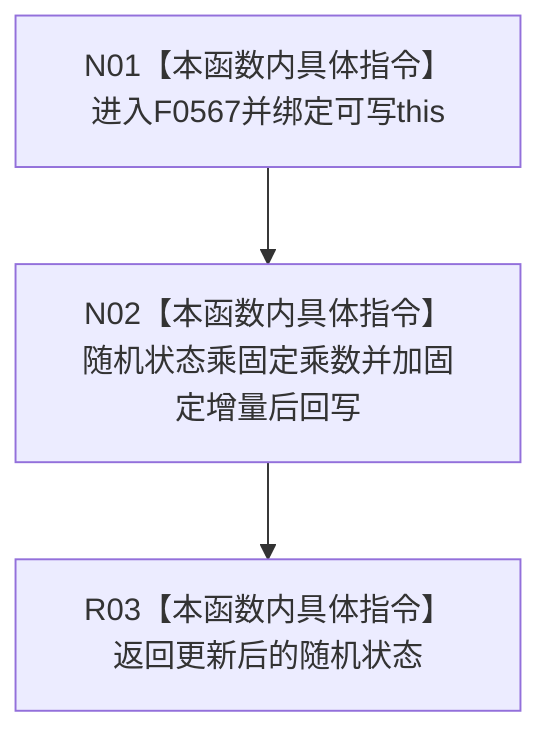

# CF-L6-0306 关系仓库性能基线隔离关系夹具下一随机数现状流程图

图类型：现状流程图
代码版本：`a582776d1bd78ab88d972e32fbaece594eb43512`
源码 blob：`34c34bffcd80f78e28345292deb69aca2eabf38d`
覆盖文件：`海中鱼巣/核心/自检.关系仓库性能基线.ixx:428-431`
唯一根函数：F0567
完整签名：`std::uint64_t 海中鱼巣::关系仓库性能基线内部::隔离关系夹具::下一随机数()`
参数：无显式参数；隐式可写 `this` 为调用期间有效的非拥有借用
返回结果：线性同余更新后的 64 位随机状态
已登记调用方：F0273 经 E1308
直接项目函数：无
外部边界：无
未解析项目调用：0
调用图：`流程图/主程序可达调用关系/01_main可达项目调用边表.md`
逐行映射表：`流程图/代码流程图/L6/CF-L6-0306_关系仓库性能基线隔离关系夹具下一随机数_逐行代码映射表.md`
偏差清单：无；本文只冻结当前性能自检代码事实
结构读取与写入：读取并覆盖成员 `随机状态_`
逻辑内返回：无拒绝或空结果分支
内部错误：无显式内部错误分支
生命周期与资源释放：无独立资源
异常：整数运算与返回不抛出
并发 / 幂等：修改共享夹具状态；无同步且非幂等
验证输出：428—431 行完整映射；1 条项目入边、0 条项目出边、0 个外部边界、0 个未解析调用
不得作为施工许可：是
不得宣称：该确定性序列具备密码学随机性或生产随机源质量

## 函数合同

```text
根函数：F0567 隔离关系夹具::下一随机数
归属模块 / 文件 / 层级：自检.关系仓库性能基线 / 海中鱼巣/核心/自检.关系仓库性能基线.ixx / L6
现有或待新增：现有非 const 成员函数
参数：无显式参数；可写 this 非拥有借用
返回结果：std::uint64_t 更新后的随机状态
被调函数流程图：无
```

## 流程图



## 节点合同

| 节点 | 类型 | 输入绑定 | 输出绑定 | 事实读写 | 后继 |
| --- | --- | --- | --- | --- | --- |
| N01 | 本函数内具体指令 | 可写 `this` | 当前随机状态 | 读取成员 | N02 |
| N02 | 本函数内具体指令 | 当前状态与两个常量 | 更新后状态 | 覆盖 `随机状态_` | R03 |
| R03 | 本函数内具体指令 | 更新后状态 | uint64 返回值 | 无新增写入 | 结束 |

## 当前边界

- `std::uint64_t` 无符号运算按模 2^64 回绕；图只记录当前算式，不赋予统计质量结论。
- 连续调用依赖前一次成员状态，函数不是只读查询。
