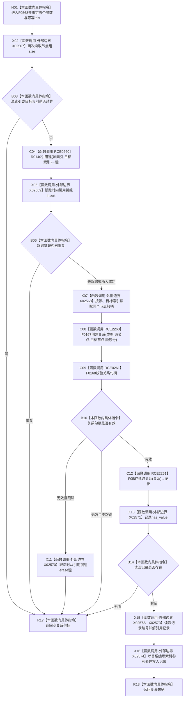

# CF-L6-0307 关系仓库性能基线隔离关系夹具添加关系现状流程图

图类型：现状流程图
代码版本：`a582776d1bd78ab88d972e32fbaece594eb43512`
源码 blob：`34c34bffcd80f78e28345292deb69aca2eabf38d`
覆盖文件：`海中鱼巣/核心/自检.关系仓库性能基线.ixx:438-456`
唯一根函数：F0568
完整签名：`海中鱼巣::关系句柄 海中鱼巣::关系仓库性能基线内部::隔离关系夹具::添加关系(海中鱼巣::关系类型 类型, std::size_t 源索引, std::size_t 目标索引, std::int64_t 顺序号, bool 跟踪引用键)`
参数：关系类型、源索引、目标索引、顺序号和跟踪引用键均按值传入；隐式可写 `this` 为非拥有借用
返回结果：索引合法、引用键未重复、关系创建成功且可读回时返回关系句柄；否则返回空句柄
已登记调用方：F0273 经 E1311；F0566 经 RCE0258
直接项目函数：RCE0260→R0140、RCE0261→F0168、RCE2260→F0167、RCE2261→F0587
外部边界：X02567 节点组 `size`；X02568 节点组下标读取；X02569 引用键组 `insert`；X02570 引用键组 `erase`；X02571 optional `has_value`；X02572 optional `operator->`；X02573 optional `operator*`；X02574 参考表 `operator[]`
未解析项目调用：0
调用图：`流程图/主程序可达调用关系/01_main可达项目调用边表.md`
逐行映射表：`流程图/代码流程图/L6/CF-L6-0307_关系仓库性能基线隔离关系夹具添加关系_逐行代码映射表.md`
偏差清单：无；本文只冻结当前性能自检代码事实
结构读取与写入：读取节点组；可写引用关系键组、关系仓库和参考表
逻辑内返回：索引越界、重复引用键、创建所得句柄无效或创建后读回为空时返回空句柄
内部错误：创建成功但读回为空时不会撤销新关系；仅句柄无效分支会撤销已插入的跟踪键
生命周期与资源释放：键、关系句柄和读回 optional 为局部值；返回句柄按值离开
异常：未捕获；容器与关系仓库调用异常沿调用栈传播
并发 / 幂等：修改夹具与关系仓库；无显式同步，引用键跟踪只在当前夹具容器内拒绝重复
验证输出：438—456 行完整映射；2 条项目入边、4 条项目出边、8 个外部边界、0 个未解析调用
不得作为施工许可：是
不得宣称：夹具引用键去重等同生产事务唯一性或持久化约束

## 函数合同

```text
根函数：F0568 隔离关系夹具::添加关系
归属模块 / 文件 / 层级：自检.关系仓库性能基线 / 海中鱼巣/核心/自检.关系仓库性能基线.ixx / L6
现有或待新增：现有非 const 成员函数
参数：类型、源索引、目标索引、顺序号、跟踪引用键均按值
返回结果：关系句柄或空句柄
被调函数流程图：R0140、F0167、F0168、F0587 使用各自队列身份或已发布图
```

## 流程图



## 节点合同

| 节点 | 类型 | 输入绑定 | 输出绑定 | 事实读写 | 后继 |
| --- | --- | --- | --- | --- | --- |
| N01 | 本函数内具体指令 | 五个值参数、可写 `this` | 进入添加流程 | 无 | X02 |
| X02 / B03 | 函数调用 / 本函数内具体指令 | 源、目标索引与节点组 | 越界判断 | 只读节点组规模 | 越界→R17；合法→C04 |
| C04—B06 | 函数调用 / 本函数内具体指令 | 两个索引与跟踪标志 | 组合键及插入结果 | 可写引用键组 | 重复→R17；继续→X07 |
| X07—B10 | 函数调用 / 本函数内具体指令 | 类型、节点、顺序号 | 新关系句柄及有效性 | 写关系仓库 | 无效→X11 或 R17；有效→C12 |
| X11 | 函数调用 | 已插入键 | 键移除结果未绑定 | 撤销引用键跟踪 | R17 |
| C12—B14 | 函数调用 / 本函数内具体指令 | 新关系句柄 | optional 关系记录 | 只读关系仓库 | 无值→R17；有值→X15 |
| X15—X16 | 函数调用 | optional 记录 | 关系编号与记录值 | 写参考表 | R18 |
| R17 / R18 | 本函数内具体指令 | 失败状态或有效句柄 | 关系句柄 | 无新增写入 | 结束 |

## 当前边界

- 第 446 行只有 `跟踪引用键` 为真时才插入并检查引用键；不跟踪时直接进入关系创建。
- 第 448—450 行在关系句柄无效时撤销已跟踪键；第 453 行读回为空时直接返回，不撤销关系或键。
- 本图不把自检参考表写成生产权威仓库。
