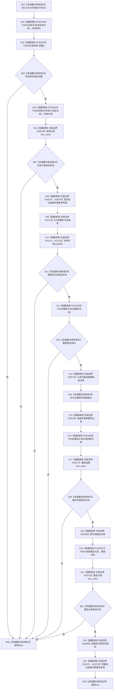

# CF-L6-0308 关系仓库性能基线隔离关系夹具应用固定变更现状流程图

图类型：现状流程图
代码版本：`a582776d1bd78ab88d972e32fbaece594eb43512`
源码 blob：`34c34bffcd80f78e28345292deb69aca2eabf38d`
覆盖文件：`海中鱼巣/核心/自检.关系仓库性能基线.ixx:510-532`
唯一根函数：F0569
完整签名：`bool 海中鱼巣::关系仓库性能基线内部::隔离关系夹具::应用固定变更()`
参数：无显式参数；隐式可写 `this` 为调用期间有效的非拥有借用
返回结果：固定失效、删除、重挂及三次参考表同步均完成时返回 `true`；任一检查失败时返回 `false`
已登记调用方：F0273 经 E1313
直接项目函数：RCE0262→F0591、RCE0263→F0592、RCE0264→F0589、RCE0265→F0590、RCE0266→F0586、RCE0267→F0587
外部边界：X01113 `find`、X01114 `end`、X01115 迭代器比较；X02575 map 迭代器 `operator->`；X02576 记录 optional `has_value`；X02577 句柄 optional `has_value`；X02578 参考表 `operator[]`；X02579 记录 optional `operator->`；X02580 句柄 optional `operator*`
未解析项目调用：0
调用图：`流程图/主程序可达调用关系/01_main可达项目调用边表.md`
逐行映射表：`流程图/代码流程图/L6/CF-L6-0308_关系仓库性能基线隔离关系夹具应用固定变更_逐行代码映射表.md`
偏差清单：无；本文只冻结当前性能自检代码事实
结构读取与写入：修改关系仓库中的固定关系；同步参考表中的失效、删除、重挂记录；更新待重挂关系句柄
逻辑内返回：失效材料不完整、审计读回为空、删除前记录不存在、删除失败、重挂失败或重挂读回为空时返回 `false`
内部错误：各阶段按顺序提交且无统一回滚；后续失败不会撤销前序关系与参考表修改
生命周期与资源释放：状态变更材料、optional、迭代器和记录副本均为局部值
异常：未捕获；关系仓库与容器操作异常沿调用栈传播
并发 / 幂等：串行修改夹具和仓库；重复执行不承诺幂等
验证输出：510—532 行完整映射；1 条项目入边、6 条项目出边、9 个外部边界、0 个未解析调用
不得作为施工许可：是
不得宣称：夹具参考表同步构成生产事务、审计持久化或并发隔离保证

## 函数合同

```text
根函数：F0569 隔离关系夹具::应用固定变更
归属模块 / 文件 / 层级：自检.关系仓库性能基线 / 海中鱼巣/核心/自检.关系仓库性能基线.ixx / L6
现有或待新增：现有非 const 成员函数
参数：无显式参数；可写 this 非拥有借用
返回结果：bool 固定变更应用结果
被调函数流程图：F0586、F0587、F0589—F0592 使用各自队列身份或已发布图
```

## 流程图



## 节点合同

| 节点 | 类型 | 输入绑定 | 输出绑定 | 事实读写 | 后继 |
| --- | --- | --- | --- | --- | --- |
| N01 | 本函数内具体指令 | 可写 `this` | 进入固定变更 | 无 | C02 |
| C02—B04 | 函数调用 / 本函数内具体指令 | 待失效关系 | 失效材料与完整性 | 修改关系状态 | 不完整→R25；完整→C05 |
| C05—X08 | 函数调用 | 失效后的当前关系 | 审计记录 | 读关系审计并写参考表 | 无值→R25；有值→X09 |
| X09—B13 | 函数调用 / 本函数内具体指令 | 待删除关系 | 删除前迭代器与删除结果 | 读参考表并删除关系 | 不存在或删除失败→R25；成功→X13 |
| X13—X15 | 函数调用 / 本函数内具体指令 | 删除前记录 | 已删除且版本递增的记录 | 写参考表 | C16 |
| C16—B18 | 函数调用 / 本函数内具体指令 | 待重挂关系与固定节点 | optional 新句柄 | 修改关系端点 | 无值→R25；有值→X19 |
| X19—B22 | 函数调用 / 本函数内具体指令 | 新句柄 | optional 重挂记录 | 读关系仓库 | 无值→R25；有值→X23 |
| X23—X24 | 函数调用 | 新句柄与重挂记录 | 更新后的成员和参考表 | 写待重挂句柄与参考表 | R26 |
| R25 / R26 | 本函数内具体指令 | 当前阶段结果 | bool | 无新增写入 | 结束 |

## 当前边界

- 第 518 行使用短路或：找不到删除前记录时不会调用 F0590；找到后才尝试删除。
- X02578 聚合第 515、522、530 行三次参考表下标写入；X02576、X02579、X02580 分别聚合各自重复调用。
- 函数没有跨失效、删除、重挂三阶段的统一事务或补偿。
