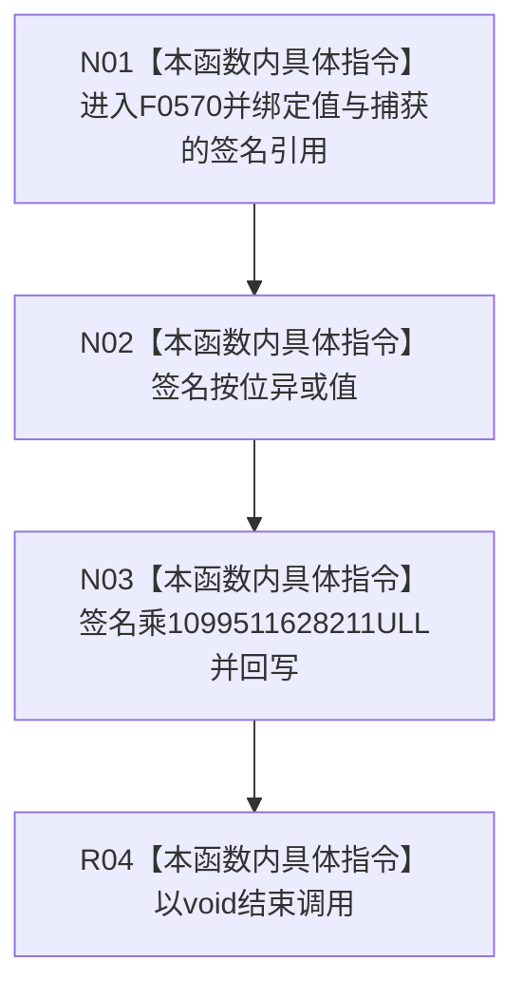

# CF-L6-0309 关系仓库性能基线当前签名写值 lambda 现状流程图

图类型：现状流程图
代码版本：`a582776d1bd78ab88d972e32fbaece594eb43512`
源码 blob：`34c34bffcd80f78e28345292deb69aca2eabf38d`
覆盖文件：`海中鱼巣/核心/自检.关系仓库性能基线.ixx:203-206`
唯一根函数：F0570
完整签名：`void 海中鱼巣::关系仓库性能基线内部::隔离关系夹具::当前签名() const::<lambda@自检.关系仓库性能基线.ixx:203>::operator()(std::uint64_t 值) const`
参数：`值` 按值传入；lambda 闭包按引用捕获外层局部 `签名`
返回结果：`void`；通过捕获引用覆盖外层 `签名`
已登记调用方：F0274 经 E1317，在 208—214 行每条排序记录调用七次
直接项目函数：无
外部边界：无
未解析项目调用：0
调用图：`流程图/主程序可达调用关系/01_main可达项目调用边表.md`
逐行映射表：`流程图/代码流程图/L6/CF-L6-0309_关系仓库性能基线当前签名写值lambda_逐行代码映射表.md`
偏差清单：无；本文只冻结当前性能自检代码事实
结构读取与写入：只修改调用方栈帧中的局部 `签名`，不写关系仓库或持久结构
逻辑内返回：无拒绝或空结果分支
内部错误：无显式内部错误分支
生命周期与资源释放：闭包借用的 `签名` 必须在调用期间存活；lambda 不拥有该值
异常：两个无符号整数运算和赋值不抛出
并发 / 幂等：作用于单个外层局部值；相同输入重复混合会再次改变签名，非幂等
验证输出：203—206 行完整映射；1 条项目入边、0 条项目出边、0 个外部边界、0 个未解析调用
不得作为施工许可：是
不得宣称：该签名算法具备密码学哈希、碰撞安全或跨版本稳定合同

## 函数合同

```text
根函数：F0570 当前签名局部 lambda::operator()
归属模块 / 文件 / 层级：自检.关系仓库性能基线 / 海中鱼巣/核心/自检.关系仓库性能基线.ixx / L6
现有或待新增：F0274 内现有局部 lambda 调用运算符
参数：std::uint64_t 值按值；捕获的签名按引用借用
返回结果：void；副作用为更新捕获的签名
被调函数流程图：无
```

## 流程图



## 节点合同

| 节点 | 类型 | 输入绑定 | 输出绑定 | 事实读写 | 后继 |
| --- | --- | --- | --- | --- | --- |
| N01 | 本函数内具体指令 | 值、捕获的签名引用 | 当前签名 | 借用外层局部 | N02 |
| N02 | 本函数内具体指令 | 当前签名与值 | 异或后签名 | 覆盖外层局部签名 | N03 |
| N03 | 本函数内具体指令 | 异或后签名与固定乘数 | 混合后签名 | 再次覆盖外层局部签名 | R04 |
| R04 | 本函数内具体指令 | 无 | void | 无新增写入 | 结束 |

## 当前边界

- E1317 聚合 F0274 第 208—214 行七个调用点；本图只展开每次 lambda 调用内部的两条指令。
- 无符号乘法按模 2^64 回绕；图不把常量来源或算法质量提升为正式合同。
