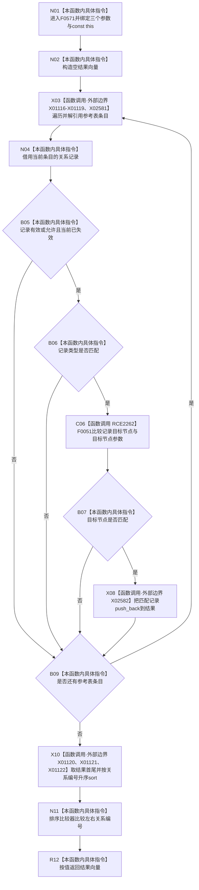

# CF-L6-0310 关系仓库性能基线隔离关系夹具参考按目标现状流程图

图类型：现状流程图
代码版本：`a582776d1bd78ab88d972e32fbaece594eb43512`
源码 blob：`34c34bffcd80f78e28345292deb69aca2eabf38d`
覆盖文件：`海中鱼巣/核心/自检.关系仓库性能基线.ixx:553-570`
唯一根函数：F0571
完整签名：`std::vector<海中鱼巣::关系记录> 海中鱼巣::关系仓库性能基线内部::隔离关系夹具::参考按目标(海中鱼巣::节点句柄 目标节点, 海中鱼巣::关系类型 类型, bool 包含当前失效) const`
参数：目标节点、关系类型和包含当前失效标志均按值传入；隐式 const `this` 为非拥有借用
返回结果：参考表中状态、类型和目标节点匹配的关系记录副本，按关系编号升序返回
已登记调用方：F0277 经 E1325；F0278 经 E1334
直接项目函数：RCE2262→F0051
外部边界：X01116—X01119 参考表范围循环；X01120、X01121、X01122 结果排序；X02581 map const 迭代器解引用；X02582 结果 `push_back`
未解析项目调用：0
调用图：`流程图/主程序可达调用关系/01_main可达项目调用边表.md`
逐行映射表：`流程图/代码流程图/L6/CF-L6-0310_关系仓库性能基线隔离关系夹具参考按目标_逐行代码映射表.md`
偏差清单：无；本文只冻结当前性能自检代码事实
结构读取与写入：只读参考表；仅写局部结果向量
逻辑内返回：没有匹配项时返回空向量
内部错误：无写后内部错误分支
生命周期与资源释放：记录引用仅在循环体内借用参考表元素；返回向量按值离开
异常：未捕获；向量追加、排序或复制异常沿调用栈传播
并发 / 幂等：对同一稳定参考表为确定性只读投影；无同步，不保证与并发写构成快照
验证输出：553—570 行完整映射；2 条项目入边、1 条项目出边、9 个外部边界、0 个未解析调用
不得作为施工许可：是
不得宣称：参考表结果是关系仓库权威查询结果、事务快照或生产能力完成

## 函数合同

```text
根函数：F0571 隔离关系夹具::参考按目标
归属模块 / 文件 / 层级：自检.关系仓库性能基线 / 海中鱼巣/核心/自检.关系仓库性能基线.ixx / L6
现有或待新增：现有 const 成员函数
参数：目标节点、关系类型、包含当前失效标志均按值；const this 非拥有借用
返回结果：std::vector<关系记录> 匹配副本，按关系编号升序
被调函数流程图：F0051 使用其已发布单函数图或队列身份
```

## 流程图



## 节点合同

| 节点 | 类型 | 输入绑定 | 输出绑定 | 事实读写 | 后继 |
| --- | --- | --- | --- | --- | --- |
| N01 / N02 | 本函数内具体指令 | 三个值参数、const `this` | 空结果向量 | 无持久写入 | X03 |
| X03 / N04 | 函数调用 / 本函数内具体指令 | 参考表 | 当前记录引用 | 只读参考表 | B05 |
| B05 | 本函数内具体指令 | 记录状态、包含当前失效 | 状态匹配 bool | 无 | false→B09；true→C06 |
| B06 / C06 / B07 | 本函数内具体指令 / 函数调用 | 记录、类型、目标节点 | 类型与目标匹配 bool | 无 | 任一 false→B09；全部 true→X08 |
| X08 | 函数调用 | 当前匹配记录 | 扩展后的结果 | 仅写局部结果向量 | B09 |
| B09 | 本函数内具体指令 | 迭代器状态 | 循环控制 | 无 | 继续→X03；结束→X10 |
| X10 / N11 | 函数调用 / 本函数内具体指令 | 结果向量 | 按关系编号升序的结果 | 重排局部结果向量 | R12 |
| R12 | 本函数内具体指令 | 排序后结果 | vector 返回值 | 无新增写入 | 结束 |

## 当前边界

- 第 560—561 行的状态匹配允许所有有效记录；只有 `包含当前失效` 为真时才额外允许已失效记录。
- 第 562 行使用短路与：状态和类型都匹配后才经 RCE2262 比较目标节点。
- 排序比较器只比较关系编号；本函数不定义关系记录的其它排序规则。
