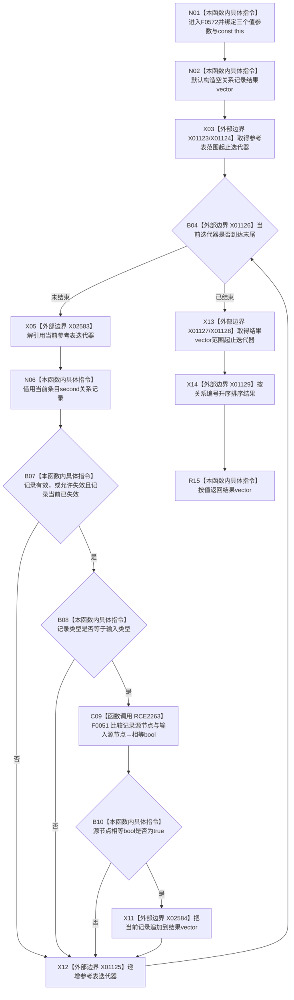

# CF-L6-0311 关系仓库性能基线隔离关系夹具参考按源现状流程图

图类型：现状流程图
代码版本：`a582776d1bd78ab88d972e32fbaece594eb43512`
源码 blob：`34c34bffcd80f78e28345292deb69aca2eabf38d`
覆盖文件：`海中鱼巣/核心/自检.关系仓库性能基线.ixx:534-551`
唯一根函数：F0572
完整签名：`std::vector<海中鱼巣::关系记录> 海中鱼巣::关系仓库性能基线内部::隔离关系夹具::参考按源(海中鱼巣::节点句柄 源节点, 海中鱼巣::关系类型 类型, bool 包含当前失效) const`
参数：`源节点`、`类型`、`包含当前失效` 均按值传入；隐式 const `this` 为调用期间有效的非拥有借用
返回结果：从夹具参考表筛出状态、类型和源节点匹配的关系记录，按关系编号升序返回值式 `vector`
已登记调用方：F0277 经 E1327；F0278 经 E1332
直接项目函数：RCE2263→F0051 `operator==(节点句柄,节点句柄)`
外部边界：X01123—X01126 参考表范围迭代；X02583 迭代器解引用；X02584 `vector::push_back`；X01127—X01129 结果范围与 `std::sort`
未解析项目调用：0
调用图：`流程图/主程序可达调用关系/01_main可达项目调用边表.md`
逐行映射表：`流程图/代码流程图/L6/CF-L6-0311_关系仓库性能基线隔离关系夹具参考按源_逐行代码映射表.md`
偏差清单：无；本文只冻结当前代码事实
依据提交 / 结构化消息：当前提交、F0572、E1327、E1332、RCE2263、X01123—X01129、X02583—X02584 与源码逐行交叉复核
结构读取与写入：只读夹具 `参考表_`；只改变局部结果 vector，不修改关系仓库或参考表
逻辑内返回：没有匹配记录时返回空 vector
内部错误：本函数没有写后失败分支
生命周期与资源释放：记录引用只在当前迭代内借用；返回 vector 由调用方按值取得
异常：未捕获；容器分配、追加或排序异常向调用方传播
并发 / 幂等：本函数自身只读，但不建立锁；调用方必须保证夹具参考表在调用期间不被并发修改
验证输出：534—551 行完整映射；2 条项目入边、1 条项目出边、9 个外部边界、0 个未解析调用
不得作为施工许可：是
不得宣称：返回组是生产关系仓库快照、空组证明生产关系不存在或性能基线通过

## 函数合同

```text
根函数：F0572 隔离关系夹具::参考按源
归属模块 / 文件 / 层级：自检.关系仓库性能基线 / 海中鱼巣/核心/自检.关系仓库性能基线.ixx / L6
现有或待新增：现有 const 成员函数
参数：源节点、关系类型、是否包含当前已失效记录；const this 非拥有借用
返回结果：按关系编号升序的关系记录 vector
被调函数流程图：F0051 已发布于 `流程图/代码流程图/L4/CF-L4-0015_节点句柄_operator_equal_现状流程图.md`
```

## 流程图



## 节点合同

| 节点 | 类型 | 输入绑定 | 输出绑定 | 事实读写 | 后继 |
| --- | --- | --- | --- | --- | --- |
| N01—N02 | 本函数内具体指令 | 三个值参数、const `this` | 空结果 vector | 无持久写入 | X03 |
| X03—X05 / X12 | 函数调用·外部边界 | `参考表_` | 当前条目或循环结束 | 只读参考表 | N06 或 X13 |
| N06—B08 | 本函数内具体指令 | 当前关系记录、输入状态口径与类型 | 状态 / 类型匹配 bool | 只读记录 | C09 或 X12 |
| C09 / B10 | 函数调用 / 本函数内具体指令 | `记录.源节点`、`源节点` | 相等 bool | 无 | X11 或 X12 |
| X11 | 函数调用·外部边界 | 当前匹配记录 | 扩展局部结果 | 仅局部 vector | X12 |
| X13—X14 | 函数调用·外部边界 | 结果范围、关系编号比较器 | 已排序结果 | 仅重排局部 vector | R15 |
| R15 | 本函数内具体指令 | 已排序结果 | 返回 vector | 无 | 结束 |

## 当前边界

- RCE2263 只对应第 543 行的节点句柄比较；状态与类型比较是本函数内枚举判断。
- X01123—X01126 保留已登记的范围迭代边界，X02583 单独冻结条目解引用，X02584 冻结候选追加。
- 本函数操作的是性能基线夹具参考表，不是生产关系仓库；结果不携带锁、事务令牌或发布见证。
