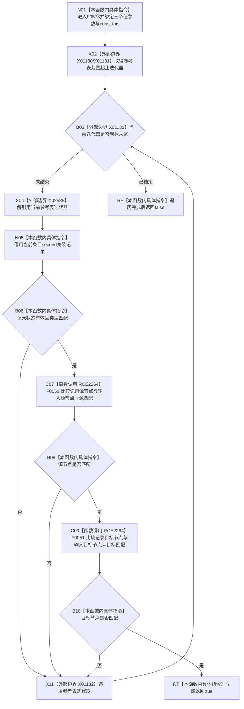

# CF-L6-0312 关系仓库性能基线隔离关系夹具参考精确存在现状流程图

图类型：现状流程图
代码版本：`a582776d1bd78ab88d972e32fbaece594eb43512`
源码 blob：`34c34bffcd80f78e28345292deb69aca2eabf38d`
覆盖文件：`海中鱼巣/核心/自检.关系仓库性能基线.ixx:587-599`
唯一根函数：F0573
完整签名：`bool 海中鱼巣::关系仓库性能基线内部::隔离关系夹具::参考精确存在(海中鱼巣::关系类型 类型, 海中鱼巣::节点句柄 源节点, 海中鱼巣::节点句柄 目标节点) const`
参数：类型、源节点、目标节点按值传入；隐式 const `this` 为调用期间有效的非拥有借用
返回结果：参考表存在状态有效且类型、源节点、目标节点均精确匹配的记录时返回 `true`，否则返回 `false`
已登记调用方：F0277 经 E1329；F0278 经 E1336
直接项目函数：RCE2264→F0051，在 595、596 行分别比较源节点与目标节点
外部边界：X01130—X01133 参考表范围迭代；X02585 迭代器解引用
未解析项目调用：0
调用图：`流程图/主程序可达调用关系/01_main可达项目调用边表.md`
逐行映射表：`流程图/代码流程图/L6/CF-L6-0312_关系仓库性能基线隔离关系夹具参考精确存在_逐行代码映射表.md`
偏差清单：无；本文只冻结当前代码事实
依据提交 / 结构化消息：当前提交、F0573、E1329、E1336、RCE2264、X01130—X01133、X02585 与源码逐行交叉复核
结构读取与写入：只读夹具参考表，零机器事实写入
逻辑内返回：遍历完成仍无匹配记录时返回 `false`
内部错误：无写后失败分支
生命周期与资源释放：当前记录引用不越过循环；无资源所有权转移
异常：未捕获；参考表迭代异常向调用方传播
并发 / 幂等：本函数自身只读但不加锁；调用方负责夹具并发边界
验证输出：587—599 行完整映射；2 条项目入边、1 条项目出边、5 个外部边界、0 个未解析调用
不得作为施工许可：是
不得宣称：`true` 证明生产关系仓库存在对应当前关系，或 `false` 是性能基线失败

## 函数合同

```text
根函数：F0573 隔离关系夹具::参考精确存在
归属模块 / 文件 / 层级：自检.关系仓库性能基线 / 海中鱼巣/核心/自检.关系仓库性能基线.ixx / L6
现有或待新增：现有 const 成员函数
参数：关系类型、源节点、目标节点按值；const this 非拥有借用
返回结果：是否存在精确匹配的有效参考记录
被调函数流程图：F0051 已发布于 `流程图/代码流程图/L4/CF-L4-0015_节点句柄_operator_equal_现状流程图.md`
```

## 流程图



## 节点合同

| 节点 | 类型 | 输入绑定 | 输出绑定 | 事实读写 | 后继 |
| --- | --- | --- | --- | --- | --- |
| N01 | 本函数内具体指令 | 三个值参数、const `this` | 查询语境 | 无 | X02 |
| X02—X04 / X11 | 函数调用·外部边界 | `参考表_` | 当前条目或循环结束 | 只读参考表 | N05、B03 或 RF |
| N05—B06 | 本函数内具体指令 | 当前记录、输入类型 | 状态 / 类型匹配 bool | 只读记录 | C07 或 X11 |
| C07—B10 | 函数调用 / 本函数内具体指令 | 两对节点句柄 | 源、目标匹配 bool | 无 | RT 或 X11 |
| RT / RF | 本函数内具体指令 | 匹配成立或遍历结束 | bool | 无 | 结束 |

## 当前边界

- RCE2264 聚合 595、596 行对 F0051 的两次调用，短路顺序固定为源节点先于目标节点。
- 本函数只比较状态、类型和两端句柄，不比较关系编号、顺序号或版本号。
- `false` 合并空表与存在记录但没有完整匹配两种语境，且只描述性能基线夹具参考表。
