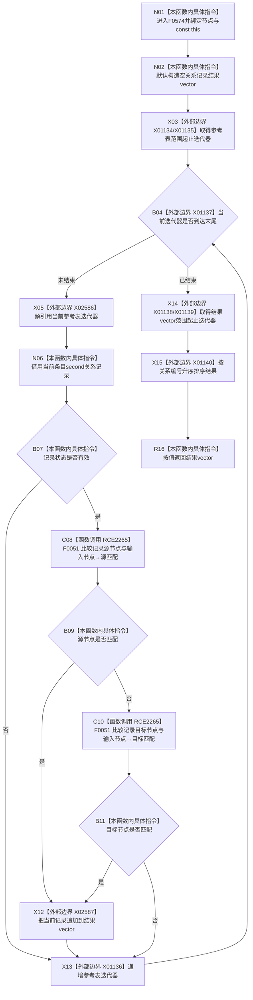

# CF-L6-0313 关系仓库性能基线隔离关系夹具参考节点相关现状流程图

图类型：现状流程图
代码版本：`a582776d1bd78ab88d972e32fbaece594eb43512`
源码 blob：`34c34bffcd80f78e28345292deb69aca2eabf38d`
覆盖文件：`海中鱼巣/核心/自检.关系仓库性能基线.ixx:572-585`
唯一根函数：F0574
完整签名：`std::vector<海中鱼巣::关系记录> 海中鱼巣::关系仓库性能基线内部::隔离关系夹具::参考节点相关(海中鱼巣::节点句柄 节点) const`
参数：`节点` 按值传入；隐式 const `this` 为调用期间有效的非拥有借用
返回结果：从参考表筛出状态有效且源节点或目标节点等于输入节点的关系记录，按关系编号升序返回
已登记调用方：F0278 经 E1338
直接项目函数：RCE2265→F0051，第 577 行按短路顺序比较源节点和目标节点
外部边界：X01134—X01137 参考表范围迭代；X02586 迭代器解引用；X02587 `vector::push_back`；X01138—X01140 结果范围与 `std::sort`
未解析项目调用：0
调用图：`流程图/主程序可达调用关系/01_main可达项目调用边表.md`
逐行映射表：`流程图/代码流程图/L6/CF-L6-0313_关系仓库性能基线隔离关系夹具参考节点相关_逐行代码映射表.md`
偏差清单：无；本文只冻结当前代码事实
依据提交 / 结构化消息：当前提交、F0574、E1338、RCE2265、X01134—X01140、X02586—X02587 与源码逐行交叉复核
结构读取与写入：只读夹具参考表；只改变局部结果 vector
逻辑内返回：无有效相关记录时返回空 vector
内部错误：无写后失败分支
生命周期与资源释放：当前记录引用仅在循环内借用；返回 vector 按值转移
异常：未捕获；容器分配、追加或排序异常向调用方传播
并发 / 幂等：本函数自身只读但不加锁；调用方负责夹具并发边界
验证输出：572—585 行完整映射；1 条项目入边、1 条项目出边、9 个外部边界、0 个未解析调用
不得作为施工许可：是
不得宣称：结果是生产关系仓库快照、包含已失效记录或性能基线通过

## 函数合同

```text
根函数：F0574 隔离关系夹具::参考节点相关
归属模块 / 文件 / 层级：自检.关系仓库性能基线 / 海中鱼巣/核心/自检.关系仓库性能基线.ixx / L6
现有或待新增：现有 const 成员函数
参数：节点按值；const this 非拥有借用
返回结果：按关系编号升序的有效相关关系记录 vector
被调函数流程图：F0051 已发布于 `流程图/代码流程图/L4/CF-L4-0015_节点句柄_operator_equal_现状流程图.md`
```

## 流程图



## 节点合同

| 节点 | 类型 | 输入绑定 | 输出绑定 | 事实读写 | 后继 |
| --- | --- | --- | --- | --- | --- |
| N01—N02 | 本函数内具体指令 | 节点、const `this` | 空结果 vector | 无持久写入 | X03 |
| X03—X05 / X13 | 函数调用·外部边界 | `参考表_` | 当前条目或循环结束 | 只读参考表 | N06 或 X14 |
| N06—B07 | 本函数内具体指令 | 当前关系记录 | 状态有效 bool | 只读记录 | C08 或 X13 |
| C08—B11 | 函数调用 / 本函数内具体指令 | 记录两端句柄、输入节点 | 是否任一端匹配 | 无 | X12 或 X13 |
| X12 | 函数调用·外部边界 | 当前匹配记录 | 扩展局部结果 | 仅局部 vector | X13 |
| X14—X15 | 函数调用·外部边界 | 结果范围、关系编号比较器 | 已排序结果 | 仅重排局部 vector | R16 |
| R16 | 本函数内具体指令 | 已排序结果 | 返回 vector | 无 | 结束 |

## 当前边界

- RCE2265 聚合第 577 行对 F0051 的两次调用；由于 `||` 短路，源节点匹配时不执行目标节点比较。
- 只收集状态为 `有效` 的记录，不包含 `已失效`，也不复核输入节点或另一端节点当前有效性。
- 本函数的“节点相关”只指夹具参考表中任一端句柄相等，不代表生产关系仓库的事务快照。
