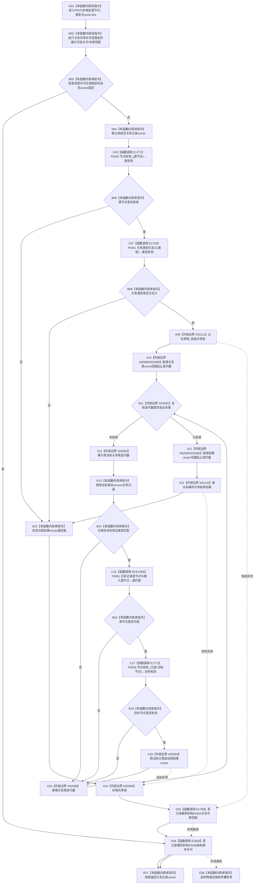

# CF-L6-0314 关系仓库获取关系记录组现状流程图

图类型：现状流程图
代码版本：`a582776d1bd78ab88d972e32fbaece594eb43512`
源码 blob：`f7a9ea9a09d3065468208c16f9ea34f806b6e183`
覆盖文件：`海中鱼巣/核心/关系仓库.cpp:843-863`
唯一根函数：F0575
完整签名：`std::vector<海中鱼巣::关系记录> 海中鱼巣::关系仓库::获取关系记录组(海中鱼巣::节点句柄 源节点, 海中鱼巣::关系类型 类型) const`
参数：`源节点`、`类型` 按值传入；隐式 const `this` 为调用期间有效的非拥有借用
返回结果：在共享许可与仓库共享锁读取窗口内，返回状态有效、类型与源节点匹配且目标节点当前有效的关系记录，按关系编号升序排列；入口无效或无候选时返回空 vector
已登记调用方：F0279 经 E1342；F0359 经 RCE1660；F0360 经 RCE1668；R0078 经 RCE0479；R0477 经 RCE1456
直接项目函数：E1755→F0341 `关系类型已定义`；E1771→F0343 `节点有效_`；RCE2266→F0051 节点句柄相等；E1793→F0344 关系令牌范围析构；E1824→F0345 结构事务许可析构
外部边界：X01141 共享锁构造；X02588—X02592 关系表 const 范围迭代与解引用；X02593 `vector::push_back`；X02594—X02595 结果 vector 范围；X01142 `std::sort`；X02596 共享锁析构
未解析项目调用：0
调用图：`流程图/主程序可达调用关系/01_main可达项目调用边表.md`
逐行映射表：`流程图/代码流程图/L6/CF-L6-0314_关系仓库获取关系记录组_逐行代码映射表.md`
偏差清单：无；本文按正式共享关系表与本批稳定 ID 冻结当前代码事实
依据提交 / 结构化消息：当前提交、F0575、全部已登记入边、E1755、E1771、E1793、E1824、RCE2266、X01141—X01142、X02588—X02596 与源码逐行交叉复核
结构读取与写入：只读事务接线、关系表与节点当前性；仅改变局部结果 vector
逻辑内返回：共享许可宏拒绝、源节点无效、类型未定义或没有匹配候选时返回空 vector
内部错误：本函数不写机器结构；异常不转换为空结果
生命周期与资源释放：共享锁经 X02596 先释放；已承载关系令牌范围经 E1793 析构后，再经 E1824 析构许可
异常：未捕获；许可、锁、容器或被调函数异常在逆序释放已构造资源后传播
并发 / 幂等：共享锁只保护本次关系表读取；目标节点当前性在同一函数内查询，但返回后不保持锁或事务见证
验证输出：843—863 行完整映射；5 条项目入边、5 条项目出边、11 个外部边界、0 个未解析调用
不得作为施工许可：是
不得宣称：空 vector 唯一证明没有关系、返回组是跨仓永久快照、目标节点返回后仍有效或本函数修改了关系

## 函数合同

```text
根函数：F0575 关系仓库::获取关系记录组
归属模块 / 文件 / 层级：全局模块片段 / 海中鱼巣/核心/关系仓库.cpp / L6
现有或待新增：现有 const 成员函数
参数：源节点、关系类型按值；const this 非拥有借用
返回结果：按关系编号升序的当前有效关系记录 vector
被调函数流程图：F0341、F0343、F0344、F0345、F0051 均已有已发布单函数图
```

## 流程图



## 项目源码调用合同

| 调用边 | 节点 | 被调函数 | 实参 / 用途 | 被调图 |
| --- | --- | --- | --- | --- |
| E1755 | C07 | F0341 `关系类型已定义(关系类型)` | `类型`；入口类型拒绝 | `流程图/代码流程图/L6/CF-L6-0021_关系类型已定义_现状流程图.md` |
| E1771 | C05 / C17 | F0343 `关系仓库::节点有效_(节点句柄) const` | 输入源节点；匹配记录目标节点 | `流程图/代码流程图/L6/CF-L6-0022_关系仓库节点有效_现状流程图.md` |
| RCE2266 | C15 | F0051 `operator==(const 节点句柄&,const 节点句柄&)` | `记录.源节点`、`源节点`；决定记录是否属于查询源 | `流程图/代码流程图/L4/CF-L4-0015_节点句柄_operator_equal_现状流程图.md` |
| E1793 | D25 | F0344 `关系令牌范围::~关系令牌范围() noexcept` | 已承载自动令牌范围；正常或异常退出 | `流程图/代码流程图/L6/CF-L6-0023_关系令牌范围析构_现状流程图.md` |
| E1824 | D26 | F0345 `结构事务许可::~结构事务许可() noexcept` | 已承载自动许可；严格晚于令牌范围析构 | `流程图/代码流程图/L6/CF-L6-0024_结构事务许可析构_现状流程图.md` |

## 当前边界

- 第 844 行宏建立共享读取许可语境，并可能在许可无效时直接返回空 vector；图只冻结本函数源码可见宏指令与正式表内的 E1793/E1824 析构边，不扩展本批共享边范围。
- 第 849 行共享锁在任何已构造后的退出路径先经 X02596 析构；随后才按承载状态经 E1793、E1824 释放宏对象。
- E1771 聚合入口源节点与每条匹配记录目标节点两处复核；RCE2266 只对应第 854 行源句柄比较。
- 返回材料不携带共享锁、许可、令牌、读取版本或发布见证，不能解释为返回后的持续当前事实。
