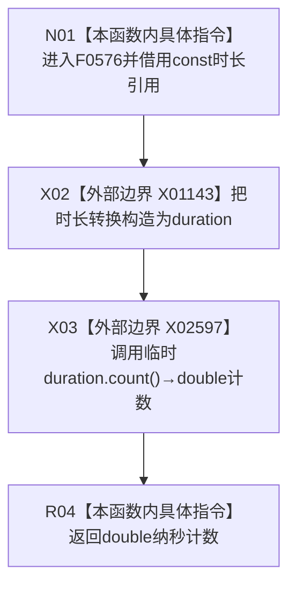

# CF-L6-0315 关系仓库性能基线纳秒现状流程图

图类型：现状流程图
代码版本：`a582776d1bd78ab88d972e32fbaece594eb43512`
源码 blob：`34c34bffcd80f78e28345292deb69aca2eabf38d`
覆盖文件：`海中鱼巣/核心/自检.关系仓库性能基线.ixx:66-68`
唯一根函数：F0576
完整签名：`double 海中鱼巣::关系仓库性能基线内部::纳秒(const 海中鱼巣::关系仓库性能基线内部::稳定时钟::duration& 时长)`
参数：`时长` 是调用期间有效的 const 左值引用，本函数不保存该引用
返回结果：把稳定时钟时长转换为以纳秒为 period 的 `duration<double,std::nano>`，返回其浮点计数
已登记调用方：F0279 经 E1343；F0284 经 E1379；F0285 经 E1387；F0286 经 E1394；F0287 经 E1401
直接项目函数：无
外部边界：X01143 `std::chrono::duration<double,std::nano>` 转换构造；X02597 `duration<double,std::nano>::count()`
未解析项目调用：0
调用图：`流程图/主程序可达调用关系/01_main可达项目调用边表.md`
逐行映射表：`流程图/代码流程图/L6/CF-L6-0315_关系仓库性能基线纳秒_逐行代码映射表.md`
偏差清单：无；本文只冻结当前代码事实
依据提交 / 结构化消息：当前提交、F0576、E1343、E1379、E1387、E1394、E1401、X01143、X02597 与源码逐行交叉复核
结构读取与写入：只读输入时长并形成临时 duration；零机器事实写入
逻辑内返回：无拒绝分支
内部错误：无
生命周期与资源释放：转换得到的临时 duration 在返回表达式结束时销毁
异常：本函数未声明 `noexcept`；当前两个 chrono 操作通常为纯值运算，本文不额外宣称实现级不抛出
并发 / 幂等：纯值转换，可重复调用
验证输出：66—68 行完整映射；5 条项目入边、0 条项目出边、2 个外部边界、0 个未解析调用
不得作为施工许可：是
不得宣称：返回值满足性能阈值、代表墙钟时间或性能基线通过

## 函数合同

```text
根函数：F0576 关系仓库性能基线内部::纳秒
归属模块 / 文件 / 层级：自检.关系仓库性能基线 / 海中鱼巣/核心/自检.关系仓库性能基线.ixx / L6
现有或待新增：现有自由函数
参数：稳定时钟 duration const 引用
返回结果：double 纳秒计数
被调函数流程图：无项目源码被调函数
```

## 流程图



## 节点合同

| 节点 | 类型 | 输入绑定 | 输出绑定 | 事实读写 | 后继 |
| --- | --- | --- | --- | --- | --- |
| N01 | 本函数内具体指令 | `const 稳定时钟::duration& 时长` | 借用输入 | 无 | X02 |
| X02 | 函数调用·外部边界 | `时长` | `duration<double,std::nano>` 临时值 | 无 | X03 |
| X03 | 函数调用·外部边界 | 临时 duration | `double` 计数 | 无 | R04 |
| R04 | 本函数内具体指令 | 浮点计数 | 返回值 | 无 | 结束 |

## 当前边界

- X01143 只对应 duration 的 period / rep 转换构造；X02597 单独对应 `.count()`。
- 返回值单位由 `std::nano` period 冻结为纳秒，表示传入 duration 的数值换算，不读取当前时钟。
- 浮点转换可能产生实现允许的舍入；本函数不设置精度、阈值或统计口径。
