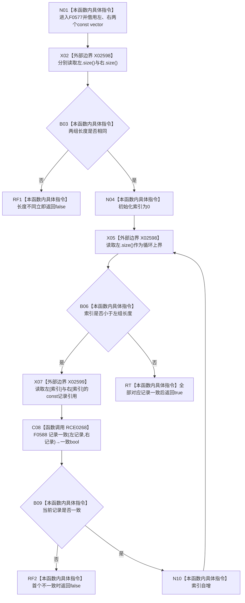

# CF-L6-0316 关系仓库性能基线记录组一致现状流程图

图类型：现状流程图
代码版本：`a582776d1bd78ab88d972e32fbaece594eb43512`
源码 blob：`34c34bffcd80f78e28345292deb69aca2eabf38d`
覆盖文件：`海中鱼巣/核心/自检.关系仓库性能基线.ixx:58-64`
唯一根函数：F0577
完整签名：`bool 海中鱼巣::关系仓库性能基线内部::记录组一致(const std::vector<海中鱼巣::关系记录>& 左, const std::vector<海中鱼巣::关系记录>& 右)`
参数：`左`、`右` 均是调用期间有效的 const vector 左值引用；本函数不保存引用
返回结果：两组长度相同且每个相同索引处的关系记录均经 F0588 判定一致时返回 `true`；长度不同或首个元素不一致时返回 `false`
已登记调用方：F0279 经 E1344
直接项目函数：RCE0268→F0588 `记录一致`
外部边界：X02598 `vector<关系记录>::size()` 共三次；X02599 const `operator[]` 共两次
未解析项目调用：0
调用图：`流程图/主程序可达调用关系/01_main可达项目调用边表.md`
逐行映射表：`流程图/代码流程图/L6/CF-L6-0316_关系仓库性能基线记录组一致_逐行代码映射表.md`
偏差清单：RCE0268 原实参载荷截断由当前源码冻结为 `左[索引],右[索引]`；本文不修改共享边表
依据提交 / 结构化消息：当前提交、F0577、F0588、E1344、RCE0268、X02598—X02599 与源码逐行交叉复核
结构读取与写入：只读两组关系记录；零机器事实写入
逻辑内返回：长度不等或任一对应记录不一致时返回 `false`
内部错误：无
生命周期与资源释放：索引为局部值；不取得或转移 vector / 记录所有权
异常：未捕获；`size()`、已由循环上界保证的 `operator[]` 与 F0588 异常均按实际实现向调用方传播
并发 / 幂等：纯只读比较；调用方必须保证两组在调用期间不被并发修改
验证输出：58—64 行完整映射；1 条项目入边、1 条项目出边、2 个外部边界 ID、0 个未解析调用
不得作为施工许可：是
不得宣称：`true` 证明生产仓库与参考表全局一致、关系顺序无关或性能基线通过

## 函数合同

```text
根函数：F0577 关系仓库性能基线内部::记录组一致
归属模块 / 文件 / 层级：自检.关系仓库性能基线 / 海中鱼巣/核心/自检.关系仓库性能基线.ixx / L6
现有或待新增：现有自由函数
参数：两个 const 关系记录 vector 引用
返回结果：逐索引全等 bool
被调函数流程图：F0588 在正式待绘队列，尚无已发布单函数图
```

## 流程图



## 节点合同

| 节点 | 类型 | 输入绑定 | 输出绑定 | 事实读写 | 后继 |
| --- | --- | --- | --- | --- | --- |
| N01 | 本函数内具体指令 | 左、右 const vector 引用 | 比较语境 | 无 | X02 |
| X02 / B03 | 函数调用·外部边界 / 本函数内具体指令 | 两组 vector | 长度相同 bool | 只读容器长度 | RF1 或 N04 |
| N04—B06 | 本函数内具体指令 / 函数调用·外部边界 | 索引、左组长度 | 循环继续 bool | 无 | X07 或 RT |
| X07 | 函数调用·外部边界 | 相同索引 | 两个 const 记录引用 | 只读记录 | C08 |
| C08 / B09 | 函数调用 / 本函数内具体指令 | 两条对应记录 | 一致 bool | 只读记录字段 | RF2 或 N10 |
| RF1 / RF2 / RT | 本函数内具体指令 | 比较结果 | bool | 无 | 结束 |

## 当前边界

- X02598 聚合第 59 行左右两次 `size()` 和第 60 行左组一次 `size()`；X02599 聚合第 61 行两次 const `operator[]`。
- RCE0268 的精确实参为 `左[索引]` 与 `右[索引]`，返回值被取反作为首个不一致的提前返回条件。
- 比较具有顺序敏感性：相同记录以不同排列出现时会返回 `false`；本函数不排序、不去重。
