# CF-L6-0317 关系仓库获取来源关系记录组现状流程图

图类型：现状流程图
代码版本：`711f200665a0e25e2a5801f144c6ad70b42cc787`
源码 blob：`f7a9ea9a09d3065468208c16f9ea34f806b6e183`
覆盖文件：`海中鱼巣/核心/关系仓库.cpp:919-947`
唯一根函数：F0578
完整签名：`std::vector<海中鱼巣::关系记录> 海中鱼巣::关系仓库::获取来源关系记录组(海中鱼巣::节点句柄 目标节点, 海中鱼巣::关系类型 类型) const`
参数：`目标节点`、`类型` 按值传入；隐式 const `this` 为调用期间有效的非拥有借用
返回结果：返回状态、类型和目标匹配且源节点当前有效的关系记录，按关系编号升序；许可拒绝、入口无效或无候选时返回空 vector
已登记调用方：F0279 经 E1345；R0079 经 RCE0482
直接项目函数：RCE2267→F0336、RCE2268→F0337、RCE2269→F0397、RCE2270→F0375、RCE2271→F0338、RCE2272→F0339、RCE2273→F0340；E1756→F0341；E1773→F0343；RCE2274→F0051；E1794→F0344；E1826→F0345
外部边界：X01144 共享锁构造；X02600—X02604 关系表 const 范围；X02605 vector 追加；X02606 size；X02607 reserve；X02608—X02612 结果候选范围；X01145 排序；X02613 共享锁析构
未解析项目调用：0
调用图：`流程图/主程序可达调用关系/01_main可达项目调用边表.md`
逐行映射表：`流程图/代码流程图/L6/CF-L6-0317_关系仓库获取来源关系记录组_逐行代码映射表.md`
偏差清单：无；本文按正式共享关系表与本批稳定 ID 冻结当前代码事实
依据提交 / 结构化消息：指定代码基线、F0578、全部入边、12 条项目出边、16 个外部边界与源码逐行交叉复核
结构读取与写入：只读事务接线、关系表和节点当前性；仅改变两个局部 vector
逻辑内返回：许可无效、目标节点无效、类型未定义或没有候选时返回空 vector
内部错误：本函数不写机器结构；异常不转换为空结果
生命周期与资源释放：共享锁先析构；若已承载令牌范围和许可，再依次析构 F0344、F0345
异常：未捕获；许可、锁、容器或被调函数异常在逆序释放已构造资源后传播
并发 / 幂等：共享锁只保护关系表扫描；源节点当前性查询与返回材料不形成返回后的持续快照
验证输出：919—947 行完整映射；2 条项目入边、12 条项目出边、16 个外部边界、0 个未解析调用
不得作为施工许可：是
不得宣称：空结果唯一证明没有反向关系、返回组是跨仓永久快照或本函数修改了关系

## 流程图

```mermaid
flowchart TD
    N01["N01【本函数内具体指令】进入F0578并绑定目标节点、类型与const this"]
    C02["C02【函数调用 RCE2267】F0336 事务接线_.已接域()→已接域"]
    B03{"B03【本函数内具体指令】已接域"}
    C04["C04【函数调用 RCE2268】F0337 读取当前关系令牌(*this)→当前令牌"]
    B05{"B05【本函数内具体指令】当前令牌为空"}
    C06["C06【函数调用 RCE2269】F0397 取得共享许可(运行期状态)→临时许可"]
    C07["C07【函数调用 RCE2270】F0375 移动构造自动许可"]
    C08["C08【函数调用 RCE2271】F0338 自动许可.有效()→许可有效"]
    B09{"B09【本函数内具体指令】许可是否有效"}
    C10["C10【函数调用 RCE2272】F0339 自动许可.读取令牌()→令牌引用"]
    C11["C11【函数调用 RCE2273】F0340 构造自动关系令牌范围"]
    N12["N12【本函数内具体指令】默认构造空记录候选组"]
    C13["C13【函数调用 E1773】F0343 节点有效_(目标节点)→目标有效"]
    C14["C14【函数调用 E1756】F0341 关系类型已定义(类型)→类型有效"]
    B15{"B15【本函数内具体指令】目标与类型是否均有效"}
    X16["X16【外部边界 X01144】构造仓库共享锁"]
    X17["X17【外部边界 X02600/X02601】取得关系表const范围"]
    B18{"B18【外部边界 X02603】关系表迭代器未到末尾"}
    X19["X19【外部边界 X02604】解引用关系表迭代器"]
    B20{"B20【本函数内具体指令】记录状态有效且类型匹配"}
    X21["X21【外部边界 X02605】追加到记录候选组"]
    X22["X22【外部边界 X02602】递增关系表迭代器"]
    X23["X23【外部边界 X02613】析构共享锁"]
    N24["N24【本函数内具体指令】默认构造最终记录组"]
    X25["X25【外部边界 X02606】读取候选组size"]
    X26["X26【外部边界 X02607】按候选数量reserve"]
    X27["X27【外部边界 X02608/X02609】取得候选组范围"]
    B28{"B28【外部边界 X02611】候选迭代器未到末尾"}
    X29["X29【外部边界 X02612】解引用当前候选记录"]
    C30["C30【函数调用 E1773】F0343 节点有效_(记录.源节点)→源有效"]
    B31{"B31【本函数内具体指令】源节点当前有效"}
    X32["X32【外部边界 X02605】追加到最终记录组"]
    X33["X33【外部边界 X02610】递增候选迭代器"]
    X34["X34【外部边界 X02608/X02609】取得最终组排序范围"]
    X35["X35【外部边界 X01145】按关系编号升序排序"]
    C36["C36【函数调用 RCE2274】F0051 比较记录目标节点与输入目标节点"]
    B37{"B37【本函数内具体指令】目标节点是否匹配"}
    N38["N38【本函数内具体指令】形成当前vector返回值"]
    D39["D39【函数调用 E1794】若已承载则析构F0344令牌范围"]
    D40["D40【函数调用 E1826】若已承载则析构F0345许可"]
    R41["R41【本函数内具体指令】按值返回记录组"]
    E42["E42【本函数内具体指令】逆序释放后继续传播异常"]

    N01 --> C02 --> B03
    B03 -- "否" --> N12
    B03 -- "是" --> C04 --> B05
    B05 -- "否" --> N12
    B05 -- "是" --> C06 --> C07 --> C08 --> B09
    B09 -- "否" --> D40 --> R41
    B09 -- "是" --> C10 --> C11 --> N12
    N12 --> C13 --> C14 --> B15
    B15 -- "否" --> N38
    B15 -- "是" --> X16 --> X17 --> B18
    B18 -- "是" --> X19 --> B20
    B20 -- "否" --> X22
    B20 -- "是" --> C36 --> B37
    B37 -- "否" --> X22
    B37 -- "是" --> X21 --> X22
    X22 --> B18
    B18 -- "否" --> X23 --> N24 --> X25 --> X26 --> X27 --> B28
    B28 -- "是" --> X29 --> C30 --> B31
    B31 -- "是" --> X32 --> X33
    B31 -- "否" --> X33
    X33 --> B28
    B28 -- "否" --> X34 --> X35 --> N38
    N38 --> D39 --> D40 --> R41
    X16 -. "异常" .-> D39
    X21 -. "异常" .-> X23
    X32 -. "异常" .-> D39
    X35 -. "异常" .-> D39
    D39 -. "异常路径" .-> D40
    D40 -. "异常路径" .-> E42
```

## 项目源码调用合同

| 调用边 | 被调函数 | 实参 / 条件 |
| --- | --- | --- |
| RCE2267—RCE2273 | F0336、F0337、F0397、F0375、F0338、F0339、F0340 | 依次建立共享许可与关系令牌范围；只有已接域且无当前令牌时取得许可 |
| E1756 | F0341 `关系类型已定义` | `类型`；目标节点有效后调用 |
| E1773 | F0343 `节点有效_` | 输入目标节点；筛选后的记录源节点 |
| RCE2274 | F0051 节点句柄相等 | `记录.目标节点`、`目标节点`；状态和类型匹配后调用 |
| E1794 / E1826 | F0344 / F0345 析构 | 已承载对象按令牌范围、许可顺序释放 |

## 当前边界

- RCE2267—RCE2273 是第 920 行宏的真实项目调用顺序；许可无效时在任何关系读取前返回空 vector。
- RCE2274 对应第 931 行目标句柄比较；E1773 分别覆盖第 922 行输入目标节点和第 939 行候选记录源节点。
- X02608/X02609 各执行两次：候选范围遍历一次、最终结果排序范围一次。
- 返回材料不携带共享锁、许可、令牌或版本见证。
