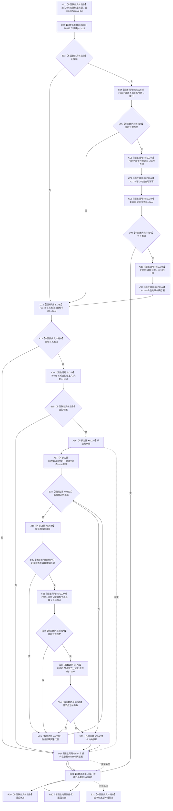

# CF-L6-0319 关系仓库存在目标关系现状流程图

图类型：现状流程图
代码版本：`711f200665a0e25e2a5801f144c6ad70b42cc787`
源码 blob：`f7a9ea9a09d3065468208c16f9ea34f806b6e183`
覆盖文件：`海中鱼巣/核心/关系仓库.cpp:996-1010`
唯一根函数：F0580
完整签名：`bool 海中鱼巣::关系仓库::存在目标关系(海中鱼巣::关系类型 类型, 海中鱼巣::节点句柄 目标节点) const`
参数：`类型`、`目标节点` 按值传入；隐式 const `this` 为非拥有借用
返回结果：存在状态有效、类型和目标匹配且源节点当前有效的记录时返回 true；否则返回 false
已登记调用方：E1350、E1663、RCE0489、RCE1576、RCE1577、RCE1722
直接项目函数：RCE2283→F0336、RCE2284→F0337、RCE2285→F0397、RCE2286→F0375、RCE2287→F0338、RCE2288→F0339、RCE2289→F0340；E1758→F0341；E1780→F0343；RCE2290→F0051；E1797→F0344；E1832→F0345
外部边界：X01147 共享锁构造；X02620—X02624 关系表 const 范围；X02625 共享锁析构
未解析项目调用：0
调用图：`流程图/主程序可达调用关系/01_main可达项目调用边表.md`
逐行映射表：`流程图/代码流程图/L6/CF-L6-0319_关系仓库存在目标关系_逐行代码映射表.md`
偏差清单：无；只冻结当前代码事实
依据提交 / 结构化消息：指定代码基线、F0580、全部稳定入边 / 出边 / 外部边界与源码逐行交叉复核
结构读取与写入：只读事务接线、节点当前性和关系表；不写机器结构
逻辑内返回：许可无效、入口无效或遍历无匹配时返回 false
内部错误：无写后内部错误分支
生命周期与资源释放：共享锁先释放，再按承载状态析构关系令牌范围和许可
异常：未捕获；已构造资源逆序释放后传播
并发 / 幂等：共享锁保护本次扫描；返回后不保持快照
验证输出：996—1010 行完整映射；6 条项目入边、12 条项目出边、7 个外部边界、0 个未解析调用
不得作为施工许可：是
不得宣称：false 唯一证明没有目标关系，或 true 证明关系返回后持续有效

## 流程图

## 当前边界

- RCE2283—RCE2289 完整表达第 997 行宏；许可无效时不进入节点或关系表读取。
- E1780 分别覆盖第 998 行输入目标节点和第 1005 行匹配记录源节点。
- RCE2290 只对应第 1004 行目标句柄比较。
- X02620—X02624 只在入口目标和类型有效且共享锁已构造后执行。
