# CF-L6-0320 关系仓库获取节点相关关系记录组现状流程图

图类型：现状流程图
代码版本：`711f200665a0e25e2a5801f144c6ad70b42cc787`
源码 blob：`f7a9ea9a09d3065468208c16f9ea34f806b6e183`
覆盖文件：`海中鱼巣/核心/关系仓库.cpp:949-978`
唯一根函数：F0581
完整签名：`std::vector<海中鱼巣::关系记录> 海中鱼巣::关系仓库::获取节点相关关系记录组(海中鱼巣::节点句柄 节点) const`
参数：`节点` 按值传入；隐式 const `this` 为非拥有借用
返回结果：返回状态有效、源或目标匹配输入节点且两端点当前均有效的关系记录，按关系编号升序；许可拒绝、入口无效或无候选时返回空 vector
已登记调用方：F0279 经 E1352
直接项目函数：RCE2291→F0336、RCE2292→F0337、RCE2293→F0397、RCE2294→F0375、RCE2295→F0338、RCE2296→F0339、RCE2297→F0340；E1775→F0343；RCE2298→F0051；E1795→F0344；E1828→F0345
外部边界：X01148 共享锁构造；X02626—X02630 关系表 const 范围；X02631 vector 追加；X01149/X01151 迭代器移动物化；X01150 `remove_if`；X02632 `erase`；X02633/X02634 vector 范围；X01152 排序；X02635 共享锁析构
未解析项目调用：0
调用图：`流程图/主程序可达调用关系/01_main可达项目调用边表.md`
逐行映射表：`流程图/代码流程图/L6/CF-L6-0320_关系仓库获取节点相关关系记录组_逐行代码映射表.md`
偏差清单：无；只冻结当前代码事实
依据提交 / 结构化消息：指定代码基线、F0581、全部稳定入边 / 出边 / 外部边界与源码逐行交叉复核
结构读取与写入：只读事务接线、关系表和节点当前性；仅改变局部 vector
逻辑内返回：许可无效、输入节点无效或没有通过过滤的记录时返回空 vector
内部错误：本函数不写机器结构；异常不转换为空结果
生命周期与资源释放：关系表扫描结束先析构共享锁；函数退出再按承载状态析构令牌范围和许可
异常：未捕获；已构造资源逆序释放后传播
并发 / 幂等：共享锁仅保护初次关系表复制；锁释放后的端点复核不构成同一关系表锁快照
验证输出：949—978 行完整映射；1 条项目入边、11 条项目出边、15 个外部边界、0 个未解析调用
不得作为施工许可：是
不得宣称：返回组是跨仓原子快照、空结果唯一证明节点无关系或本函数删除了机器关系

## 流程图

```mermaid
flowchart TD
    N01["N01【本函数内具体指令】进入F0581并绑定节点与const this"]
    C02["C02【函数调用 RCE2291】F0336 已接域()→bool"]
    B03{"B03【本函数内具体指令】已接域"}
    C04["C04【函数调用 RCE2292】F0337 读取当前关系令牌→指针"]
    B05{"B05【本函数内具体指令】当前令牌为空"}
    C06["C06【函数调用 RCE2293】F0397 取得共享许可→临时许可"]
    C07["C07【函数调用 RCE2294】F0375 移动构造自动许可"]
    C08["C08【函数调用 RCE2295】F0338 许可有效()→bool"]
    B09{"B09【本函数内具体指令】许可有效"}
    C10["C10【函数调用 RCE2296】F0339 读取令牌→const引用"]
    C11["C11【函数调用 RCE2297】F0340 构造关系令牌范围"]
    N12["N12【本函数内具体指令】默认构造空候选vector"]
    C13["C13【函数调用 E1775】F0343 节点有效_(输入节点)→bool"]
    B14{"B14【本函数内具体指令】输入节点有效"}
    X15["X15【外部边界 X01148】构造共享锁"]
    X16["X16【外部边界 X02626/X02627】取得关系表const范围"]
    B17{"B17【外部边界 X02629】关系表迭代器未到末尾"}
    X18["X18【外部边界 X02630】解引用当前条目"]
    B19{"B19【本函数内具体指令】记录状态有效"}
    C20["C20【函数调用 RCE2298】F0051 比较记录源节点与输入节点"]
    B21{"B21【本函数内具体指令】源节点匹配"}
    C22["C22【函数调用 RCE2298】F0051 比较记录目标节点与输入节点"]
    B23{"B23【本函数内具体指令】目标节点匹配"}
    X24["X24【外部边界 X02631】追加当前记录"]
    X25["X25【外部边界 X02628】递增关系表迭代器"]
    X26["X26【外部边界 X02635】析构共享锁"]
    X27["X27【外部边界 X02633/X02634/X01149】形成remove_if范围参数"]
    X28["X28【外部边界 X01150】remove_if调度端点有效谓词"]
    C29["C29【函数调用 E1775】F0343 节点有效_(记录.源节点)→bool"]
    B30{"B30【本函数内具体指令】源节点无效"}
    C31["C31【函数调用 E1775】F0343 节点有效_(记录.目标节点)→bool"]
    B32{"B32【本函数内具体指令】目标节点无效"}
    X33["X33【外部边界 X01151/X02634】形成erase末端参数"]
    X34["X34【外部边界 X02632】擦除remove_if尾段"]
    X35["X35【外部边界 X02633/X02634】取得排序范围"]
    X36["X36【外部边界 X01152】按关系编号升序排序"]
    D37["D37【函数调用 E1795】析构已承载F0344令牌范围"]
    D38["D38【函数调用 E1828】析构已承载F0345许可"]
    R39["R39【本函数内具体指令】按值返回记录vector"]
    E40["E40【本函数内具体指令】逆序释放后传播异常"]

    N01 --> C02 --> B03
    B03 -- "否" --> N12
    B03 -- "是" --> C04 --> B05
    B05 -- "否" --> N12
    B05 -- "是" --> C06 --> C07 --> C08 --> B09
    B09 -- "否" --> D38 --> R39
    B09 -- "是" --> C10 --> C11 --> N12
    N12 --> C13 --> B14
    B14 -- "否" --> D37
    B14 -- "是" --> X15 --> X16 --> B17
    B17 -- "是" --> X18 --> B19
    B19 -- "否" --> X25
    B19 -- "是" --> C20 --> B21
    B21 -- "是" --> X24
    B21 -- "否" --> C22 --> B23
    B23 -- "是" --> X24
    B23 -- "否" --> X25
    X24 --> X25 --> B17
    B17 -- "否" --> X26 --> X27 --> X28 --> C29 --> B30
    B30 -- "是" --> X33
    B30 -- "否" --> C31 --> B32 --> X33
    X33 --> X34 --> X35 --> X36 --> D37 --> D38 --> R39
    X15 -. "异常" .-> D37
    X34 -. "异常" .-> D37
    X36 -. "异常" .-> D37
    D37 -. "异常路径" .-> D38
    D38 -. "异常路径" .-> E40
```

## 当前边界

- RCE2291—RCE2297 完整表达第 950 行共享许可宏。
- RCE2298 在第 960 行按 `||` 左到右短路执行最多两次；E1775 分别覆盖输入节点、remove_if 谓词中的记录源节点和目标节点。
- X01149/X01151 是既有迭代器移动物化边界；X02633/X02634 精确记录同一表达式中的 vector `begin/end`。
- `erase(remove_if(...), end())` 只改变局部返回 vector，不删除关系表记录。
