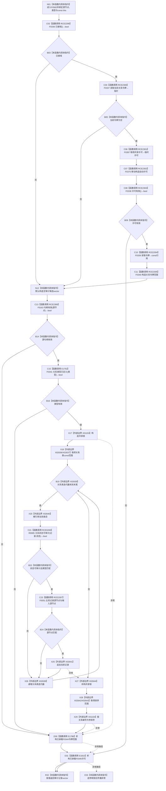

# CF-L6-0321 关系仓库获取关系审计记录组现状流程图

图类型：现状流程图
代码版本：`711f200665a0e25e2a5801f144c6ad70b42cc787`
源码 blob：`f7a9ea9a09d3065468208c16f9ea34f806b6e183`
覆盖文件：`海中鱼巣/核心/关系仓库.cpp:314-337`
唯一根函数：F0582
完整签名：`std::vector<海中鱼巣::关系记录> 海中鱼巣::关系仓库::获取关系审计记录组(海中鱼巣::节点句柄 源节点, 海中鱼巣::关系类型 类型) const`
参数：`源节点`、`类型` 按值传入；隐式 const `this` 为非拥有借用
返回结果：返回状态可审计、类型和源节点匹配的关系记录，按关系编号升序；许可拒绝、入口无效或无候选时返回空 vector
已登记调用方：F0279 经 E1355；R0074 经 RCE0467
直接项目函数：RCE2299→F0336、RCE2300→F0337、RCE2301→F0397、RCE2302→F0375、RCE2303→F0338、RCE2304→F0339、RCE2305→F0340；RCE2306→F0163；E1752→F0341；RCE0269→R0085；RCE2307→F0051；E1786→F0344；E1810→F0345
外部边界：X01153 共享锁构造；X02636—X02640 关系表 const 范围；X02641 vector 追加；X02642/X02643 排序范围；X01154 排序；X02644 共享锁析构
未解析项目调用：0
调用图：`流程图/主程序可达调用关系/01_main可达项目调用边表.md`
逐行映射表：`流程图/代码流程图/L6/CF-L6-0321_关系仓库获取关系审计记录组_逐行代码映射表.md`
偏差清单：无；只冻结当前代码事实
依据提交 / 结构化消息：指定代码基线、F0582、全部稳定入边 / 出边 / 外部边界与源码逐行交叉复核
结构读取与写入：只读事务接线和关系表；仅改变局部 vector
逻辑内返回：许可无效、源句柄无效、类型未定义或无候选时返回空 vector
内部错误：本函数不写机器结构；异常不转换为空结果
生命周期与资源释放：共享锁先释放，再按承载状态析构关系令牌范围和许可
异常：未捕获；已构造资源逆序释放后传播
并发 / 幂等：共享锁保护关系表审计读取；返回材料不携带锁或版本见证
验证输出：314—337 行完整映射；2 条项目入边、13 条项目出边、11 个外部边界、0 个未解析调用
不得作为施工许可：是
不得宣称：审计记录组都是当前有效关系、空结果唯一证明无历史关系或本函数修改了审计事实

## 流程图

## 当前边界

- RCE2299—RCE2305 完整表达第 317 行共享许可宏。
- RCE2306 是第 319 行节点句柄重载，不是 `节点有效_`；RCE2307 对应第 328 行节点句柄相等。
- RCE0269 允许有效与已失效等可审计状态进入候选，不等于记录当前有效。
- X02642/X02643 只为第 333 行排序提供局部 vector 范围。
