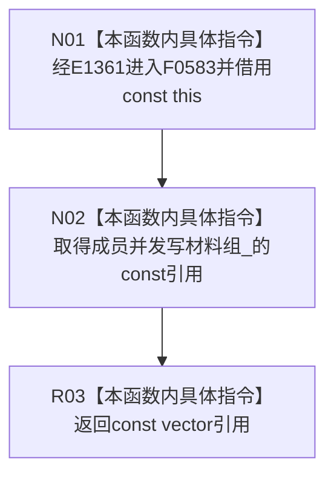

# CF-L6-0322 关系仓库性能基线隔离关系夹具读取并发写材料组现状流程图

图类型：现状流程图
代码版本：`711f200665a0e25e2a5801f144c6ad70b42cc787`
源码 blob：`34c34bffcd80f78e28345292deb69aca2eabf38d`
覆盖文件：`海中鱼巣/核心/自检.关系仓库性能基线.ixx:330`
唯一根函数：F0583
完整签名：`const std::vector<海中鱼巣::关系仓库性能基线内部::并发写材料>& 海中鱼巣::关系仓库性能基线内部::隔离关系夹具::读取并发写材料组() const`
参数：无显式参数；隐式 const `this` 为调用期间有效的非拥有借用
返回结果：返回成员 `并发写材料组_` 的 const 非拥有引用
已登记调用方：F0282 经 E1361
直接项目函数：无
外部边界：无
未解析项目调用：0
调用图：`流程图/主程序可达调用关系/01_main可达项目调用边表.md`
逐行映射表：`流程图/代码流程图/L6/CF-L6-0322_关系仓库性能基线隔离关系夹具读取并发写材料组_逐行代码映射表.md`
偏差清单：无；只冻结当前自检代码事实
依据提交 / 结构化消息：指定代码基线、F0583、E1361 与源码第 330 行交叉复核
结构读取与写入：只读成员 vector 身份；不复制、不写入材料组
逻辑内返回：无分支；唯一返回 const 引用
内部错误：本函数无内部错误分支
生命周期与资源释放：返回引用不延长夹具或成员生命周期；调用方必须保证夹具持续有效
异常：成员引用返回不抛出异常
并发 / 幂等：无同步；并发安全取决于外部对夹具和成员 vector 的访问纪律
验证输出：第 330 行完整映射；1 条项目入边、0 个项目出边、0 个外部边界、0 个未解析调用
不得作为施工许可：是
不得宣称：返回引用证明并发写材料数量正确、材料已验证、生产仓库已接线或并发基线通过

## 流程图

## 当前边界

- F0583 不调用 vector 成员函数，只把既有成员对象绑定为 const 引用返回。
- 返回引用的有效期受 `隔离关系夹具` 生命周期约束；本函数不复制或冻结材料内容。
