# CF-L6-0323 关系仓库性能基线运行并发基线线程 lambda 现状流程图

图类型：现状流程图
代码版本：`711f200665a0e25e2a5801f144c6ad70b42cc787`
源码 blob：`34c34bffcd80f78e28345292deb69aca2eabf38d`
覆盖文件：`海中鱼巣/核心/自检.关系仓库性能基线.ixx:658-687`
唯一根函数：F0584
完整签名：`void 海中鱼巣::关系仓库性能基线内部::运行并发基线(海中鱼巣::关系仓库性能基线内部::隔离关系夹具&, const 海中鱼巣::关系仓库性能基线内部::查询定义&, double)::<lambda@自检.关系仓库性能基线.ixx:658>::operator()() const`
参数：无显式参数；`线程索引` 按值捕获，其余所用外层局部对象与夹具按引用捕获
返回结果：`void`；把本线程最终关系句柄写入 `最终关系组[线程索引]`
已登记调用方：F0282 经 E1362 作为 `std::thread` 回调调度
直接项目函数：E1365→F0279 `执行查询`；E1366→F0288 `读取关系仓库`；E1367→F0586 `重挂关系并返回新句柄`
外部边界：X02645 写材料组 const 下标；X01156 线程样本 vector 下标；X02646 reserve；X02647 atomic load；X01157 yield；X01159 `steady_clock::now`；X01160 时间点比较；X02648 atomic store；X02649 size；X02650 push_back；X02651 fetch_add；X01161 optional 访问 / 生命周期；X02652 关系句柄 vector 下标
未解析项目调用：0
调用图：`流程图/主程序可达调用关系/01_main可达项目调用边表.md`
逐行映射表：`流程图/代码流程图/L6/CF-L6-0323_关系仓库性能基线运行并发基线线程lambda_逐行代码映射表.md`
偏差清单：无；只冻结隔离关系仓库性能自检代码事实
依据提交 / 结构化消息：指定代码基线、F0584、E1362/E1365—E1367、X01156/X01157/X01159—X01161、X02645—X02652 与源码逐行交叉复核
结构读取与写入：读取隔离夹具并经 F0586 重挂隔离关系；写线程局部样本、原子正确位 / 操作计数和最终关系组；不触碰生产仓库
逻辑内返回：查询不正确或重挂返回空 optional 时把 `正确` 置 false 并退出当前循环，最终仍执行 void 收口
内部错误：本 lambda 不把失败转换成成功；具体关系重挂内部错误由 F0586 合同承担
生命周期与资源释放：捕获引用只在所属 `std::thread` 完成前有效；局部 optional、写材料副本和引用在 lambda 返回时释放
异常：未捕获；被调函数或容器异常会沿线程函数传播并触发 `std::terminate`
并发 / 幂等：四线程共享原子开始位、正确位和计数；每线程写独立样本槽与最终关系槽，但共同操作隔离关系仓库
验证输出：658—687 行完整映射；1 条项目入边、3 条项目出边、13 个外部边界、0 个未解析调用
不得作为施工许可：是
不得宣称：线程回调完成证明性能阈值通过、生产并发安全、生产关系已修改或完整验收完成

## 流程图

```mermaid
flowchart TD
    N01["N01【本函数内具体指令】经E1362进入F0584；绑定捕获并按值取得线程索引"]
    X02["X02【外部边界 X02645】写材料组[线程索引]→写材料副本"]
    N03["N03【本函数内具体指令】初始化使用乙=false"]
    X04["X04【外部边界 X01156】线程读取样本[线程索引]→本线程样本引用"]
    X05["X05【外部边界 X02646】为本线程样本reserve 512"]
    X06["X06【外部边界 X02647】开始.load(acquire)→已开始"]
    B07{"B07【本函数内具体指令】已开始"}
    X08["X08【外部边界 X01157】当前线程yield"]
    X09["X09【外部边界 X01159】steady_clock::now()→当前时刻"]
    X10["X10【外部边界 X01160】当前时刻与窗口结束比较"]
    B39{"B39【本函数内具体指令】当前时刻早于窗口结束"}
    X11["X11【外部边界 X02647】正确.load(relaxed)→仍正确"]
    B12{"B12【本函数内具体指令】正确位仍为true"}
    N13["N13【本函数内具体指令】初始化读取次数=0"]
    B14{"B14【本函数内具体指令】读取次数小于9"}
    C15["C15【函数调用 E1365】F0279 夹具.执行查询(密集正向)→测量"]
    B16{"B16【本函数内具体指令】测量是否正确"}
    X17["X17【外部边界 X02648】正确.store(false,relaxed)"]
    N18["N18【本函数内具体指令】跳出九读循环"]
    X19["X19【外部边界 X02649】读取本线程样本size"]
    B20{"B20【本函数内具体指令】样本数小于512"}
    X21["X21【外部边界 X02650】追加测量耗时纳秒"]
    X22["X22【外部边界 X02651】完成操作数量.fetch_add(1,relaxed)"]
    N23["N23【本函数内具体指令】读取次数递增"]
    X24["X24【外部边界 X02647】正确.load(relaxed)→仍正确"]
    B25{"B25【本函数内具体指令】仍正确"}
    N26["N26【本函数内具体指令】按使用乙选择目标甲或目标乙"]
    C27["C27【函数调用 E1366】F0288 夹具.读取关系仓库()→仓库引用"]
    C28["C28【函数调用 E1367】F0586 重挂关系并返回新句柄→新关系optional"]
    X29["X29【外部边界 X01161】检查新关系.has_value()"]
    B30{"B30【本函数内具体指令】新关系有值"}
    X31["X31【外部边界 X02648】正确.store(false,relaxed)"]
    N32["N32【本函数内具体指令】跳出吞吐窗口循环"]
    X33["X33【外部边界 X01161】解引用新关系optional"]
    N34["N34【本函数内具体指令】更新写材料关系并翻转使用乙"]
    X35["X35【外部边界 X02651】完成操作数量.fetch_add(1,relaxed)"]
    X36["X36【外部边界 X02652】最终关系组[线程索引]取得槽位"]
    N37["N37【本函数内具体指令】写入本线程最终关系句柄"]
    R38["R38【本函数内具体指令】释放X01161局部optional等并返回void"]

    N01 --> X02 --> N03 --> X04 --> X05 --> X06 --> B07
    B07 -- "否" --> X08 --> X06
    B07 -- "是" --> X09 --> X10 --> B39
    B39 -- "否" --> X36
    B39 -- "是" --> X11 --> B12
    B12 -- "否" --> X36
    B12 -- "是" --> N13 --> B14
    B14 -- "否" --> X24
    B14 -- "是" --> C15 --> B16
    B16 -- "否" --> X17 --> N18 --> X24
    B16 -- "是" --> X19 --> B20
    B20 -- "是" --> X21 --> X22
    B20 -- "否" --> X22
    X22 --> N23 --> B14
    X24 --> B25
    B25 -- "否" --> X36
    B25 -- "是" --> N26 --> C27 --> C28 --> X29 --> B30
    B30 -- "否" --> X31 --> N32 --> X36
    B30 -- "是" --> X33 --> N34 --> X35 --> X09
    X36 --> N37 --> R38
```

## 当前边界

- X02647 聚合第 663 行 acquire 读取和第 664、674 行 relaxed 读取，共 3 次；X02648、X02651 各执行最多 2 次。
- X01159 已精确化为第 664 行 `steady_clock::now()`；时间点比较由 X01160 单独承担。
- X01161 覆盖新关系 optional 的有值检查、解引用和局部生命周期；空 optional 分支把共享正确位置 false。
- F0586 修改的是性能自检隔离夹具内关系仓库；本图不把该行为写成生产关系能力。
