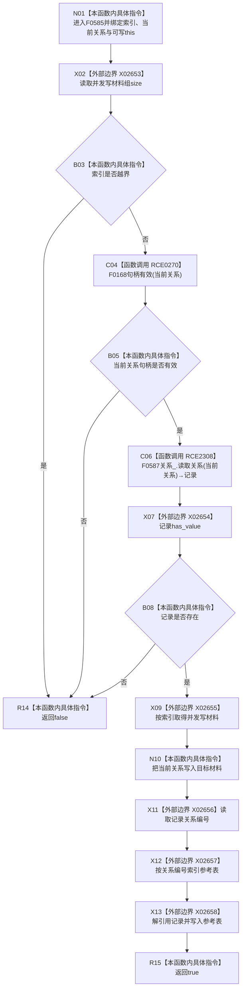

# CF-L6-0324 关系仓库性能基线隔离关系夹具更新并发写关系现状流程图

图类型：现状流程图
代码版本：`711f200665a0e25e2a5801f144c6ad70b42cc787`
源码 blob：`34c34bffcd80f78e28345292deb69aca2eabf38d`
覆盖文件：`海中鱼巣/核心/自检.关系仓库性能基线.ixx:332-339`
唯一根函数：F0585
完整签名：`bool 海中鱼巣::关系仓库性能基线内部::隔离关系夹具::更新并发写关系(std::size_t 索引, 海中鱼巣::关系句柄 当前关系)`
参数：索引和当前关系按值传入；隐式可写 `this` 为非拥有借用
返回结果：索引合法、关系句柄有效且可读回时，同步并发写材料与参考表后返回 `true`；否则返回 `false`
已登记调用方：F0282 经 E1363
直接项目函数：RCE0270→F0168；RCE2308→F0587
外部边界：X02653 `vector::size`、X02654 optional `has_value`、X02655 vector 下标、X02656 optional `operator->`、X02657 map 下标、X02658 optional `operator*`
未解析项目调用：0
调用图：`流程图/主程序可达调用关系/01_main可达项目调用边表.md`
逐行映射表：`流程图/代码流程图/L6/CF-L6-0324_关系仓库性能基线隔离关系夹具更新并发写关系_逐行代码映射表.md`
偏差清单：无；本文按当前代码与稳定边界冻结自检夹具事实
结构读取与写入：读取关系仓库；更新一项并发写材料的关系句柄和参考表对应关系记录
逻辑内返回：索引越界、句柄无效或关系读回为空时返回 `false`
内部错误：两处写入之间无显式事务；参考表写入异常时材料句柄可能已更新
生命周期与资源释放：optional 关系记录为局部值，函数退出时释放
异常：未捕获；容器或关系读取异常沿调用栈传播
并发 / 幂等：函数名用于并发写自检材料，但本函数自身无锁；调用方必须提供适当隔离
验证输出：332—339 行完整映射；1 条项目入边、2 条项目出边、6 个外部边界、0 个未解析调用
不得作为施工许可：是
不得宣称：夹具参考表同步是生产事务提交或并发安全保证

## 流程图

## 项目调用合同

| 调用边 | 节点 | 被调函数 | 实参 / 结果 | 条件 |
| --- | --- | --- | --- | --- |
| RCE0270 | C04 | F0168 `句柄有效(const 关系句柄&)` | `当前关系` → bool | 索引未越界后执行 |
| RCE2308 | C06 | F0587 `关系仓库::读取关系(关系句柄) const` | `this=&关系_`、`当前关系` → optional 记录 | 索引合法且句柄有效 |

## 当前边界

- 第 333 行按 `||` 短路：只有索引未越界才调用 RCE0270。
- 第 336 行先更新并发写材料，第 337 行再更新参考表；两步不是原子提交。
- 返回 `false` 不修改越界或读回失败分支，但不包装异常。
