# CF-L6-0325 关系仓库重挂关系并返回新句柄现状流程图

图类型：现状流程图
代码版本：`711f200665a0e25e2a5801f144c6ad70b42cc787`
源码 blob：`f7a9ea9a09d3065468208c16f9ea34f806b6e183`
覆盖文件：`海中鱼巣/核心/关系仓库.cpp:431-479`；宏展开依据同文件 `116-123`
唯一根函数：F0586
完整签名：`std::optional<海中鱼巣::关系句柄> 海中鱼巣::关系仓库::重挂关系并返回新句柄(海中鱼巣::关系句柄 关系, 海中鱼巣::节点句柄 新源节点, 海中鱼巣::节点句柄 新目标节点)`
参数：关系、新源节点、新目标节点均按值传入；隐式可写 `this` 为非拥有借用
返回结果：共享许可、两个新端点、目标关系当前形状、类型准入、版本容量和全表唯一性全部通过时，在独占锁内更新端点并递增版本，返回新句柄；否则返回空 optional
已登记调用方：E1390、RCE0266、E1367
直接项目函数：RCE2309→F0336、RCE2310→F0337、RCE2311→F0397、RCE2312→F0375、RCE2313→F0338、RCE2314→F0339、RCE2315→F0340；RCE2316→F0163；E1763→F0343；RCE2317→F0184；RCE2318→F0051；E1789→F0344；E1816→F0345
外部边界：X01162 独占锁构造、X01163 查找迭代器比较、X01164 optional 句柄构造；X02659 独占锁析构、X02660 `find`、X02661 `end`、X02662 迭代器 `operator->`、X02663 `numeric_limits::max`、X02664—X02668 关系表范围 begin/end/递增/不等/解引用
未解析项目调用：0
逐行映射表：`流程图/代码流程图/L6/CF-L6-0325_关系仓库重挂关系并返回新句柄_逐行代码映射表.md`
偏差清单：无
结构读取与写入：在独占锁内扫描关系表，并原位更新目标关系的源、目标与版本号
逻辑内返回：许可、新端点、关系形状、类型、版本或唯一性任一不满足时返回空 optional
内部错误：版本耗尽经 RCE2317 记录追根因诊断后返回空；诊断不修复结构
生命周期与资源释放：独占锁先释放；已承载关系令牌范围经 E1789 先于自动许可经 E1816 析构
异常：未捕获；按已构造状态逆序释放后传播
并发 / 幂等：关系表读取和写入在同一独占锁内；旧句柄成功一次后因版本变化不能再次重挂
验证输出：431—479 行完整映射；3 条项目入边、13 条项目出边、13 个外部边界、0 个未解析调用
不得作为施工许可：是
不得宣称：空 optional 唯一表示冲突，或重挂同时修改其它关系

## 流程图

```mermaid
flowchart TD
    N01["N01【本函数内具体指令】进入F0586并绑定关系、新源、新目标与可写this"]
    M02["M02【本函数内具体指令】构造空自动许可和自动令牌范围"]
    C03["C03【函数调用 RCE2309】F0336已接域"]
    B04{"B04【本函数内具体指令】是否已接域"}
    C05["C05【函数调用 RCE2310】F0337读取当前关系令牌"]
    B06{"B06【本函数内具体指令】当前令牌是否为空"}
    C07["C07【函数调用 RCE2311】F0397取得共享许可"]
    C08["C08【函数调用 RCE2312】F0375移动许可"]
    D09["D09【函数调用 E1816】F0345析构已移空临时许可"]
    C10["C10【函数调用 RCE2313】F0338许可有效"]
    B11{"B11【本函数内具体指令】许可是否有效"}
    C12["C12【函数调用 RCE2314】F0339读取令牌"]
    C13["C13【函数调用 RCE2315】F0340构造令牌范围"]
    C14["C14【函数调用 RCE2316】F0163校验新源节点句柄"]
    B15{"B15【本函数内具体指令】新源句柄是否有效"}
    C16["C16【函数调用 RCE2316】F0163校验新目标节点句柄"]
    B17{"B17【本函数内具体指令】两个新端点句柄是否都有效"}
    N18["N18【本函数内具体指令】失败分支执行容错检查宏"]
    C19["C19【函数调用 E1763】F0343复核新源节点"]
    B20{"B20【本函数内具体指令】新源节点是否当前有效"}
    C21["C21【函数调用 E1763】F0343复核新目标节点"]
    B22{"B22【本函数内具体指令】两个新端点节点是否都有效"}
    X23["X23【外部边界 X01162】构造关系表独占锁"]
    X24["X24【外部边界 X02660】按关系编号find"]
    X25["X25【外部边界 X02661/X01163】取得end并比较"]
    B26{"B26【本函数内具体指令】是否找到目标关系"}
    X27["X27【外部边界 X02662】从迭代器借用目标记录"]
    B28{"B28【本函数内具体指令】仓库、版本和有效状态是否匹配"}
    B29{"B29【本函数内具体指令】关系类型是否允许重挂"}
    X30["X30【外部边界 X02663】读取uint32最大值"]
    B31{"B31【本函数内具体指令】版本是否已耗尽"}
    C32["C32【函数调用 RCE2317】F0184记录版本耗尽追根因诊断"]
    X33["X33【外部边界 X02664/X02665】取得关系表范围"]
    B34{"B34【外部边界 X02667】范围迭代器是否未到末尾"}
    X35["X35【外部边界 X02668】解引用当前条目"]
    B36{"B36【本函数内具体指令】是否为需比较的同类型有效其他关系"}
    C37["C37【函数调用 RCE2318】F0051比较其他源与新源"]
    B38{"B38【本函数内具体指令】其他源是否等于新源"}
    C39["C39【函数调用 RCE2318】F0051比较其他目标与新目标"]
    B40{"B40【本函数内具体指令】是否形成完全重复端点"}
    B41{"B41【本函数内具体指令】目标关系是否为普通父子"}
    C42["C42【函数调用 RCE2318】F0051比较其他目标与新目标"]
    B43{"B43【本函数内具体指令】是否形成普通父重复目标"}
    X44["X44【外部边界 X02666】递增范围迭代器"]
    N45["N45【本函数内具体指令】写入新源、新目标并递增版本"]
    X46["X46【外部边界 X01164】构造optional新关系句柄"]
    N47["N47【本函数内具体指令】形成空返回材料"]
    X48["X48【外部边界 X02659】若已构造则析构独占锁"]
    D49["D49【函数调用 E1789】若承载则析构关系令牌范围"]
    D50["D50【函数调用 E1816】若承载则析构自动许可"]
    R51["R51【本函数内具体指令】返回std::nullopt"]
    R52["R52【本函数内具体指令】返回optional新句柄"]

    N01 --> M02 --> C03 --> B04
    B04 -- "否" --> C14
    B04 -- "是" --> C05 --> B06
    B06 -- "否" --> C14
    B06 -- "是" --> C07 --> C08 --> D09 --> C10 --> B11
    B11 -- "否" --> N47
    B11 -- "是" --> C12 --> C13 --> C14
    C14 --> B15
    B15 -- "否" --> N18 --> N47
    B15 -- "是" --> C16 --> B17
    B17 -- "否" --> N18 --> N47
    B17 -- "是" --> C19 --> B20
    B20 -- "否" --> N18 --> N47
    B20 -- "是" --> C21 --> B22
    B22 -- "否" --> N18 --> N47
    B22 -- "是" --> X23 --> X24 --> X25 --> B26
    B26 -- "否" --> N47
    B26 -- "是" --> X27 --> B28
    B28 -- "否" --> N47
    B28 -- "是" --> B29
    B29 -- "否" --> N47
    B29 -- "是" --> X30 --> B31
    B31 -- "是" --> C32 --> N47
    B31 -- "否" --> X33 --> B34
    B34 -- "否；扫描完成" --> N45
    B34 -- "是" --> X35 --> B36
    B36 -- "否" --> X44 --> B34
    B36 -- "是" --> C37 --> B38
    B38 -- "是" --> C39 --> B40
    B38 -- "否" --> B41
    B40 -- "是" --> N47
    B40 -- "否" --> B41
    B41 -- "否" --> X44
    B41 -- "是" --> C42 --> B43
    B43 -- "是" --> N47
    B43 -- "否" --> X44
    N45 --> X46 --> X48 --> D49 --> D50 --> R52
    N47 --> X48 --> D49 --> D50 --> R51
```

## 当前边界

- RCE2316、E1763 均在同一源码行按 `&&` 短路调用两次，第二次只在第一次成功时执行。
- RCE2318 聚合三次节点句柄比较：完全重复端点两次，普通父重复目标一次。
- 所有重复关系检查和目标记录更新均在同一独占锁窗口内。
