# CF-L6-0326 关系仓库读取关系现状流程图

图类型：现状流程图
代码版本：`711f200665a0e25e2a5801f144c6ad70b42cc787`
源码 blob：`f7a9ea9a09d3065468208c16f9ea34f806b6e183`
覆盖文件：`海中鱼巣/核心/关系仓库.cpp:277-293`；宏展开依据同文件 `116-123`
唯一根函数：F0587
完整签名：`std::optional<海中鱼巣::关系记录> 海中鱼巣::关系仓库::读取关系(海中鱼巣::关系句柄 关系) const`
参数：关系句柄按值传入；隐式 const `this` 为非拥有借用
返回结果：共享许可成立后，在共享锁内按关系编号复制记录；仓库、版本、状态和两个端点当前性均有效时返回记录副本，否则返回 `std::nullopt`
已登记调用方：E1368、E1376、E1386、E1391、E1400、RCE1666、RCE1672、RCE0126、RCE1677、RCE0209、RCE0267、RCE1698、RCE1700、RCE2261
直接项目函数：RCE2319→F0336、RCE2320→F0337、RCE2321→F0397、RCE2322→F0375、RCE2323→F0338、RCE2324→F0339、RCE2325→F0340；E1759→F0343；E1784→F0344；E1806→F0345
外部边界：X01165 共享锁构造、X01166 迭代器比较、X01167 optional 构造；X02669 共享锁析构、X02670 `find`、X02671 `end`、X02672 迭代器 `operator->`
未解析项目调用：0
逐行映射表：`流程图/代码流程图/L6/CF-L6-0326_关系仓库读取关系_逐行代码映射表.md`
偏差清单：无；宏按 F0387 已发布先例展开
结构读取与写入：读取事务接线、关系表及节点当前性；零机器事实写入
逻辑内返回：许可无效、关系不存在、句柄仓库/版本不匹配、记录非有效或任一端点无效时返回空 optional
内部错误：空 optional 合并多种拒绝原因
生命周期与资源释放：共享锁在复制记录后先释放；已承载关系令牌范围经 E1784 先于自动许可经 E1806 析构
异常：未捕获；按已构造状态逆序释放后传播
并发 / 幂等：关系表复制受共享锁保护；端点复核发生在锁外，不形成跨仓原子快照
验证输出：277—293 行完整映射；14 条项目入边、10 条项目出边、7 个外部边界、0 个未解析调用
不得作为施工许可：是
不得宣称：返回记录在函数返回后仍代表后续当前结构

## 流程图

```mermaid
flowchart TD
    N01["N01【本函数内具体指令】进入F0587并绑定关系句柄与const this"]
    M02["M02【本函数内具体指令】构造空自动许可和自动令牌范围"]
    C03["C03【函数调用 RCE2319】F0336事务接线_.已接域"]
    B04{"B04【本函数内具体指令】是否已接域"}
    C05["C05【函数调用 RCE2320】F0337读取当前关系令牌"]
    B06{"B06【本函数内具体指令】当前令牌是否为空"}
    C07["C07【函数调用 RCE2321】F0397取得共享许可"]
    C08["C08【函数调用 RCE2322】F0375移动构造自动许可"]
    D09["D09【函数调用 E1806】F0345析构已移空临时许可"]
    C10["C10【函数调用 RCE2323】F0338自动许可.有效"]
    B11{"B11【本函数内具体指令】许可是否有效"}
    C12["C12【函数调用 RCE2324】F0339读取令牌"]
    C13["C13【函数调用 RCE2325】F0340构造关系令牌范围"]
    N14["N14【本函数内具体指令】默认构造局部关系记录"]
    X15["X15【外部边界 X01165】构造关系表共享锁"]
    X16["X16【外部边界 X02670】按关系编号find"]
    X17["X17【外部边界 X02671/X01166】取得end并比较迭代器"]
    B18{"B18【本函数内具体指令】是否找到关系"}
    X19["X19【外部边界 X02672】从迭代器读取关系记录"]
    N20["N20【本函数内具体指令】复制记录到局部值"]
    X21["X21【外部边界 X02669】析构共享锁"]
    B22{"B22【本函数内具体指令】仓库、版本和有效状态是否匹配"}
    C23["C23【函数调用 E1759】F0343复核源节点"]
    B24{"B24【本函数内具体指令】源节点是否有效"}
    C25["C25【函数调用 E1759】F0343复核目标节点"]
    B26{"B26【本函数内具体指令】目标节点是否有效"}
    X27["X27【外部边界 X01167】把记录转换构造为optional"]
    N28["N28【本函数内具体指令】形成空或有值返回材料"]
    D29["D29【函数调用 E1784】若承载则析构关系令牌范围"]
    D30["D30【函数调用 E1806】若承载则析构自动许可"]
    R31["R31【本函数内具体指令】返回std::nullopt"]
    R32["R32【本函数内具体指令】返回optional关系记录"]

    N01 --> M02 --> C03 --> B04
    B04 -- "否" --> N14
    B04 -- "是" --> C05 --> B06
    B06 -- "否" --> N14
    B06 -- "是" --> C07 --> C08 --> D09 --> C10 --> B11
    B11 -- "否" --> N28
    B11 -- "是" --> C12 --> C13 --> N14
    N14 --> X15 --> X16 --> X17 --> B18
    B18 -- "否" --> X21 --> N28
    B18 -- "是" --> X19 --> N20 --> X21 --> B22
    B22 -- "否" --> N28
    B22 -- "是" --> C23 --> B24
    B24 -- "否" --> N28
    B24 -- "是" --> C25 --> B26
    B26 -- "否" --> N28
    B26 -- "是" --> X27 --> D29 --> D30 --> R32
    N28 --> D29 --> D30 --> R31
```

## 当前边界

- 宏七边顺序固定为 F0336、F0337、F0397、F0375、F0338、F0339、F0340；E1806 同时覆盖临时许可与已承载自动许可析构。
- E1759 在第 289 行短路调用两次，依次复核源节点、目标节点。
- 共享锁只覆盖 281—285 行；端点当前性复核在锁释放后执行。
