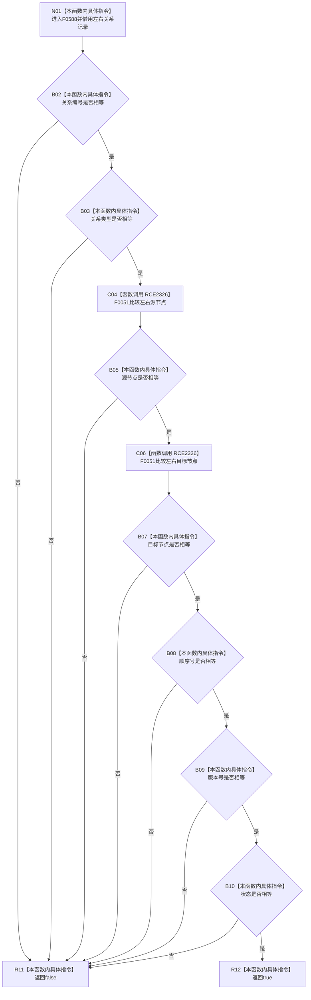

# CF-L6-0327 关系仓库性能基线记录一致现状流程图

图类型：现状流程图
代码版本：`711f200665a0e25e2a5801f144c6ad70b42cc787`
源码 blob：`34c34bffcd80f78e28345292deb69aca2eabf38d`
覆盖文件：`海中鱼巣/核心/自检.关系仓库性能基线.ixx:48-56`
唯一根函数：F0588
完整签名：`bool 海中鱼巣::关系仓库性能基线内部::记录一致(const 海中鱼巣::关系记录& 左, const 海中鱼巣::关系记录& 右)`
参数：左、右关系记录均为调用期间有效的 const 非拥有借用
返回结果：关系编号、类型、源节点、目标节点、顺序号、版本号、状态七项依次相等时返回 `true`，否则按短路返回 `false`
已登记调用方：F0283 经 E1369；F0577 经 RCE0268
直接项目函数：RCE2326→F0051，聚合源节点和目标节点两次比较
外部边界：无；共享表内既有错配边界与当前第 50 行枚举比较不相容，本文不使用
未解析项目调用：0
调用图：`流程图/主程序可达调用关系/01_main可达项目调用边表.md`
逐行映射表：`流程图/代码流程图/L6/CF-L6-0327_关系仓库性能基线记录一致_逐行代码映射表.md`
偏差清单：共享表错配边界等待移除或纠正，不写入当前事实图
结构读取与写入：只读两个关系记录，不写任何结构
逻辑内返回：任一字段不相等时返回 `false`
内部错误：无
生命周期与资源释放：不保存参数引用，无独立资源
异常：内建比较及 F0051 均不抛出
并发 / 幂等：纯值比较；调用期间参数记录必须保持有效
验证输出：48—56 行完整映射；2 条项目入边、1 条项目出边、0 个有效外部边界、0 个未解析调用
不得作为施工许可：是
不得宣称：记录相等证明仓库状态、事务版本或业务语义整体一致

## 流程图

## 当前边界

- RCE2326 聚合第 51、52 行两个 F0051 调用；第二个调用仅在全部前置字段相等时执行。
- 第 50 行是 `关系类型` 枚举的内建比较，不是 `vector<冻结主信息记录>` 标准库比较；错配边界不得进入图或映射。
- 返回 bool 只表达七字段当前值相等，不读取仓库或节点当前性。
