# CF-L6-0328 关系仓库读取关系审计现状流程图

图类型：现状流程图
代码版本：`711f200665a0e25e2a5801f144c6ad70b42cc787`
源码 blob：`f7a9ea9a09d3065468208c16f9ea34f806b6e183`
覆盖文件：`海中鱼巣/核心/关系仓库.cpp:295-312`；宏展开依据同文件 `116-123`
唯一根函数：F0589
完整签名：`std::optional<海中鱼巣::关系记录> 海中鱼巣::关系仓库::读取关系审计(海中鱼巣::关系句柄 当前关系) const`
参数：当前关系句柄按值传入；隐式 const `this` 为非拥有借用
返回结果：句柄有效且属于本仓、记录存在、版本匹配且状态可审计时返回记录副本，否则返回空 optional
已登记调用方：E1370、E1384、RCE0264、RCE0464
直接项目函数：RCE2327→F0336、RCE2328→F0337、RCE2329→F0397、RCE2330→F0375、RCE2331→F0338、RCE2332→F0339、RCE2333→F0340；RCE2334→F0168；RCE0271→R0085；E1785→F0344；E1808→F0345
外部边界：X01189 共享锁构造、X01190 迭代器比较、X01191 optional 构造；X02673 共享锁析构、X02674 `find`、X02675 `end`、X02676 迭代器 `operator->`
未解析项目调用：0
逐行映射表：`流程图/代码流程图/L6/CF-L6-0328_关系仓库读取关系审计_逐行代码映射表.md`
偏差清单：无
结构读取与写入：只读事务接线和关系表，零机器事实写入
逻辑内返回：许可、句柄、仓库、存在性、版本或可审计状态任一不满足时返回空 optional
生命周期与资源释放：共享锁在复制记录后释放；宏对象按令牌范围后许可的顺序析构
异常：未捕获，逆序释放后传播
并发 / 幂等：关系记录复制在共享锁内完成；返回副本不携带锁或读取见证
验证输出：295—312 行完整映射；4 条项目入边、11 条项目出边、7 个外部边界、0 个未解析调用
不得作为施工许可：是
不得宣称：可审计记录等同当前有效关系或永久审计事实

## 流程图

```mermaid
flowchart TD
    N01["N01【本函数内具体指令】进入F0589并绑定当前关系与const this"]
    M02["M02【本函数内具体指令】构造空自动许可和自动令牌范围"]
    C03["C03【函数调用 RCE2327】F0336已接域"]
    B04{"B04【本函数内具体指令】是否已接域"}
    C05["C05【函数调用 RCE2328】F0337读取当前关系令牌"]
    B06{"B06【本函数内具体指令】当前令牌是否为空"}
    C07["C07【函数调用 RCE2329】F0397取得共享许可"]
    C08["C08【函数调用 RCE2330】F0375移动许可"]
    D09["D09【函数调用 E1808】F0345析构已移空临时许可"]
    C10["C10【函数调用 RCE2331】F0338许可有效"]
    B11{"B11【本函数内具体指令】许可是否有效"}
    C12["C12【函数调用 RCE2332】F0339读取令牌"]
    C13["C13【函数调用 RCE2333】F0340构造令牌范围"]
    C14["C14【函数调用 RCE2334】F0168校验当前关系句柄"]
    B15{"B15【本函数内具体指令】句柄有效且属于本仓"}
    N16["N16【本函数内具体指令】默认构造局部关系记录"]
    X17["X17【外部边界 X01189】构造共享锁"]
    X18["X18【外部边界 X02674】按关系编号find"]
    X19["X19【外部边界 X02675/X01190】取得end并比较"]
    B20{"B20【本函数内具体指令】是否找到记录"}
    X21["X21【外部边界 X02676】访问迭代器记录"]
    N22["N22【本函数内具体指令】复制记录"]
    X23["X23【外部边界 X02673】析构共享锁"]
    C24["C24【函数调用 RCE0271】R0085关系状态可审计"]
    B25{"B25【本函数内具体指令】版本匹配且状态可审计"}
    X26["X26【外部边界 X01191】构造optional记录"]
    N27["N27【本函数内具体指令】形成空或有值返回材料"]
    D28["D28【函数调用 E1785】若承载则析构令牌范围"]
    D29["D29【函数调用 E1808】若承载则析构自动许可"]
    R30["R30【本函数内具体指令】返回std::nullopt"]
    R31["R31【本函数内具体指令】返回optional记录"]

    N01 --> M02 --> C03 --> B04
    B04 -- "否" --> C14
    B04 -- "是" --> C05 --> B06
    B06 -- "否" --> C14
    B06 -- "是" --> C07 --> C08 --> D09 --> C10 --> B11
    B11 -- "否" --> N27
    B11 -- "是" --> C12 --> C13 --> C14
    C14 --> B15
    B15 -- "否" --> N27
    B15 -- "是" --> N16 --> X17 --> X18 --> X19 --> B20
    B20 -- "否" --> X23 --> N27
    B20 -- "是" --> X21 --> N22 --> X23 --> C24 --> B25
    B25 -- "否" --> N27
    B25 -- "是" --> X26 --> D28 --> D29 --> R31
    N27 --> D28 --> D29 --> R30
```

## 当前边界

- 宏七边严格按已发布 F0387 顺序展开；E1808 同时表达临时许可与自动许可析构。
- RCE2334 在仓库编号比较之前校验关系句柄。
- RCE0271 仅在记录已复制并释放共享锁后按记录状态执行。
