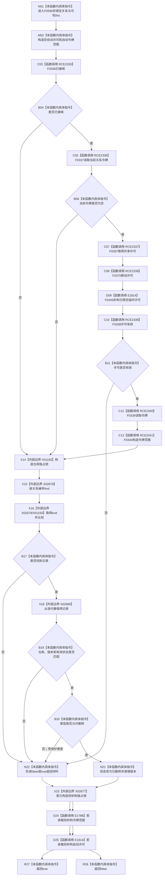

# CF-L6-0329 关系仓库删除关系现状流程图

图类型：现状流程图
代码版本：`711f200665a0e25e2a5801f144c6ad70b42cc787`
源码 blob：`f7a9ea9a09d3065468208c16f9ea34f806b6e183`
覆盖文件：`海中鱼巣/核心/关系仓库.cpp:409-424`；宏展开依据同文件 `116-123`
唯一根函数：F0590
完整签名：`bool 海中鱼巣::关系仓库::删除关系(海中鱼巣::关系句柄 关系)`
参数：关系句柄按值传入；隐式可写 `this` 为非拥有借用
返回结果：共享许可成立、关系存在且句柄仓库/版本/状态匹配、类型不是用途观察证据角色时，把记录标为已删除并递增版本后返回 `true`；否则返回 `false`
已登记调用方：E1377、E1395、E1399、RCE1667、RCE0125、RCE0265、RCE0470
直接项目函数：RCE2335→F0336、RCE2336→F0337、RCE2337→F0397、RCE2338→F0375、RCE2339→F0338、RCE2340→F0339、RCE2341→F0340；E1788→F0344；E1814→F0345
外部边界：X01192 独占锁构造、X01193 迭代器比较；X02677 独占锁析构、X02678 `find`、X02679 `end`、X02680 迭代器 `operator->`
未解析项目调用：0
逐行映射表：`流程图/代码流程图/L6/CF-L6-0329_关系仓库删除关系_逐行代码映射表.md`
偏差清单：无
结构读取与写入：在仓库独占锁内读取并修改关系记录状态与版本号
逻辑内返回：许可无效、关系不存在、句柄不匹配、记录非有效或受保护关系类型时返回 `false`
内部错误：无写后检查；写入完成即返回成功
生命周期与资源释放：独占锁先释放；宏令牌范围后于锁、先于许可析构
异常：未捕获；锁与宏对象按已构造状态逆序释放后传播
并发 / 幂等：关系表写入受独占锁保护；同一旧句柄再次调用因版本或状态不匹配返回 false
验证输出：409—424 行完整映射；7 条项目入边、9 条项目出边、6 个外部边界、0 个未解析调用
不得作为施工许可：是
不得宣称：返回 false 唯一表示关系不存在，或删除会物理移除关系记录

## 流程图

## 当前边界

- 宏取得的是共享事务许可；关系表实际写入仍由 X01192 独占仓库锁保护。
- 删除是状态改写并递增版本，不从 `关系表_` 物理擦除。
- X02677 在所有持锁出口先于 E1788、E1814 执行。
