# CF-L6-0330 关系仓库失效关系现状流程图

图类型：现状流程图
代码版本：`711f200665a0e25e2a5801f144c6ad70b42cc787`
源码 blob：`f7a9ea9a09d3065468208c16f9ea34f806b6e183`
覆盖文件：`海中鱼巣/核心/关系仓库.cpp:339-407`；宏展开依据同文件 `116-123`
唯一根函数：F0591
完整签名：`海中鱼巣::关系状态变更材料 海中鱼巣::关系仓库::失效关系(海中鱼巣::关系句柄 关系)`
参数：关系句柄按值传入；隐式可写 `this` 为非拥有借用
返回结果：始终返回值式关系状态变更材料；材料状态区分无效句柄、转换不允许、内部不一致、已在目标状态、版本已耗尽或已变更
已登记调用方：F0285 经 E1383；F0569 经 RCE0262
直接项目函数：RCE2342→F0336、RCE2343→F0337、RCE2344→F0397、RCE2345→F0375、RCE2346→F0338、RCE2347→F0339、RCE2348→F0340；RCE2349→F0168；E1761→F0343；RCE2350→F0184；RCE2351→F0592；E1787→F0344；E1812→F0345
外部边界：X01194 独占锁构造、X01195 迭代器比较；X02681 独占锁析构、X02682 `find`、X02683 `end`、X02684 迭代器 `operator->`、X02685 `numeric_limits<uint32_t>::max`
未解析项目调用：0
逐行映射表：`流程图/代码流程图/L6/CF-L6-0330_关系仓库失效关系_逐行代码映射表.md`
偏差清单：无
结构读取与写入：独占锁内读取目标记录；成功分支把状态改为已失效并递增版本
逻辑内返回：无效句柄、受限类型、端点无效、旧/不匹配版本、非法状态、已失效或版本耗尽均通过结构化材料返回
内部错误：端点无效或写后材料不完整时设置内部不一致并经 RCE2350 记录诊断
生命周期与资源释放：独占锁先释放；关系令牌范围经 E1787 先于许可经 E1812 析构
异常：未捕获；按已构造状态逆序释放后传播
并发 / 幂等：读改写在同一独占锁内；当前审计句柄或刚失效前句柄可得到已在目标状态材料
验证输出：339—407 行完整映射；2 条项目入边、13 条项目出边、7 个外部边界、0 个未解析调用
不得作为施工许可：是
不得宣称：任一结构化非成功状态是异常、或失效会物理删除关系

## 流程图

```mermaid
flowchart TD
    N01["N01【本函数内具体指令】进入F0591并绑定关系与可写this"]
    M02["M02【本函数内具体指令】构造空自动许可和自动令牌范围"]
    C03["C03【函数调用 RCE2342】F0336已接域"]
    B04{"B04【本函数内具体指令】是否已接域"}
    C05["C05【函数调用 RCE2343】F0337读取当前关系令牌"]
    B06{"B06【本函数内具体指令】当前令牌是否为空"}
    C07["C07【函数调用 RCE2344】F0397取得共享许可"]
    C08["C08【函数调用 RCE2345】F0375移动许可"]
    D09["D09【函数调用 E1812】F0345析构已移空临时许可"]
    C10["C10【函数调用 RCE2346】F0338许可有效"]
    B11{"B11【本函数内具体指令】许可是否有效"}
    C12["C12【函数调用 RCE2347】F0339读取令牌"]
    C13["C13【函数调用 RCE2348】F0340构造令牌范围"]
    N14["N14【本函数内具体指令】默认构造结果并写入原关系"]
    C15["C15【函数调用 RCE2349】F0168校验关系句柄"]
    B16{"B16【本函数内具体指令】句柄有效且属于本仓"}
    N17["N17【本函数内具体指令】结果状态设为无效句柄"]
    X18["X18【外部边界 X01194】构造关系表独占锁"]
    X19["X19【外部边界 X02682】按关系编号find"]
    X20["X20【外部边界 X02683/X01195】取得end并比较"]
    B21{"B21【本函数内具体指令】是否找到记录"}
    X22["X22【外部边界 X02684】从迭代器借用记录"]
    N23["N23【本函数内具体指令】复制类型、端点、当前句柄和状态到结果"]
    B24{"B24【本函数内具体指令】用途观察证据角色顺序号是否允许失效"}
    N25["N25【本函数内具体指令】结果设为状态转换不允许"]
    C26["C26【函数调用 E1761】F0343复核源节点"]
    B27{"B27【本函数内具体指令】源节点是否有效"}
    C28["C28【函数调用 E1761】F0343复核目标节点"]
    B29{"B29【本函数内具体指令】两个端点是否都有效"}
    N30["N30【本函数内具体指令】结果设为内部不一致"]
    C31["C31【函数调用 RCE2350】F0184记录写前端点无效诊断"]
    B32{"B32【本函数内具体指令】记录是否已失效"}
    B33{"B33【本函数内具体指令】输入是否为当前审计句柄"}
    X34["X34【外部边界 X02685】读取uint32最大值"]
    B35{"B35【本函数内具体指令】输入是否为刚失效前句柄"}
    B36{"B36【本函数内具体指令】两种已失效句柄是否至少一种成立"}
    N37["N37【本函数内具体指令】形成无效句柄或已在目标状态材料"]
    B38{"B38【本函数内具体指令】记录状态是否有效"}
    B39{"B39【本函数内具体指令】输入版本是否匹配记录版本"}
    X40["X40【外部边界 X02685】再次读取uint32最大值"]
    B41{"B41【本函数内具体指令】记录版本是否耗尽"}
    N42["N42【本函数内具体指令】形成状态不允许、无效句柄或版本耗尽材料"]
    N43["N43【本函数内具体指令】保存原状态、写已失效、递增版本并形成已变更材料"]
    C44["C44【函数调用 RCE2351】F0592结果.完整"]
    B45{"B45【本函数内具体指令】写后材料是否完整"}
    N46["N46【本函数内具体指令】不完整时把结果改为内部不一致"]
    C47["C47【函数调用 RCE2350】F0184记录写后材料不完整诊断"]
    N48["N48【本函数内具体指令】形成当前结果返回值"]
    N49["N49【本函数内具体指令】形成宏许可拒绝的默认空材料"]
    X50["X50【外部边界 X02681】若已构造则析构独占锁"]
    D51["D51【函数调用 E1787】若承载则析构关系令牌范围"]
    D52["D52【函数调用 E1812】若承载则析构自动许可"]
    R53["R53【本函数内具体指令】按值返回关系状态变更材料"]

    N01 --> M02 --> C03 --> B04
    B04 -- "否" --> N14
    B04 -- "是" --> C05 --> B06
    B06 -- "否" --> N14
    B06 -- "是" --> C07 --> C08 --> D09 --> C10 --> B11
    B11 -- "否" --> N49 --> D51 --> D52 --> R53
    B11 -- "是" --> C12 --> C13 --> N14
    N14 --> C15 --> B16
    B16 -- "否" --> N17 --> N48 --> D51
    B16 -- "是" --> X18 --> X19 --> X20 --> B21
    B21 -- "否" --> N17 --> N48 --> X50
    B21 -- "是" --> X22 --> N23 --> B24
    B24 -- "否" --> N25 --> N48
    B24 -- "是" --> C26 --> B27
    B27 -- "否" --> N30 --> C31 --> N48
    B27 -- "是" --> C28 --> B29
    B29 -- "否" --> N30 --> C31 --> N48
    B29 -- "是" --> B32
    B32 -- "是" --> B33 --> X34 --> B35 --> B36
    B36 -- "否" --> N37 --> N48
    B36 -- "是" --> N37 --> N48
    B32 -- "否" --> B38
    B38 -- "否" --> N42 --> N48
    B38 -- "是" --> B39
    B39 -- "否" --> N42 --> N48
    B39 -- "是" --> X40 --> B41
    B41 -- "是" --> N42 --> N48
    B41 -- "否" --> N43 --> C44 --> B45
    B45 -- "是" --> N48
    B45 -- "否" --> N46 --> C47 --> N48
    N48 --> X50 --> D51 --> D52 --> R53
```

## 当前边界

- RCE2350 聚合第 368、404 行两次诊断，结果均丢弃；诊断不修复或回滚关系。
- X02685 聚合第 373、391 行两次最大版本读取。
- 已失效分支允许当前审计句柄或刚失效前句柄返回“已在目标状态”；其它版本返回无效句柄。
