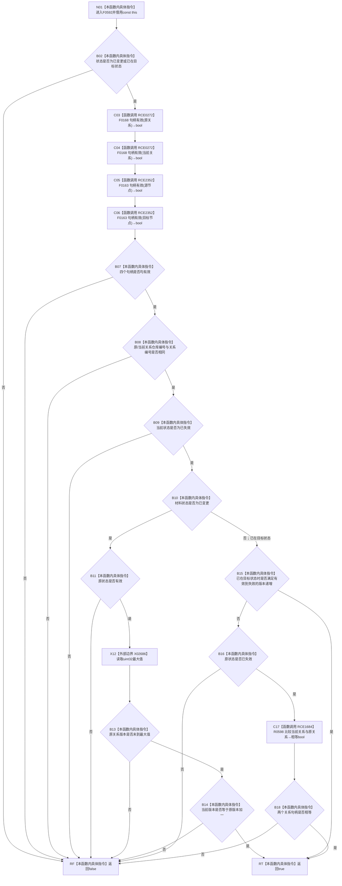

# CF-L6-0331 关系状态变更材料完整现状流程图

图类型：现状流程图
代码版本：`711f200665a0e25e2a5801f144c6ad70b42cc787`
源码 blob：`0628ee4ade067238e826b26753d806c05b507764`
覆盖文件：`海中鱼巣/核心/关系仓库.h:113-135`
唯一根函数：F0592
完整签名：`bool 海中鱼巣::关系状态变更材料::完整() const`
参数：无显式参数；隐式 const `this` 为调用期间有效的非拥有借用
返回结果：材料满足状态、四个句柄、同一关系身份、当前失效状态及对应版本迁移约束时返回 `true`，否则返回 `false`
已登记调用方：F0285 经 E1385；F0569 经 RCE0263
直接项目函数：RCE0272→F0168，检查原关系与当前关系；RCE2352→F0163，检查源节点与目标节点；RCE1684→R0598，比较当前关系与原关系
外部边界：X02686 `std::numeric_limits<std::uint32_t>::max()`，第 127、131 行共两次
未解析项目调用：0
调用图：`流程图/主程序可达调用关系/01_main可达项目调用边表.md`
逐行映射表：`流程图/代码流程图/L6/CF-L6-0331_关系状态变更材料完整_逐行代码映射表.md`
偏差清单：RCE0272 已按精确重载收窄为 116—117 行；节点句柄重载由 RCE2352 独立冻结
依据提交 / 结构化消息：当前源码、F0592、E1385、RCE0263、RCE0272、RCE1684、RCE2352、X02686 交叉复核
结构读取与写入：只读值式材料字段，零机器事实写入
逻辑内返回：任一完整性约束不成立时返回 `false`
内部错误：无写后失败分支
生命周期与资源释放：不取得资源，不保存引用
异常：未声明 `noexcept`；当前被调比较和数值边界均为只读值运算
并发 / 幂等：对同一不变材料重复调用结果一致；调用方须保证对象调用期间不被并发修改
验证输出：113—135 行完整映射；2 条项目入边、3 条项目出边、1 个外部边界 ID、0 个未解析调用
不得作为施工许可：是
不得宣称：返回 `true` 证明关系变更已经发布、持久化或通过仓库读回

## 函数合同

```text
根函数：F0592 关系状态变更材料::完整
归属模块 / 文件 / 层级：头文件内联定义 / 海中鱼巣/核心/关系仓库.h / L6
现有或待新增：现有 const 成员函数
参数：无显式参数；const this 非拥有借用
返回结果：材料内部一致性 bool
被调函数流程图：F0163、F0168、R0598 均已有正式身份；按各自队列状态双向引用
```

## 流程图



## 当前边界

- RCE0272 仅覆盖两个关系句柄重载调用；RCE2352 仅覆盖两个节点句柄重载调用，不能合并为同一函数身份。
- X02686 聚合两个同签名调用，分别服务于“已变更”和“已在目标状态”的版本递增候选。
- `已在目标状态` 允许两种完整材料：有效到失效且版本递增，或原状态已经失效且当前关系句柄与原关系句柄完全相等。
