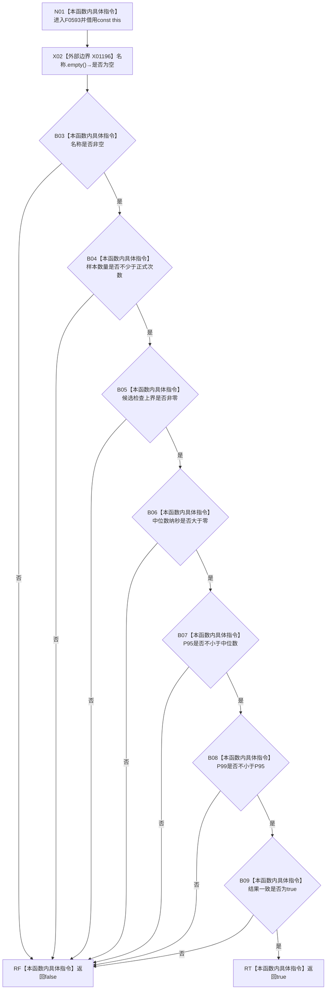

# CF-L6-0332 关系仓库性能基线分位指标完整现状流程图

图类型：现状流程图
代码版本：`711f200665a0e25e2a5801f144c6ad70b42cc787`
源码 blob：`34c34bffcd80f78e28345292deb69aca2eabf38d`
覆盖文件：`海中鱼巣/核心/自检.关系仓库性能基线.ixx:87-95`
唯一根函数：F0593
完整签名：`bool 海中鱼巣::关系仓库性能基线内部::分位指标::完整() const`
参数：无显式参数；隐式 const `this` 为调用期间有效的非拥有借用
返回结果：名称非空、样本数达标、候选上界非零、三个分位数满足正值与单调关系且结果一致时返回 `true`
已登记调用方：F0291 经 E1403；F0292 经 E1404
直接项目函数：无
外部边界：X01196 `bool std::string::empty() const noexcept`
未解析项目调用：0
调用图：`流程图/主程序可达调用关系/01_main可达项目调用边表.md`
逐行映射表：`流程图/代码流程图/L6/CF-L6-0332_关系仓库性能基线分位指标完整_逐行代码映射表.md`
偏差清单：无；本文只冻结当前自检材料完整性事实
依据提交 / 结构化消息：当前源码、F0593、E1403、E1404、X01196 交叉复核
结构读取与写入：只读分位指标字段，零机器事实写入
逻辑内返回：任一完整性条件不成立时返回 `false`
内部错误：无
生命周期与资源释放：无资源取得或所有权转移
异常：未声明 `noexcept`；X01196 当前合同为 `noexcept`
并发 / 幂等：纯只读短路判断
验证输出：87—95 行完整映射；2 条项目入边、0 条项目出边、1 个外部边界、0 个未解析调用
不得作为施工许可：是
不得宣称：返回 `true` 证明性能阈值达标、统计置信度充分或生产关系仓库能力完成

## 流程图

## 当前边界

- 本函数只验证材料字段形态，不读取计时样本、不计算分位数，也不比较任何正式性能阈值。
- `结果一致` 是最后一个短路条件；前项失败时不会读取其后表达式。
