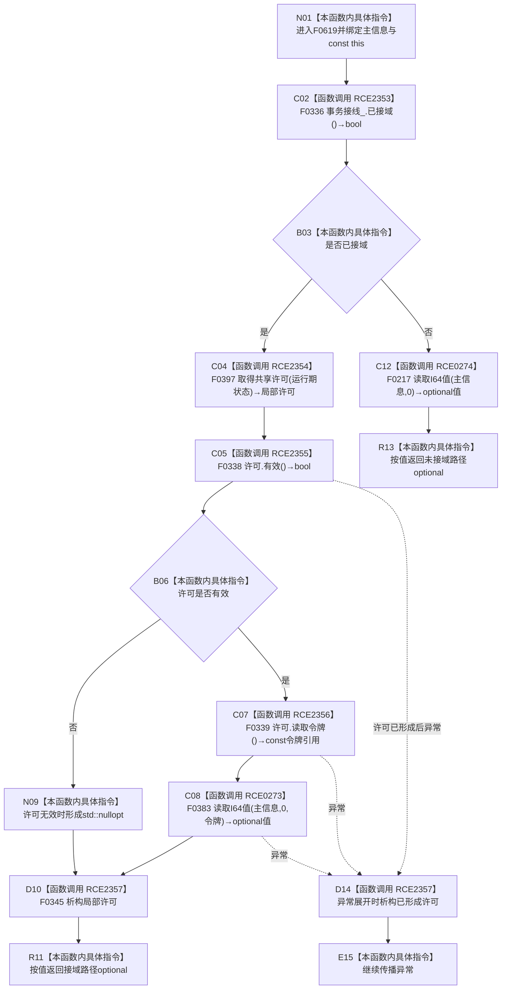

# CF-L6-0333 主信息仓库读取I64值无令牌重载现状流程图

图类型：现状流程图
代码版本：`711f200665a0e25e2a5801f144c6ad70b42cc787`
源码 blob：`11f8fa53ff961a8cbaac34cf75b69a22533ca907`
覆盖文件：`海中鱼巣/核心/主信息仓库.cpp:422-428`
唯一根函数：F0619
完整签名：`std::optional<std::int64_t> 海中鱼巣::主信息仓库::读取I64值(海中鱼巣::主信息句柄 主信息) const`
参数：`主信息` 按值传入；隐式 const `this` 为调用期间有效的非拥有借用
返回结果：接域时取得共享许可，许可有效则经令牌重载读取 0 号 I64 值，许可无效返回空 optional；未接域时经二参数重载读取 0 号值
已登记调用方：F0329 经 E1666；F0366 经 RCE1716；R0029 经 RCE0363；R0732 经 RCE2258
直接项目函数：RCE2353→F0336、RCE2354→F0397、RCE2355→F0338、RCE2356→F0339、RCE0273→F0383、RCE0274→F0217、RCE2357→F0345
外部边界：无
未解析项目调用：0；取得共享许可函数指针按当前生产接线唯一解析到 F0397
调用图：`流程图/主程序可达调用关系/01_main可达项目调用边表.md`
逐行映射表：`流程图/代码流程图/L6/CF-L6-0333_主信息仓库读取I64值无令牌重载_逐行代码映射表.md`
偏差清单：无；原有 RCE0273/RCE0274 已按实参与分支精确化
依据提交 / 结构化消息：当前源码、全部入边、RCE0273、RCE0274、RCE2353—RCE2357 与稳定函数身份交叉复核
结构读取与写入：只读事务接线与主信息 I64 值，零机器事实写入
逻辑内返回：许可无效或被调读取不命中时返回空 optional
内部错误：接线形态若部分存在但 F0336 返回 false，将落入无令牌重载；本函数不单独辨识该漂移
生命周期与资源释放：接域路径局部许可在返回值形成后或异常展开时经 RCE2357 析构
异常：未捕获；许可取得、令牌读取和被调查询异常按局部许可构造状态传播
并发 / 幂等：接域路径使用共享许可；未接域路径委托 F0217 的当前读取合同
验证输出：422—428 行完整映射；4 条项目入边、7 条项目出边、0 个外部边界、0 个未解析调用
不得作为施工许可：是
不得宣称：空 optional 唯一证明值不存在、返回值在许可释放后仍代表后续当前值或本函数写入了主信息

## 流程图

## 项目源码调用合同

| 调用边 | 被调函数 | 实参 / 条件 | 结果 |
| --- | --- | --- | --- |
| RCE2353 | F0336 `结构事务接线::已接域() const` | `this=&事务接线_`；函数入口 | bool 决定分支 |
| RCE2354 | F0397 共享许可函数对象 | `事务接线_.运行期状态`；仅已接域 | 局部许可 |
| RCE2355 | F0338 `结构事务许可::有效() const` | `this=&许可` | bool 决定令牌读取或空结果 |
| RCE2356 | F0339 `结构事务许可::读取令牌() const` | `this=&许可`；仅许可有效 | const 令牌引用 |
| RCE0273 | F0383 令牌重载 | `this,主信息,0,RCE2356结果` | optional I64 |
| RCE0274 | F0217 二参数重载 | `this,主信息,0`；仅未接域 | optional I64 |
| RCE2357 | F0345 许可析构 | `this=&许可`；正常或异常退出 | void |

## 当前边界

- 第 425 行三元表达式严格短路：许可无效时不调用 RCE2356 或 RCE0273。
- RCE2357 发生在接域分支返回值求值完成之后、实际离开函数之前；未接域路径没有局部许可。
- 本函数固定读取 0 号值槽位，不接受调用方值索引，也不把令牌或许可交给调用方。
