# CF-L6-0334 关系仓库获取目标节点组现状流程图

图类型：现状流程图
代码版本：`711f200665a0e25e2a5801f144c6ad70b42cc787`
源码 blob：`f7a9ea9a09d3065468208c16f9ea34f806b6e183`
覆盖文件：`海中鱼巣/核心/关系仓库.cpp:790-821`；宏展开依据同文件 `116-123`
唯一根函数：F0621
完整签名：`std::vector<海中鱼巣::节点句柄> 海中鱼巣::关系仓库::获取目标节点组(海中鱼巣::节点句柄 源节点, 海中鱼巣::关系类型 类型) const`
参数：源节点、关系类型按值传入；隐式 const `this` 为调用期间有效的非拥有借用
返回结果：在共享许可与仓库共享锁窗口内收集状态、类型、源节点匹配且目标节点当前有效的候选，按顺序号、关系编号排序后返回目标句柄
已登记调用方：F0330 经 E1670；F0371 经 RCE0156；F0496 经 RCE2202；F0497 经 RCE2203；F0554 经 RCE2234；R0220 经 RCE0777；R0221 经 RCE0779；R0482 经 RCE1472；R0494 经 RCE1498
直接项目函数：宏 RCE2366→F0336、RCE2367→F0337、RCE2368→F0397、RCE2369→F0375、RCE2370→F0338、RCE2371→F0339、RCE2372→F0340；E1753→F0341；E1767→F0343；RCE2373→F0051；E1791→F0344；E1820→F0345
外部边界：X01199 共享锁构造；X02697—X02701 关系表迭代；X02702 候选追加；X02703—X02704 候选 vector 起止迭代器；X01200 排序；X02705 候选数量；X02706 结果预留；X02707—X02709 候选迭代；X02710 结果追加；X02711 共享锁析构
未解析项目调用：0；RCE2368 按当前生产接线唯一绑定 F0397
调用图：`流程图/主程序可达调用关系/01_main可达项目调用边表.md`
逐行映射表：`流程图/代码流程图/L6/CF-L6-0334_关系仓库获取目标节点组_逐行代码映射表.md`
偏差清单：无；本文按正式分配的宏七边和容器边界冻结当前代码事实
依据提交 / 结构化消息：当前源码、全部入边、E1753、E1767、E1791、E1820、RCE2366—RCE2373、X01199—X01200、X02697—X02711 交叉复核
结构读取与写入：只读事务接线、关系表和节点有效性；只改变两个局部 vector
逻辑内返回：许可无效、入口无效或无匹配候选时返回空 vector
内部错误：异常不包装为空结果
生命周期与资源释放：共享锁经 X02711 先释放；已承载令牌范围经 E1791 析构后，再经 E1820 析构许可
异常：未捕获；许可、锁、容器和被调查询异常在逆序释放已构造资源后传播
并发 / 幂等：共享锁覆盖关系表扫描、排序和结果构造；返回后不保持锁或事务见证
验证输出：790—821 行完整映射；9 条项目入边、12 个项目出边 ID、17 个外部边界 ID、0 个未解析调用
不得作为施工许可：是
不得宣称：空 vector 唯一证明关系不存在、返回顺序是永久事实或本函数修改了关系

## 流程图

```mermaid
flowchart TD
    N01["N01【本函数内具体指令】进入F0621并绑定源节点、类型与const this"]
    C02["C02【函数调用 RCE2366】F0336 事务接线_.已接域()→bool"]
    B03{"B03【本函数内具体指令】是否已接域"}
    C04["C04【函数调用 RCE2367】F0337 读取当前关系令牌(*this)→指针"]
    B05{"B05【本函数内具体指令】当前关系令牌是否为空"}
    C06["C06【函数调用 RCE2368】F0397 取得共享许可(运行期状态)→临时许可"]
    C07["C07【函数调用 RCE2369】F0375 把临时许可移动构造进自动许可"]
    D08["D08【函数调用 E1820】F0345 析构完整表达式末已移空临时许可"]
    C09["C09【函数调用 RCE2370】F0338 自动许可.有效()→bool"]
    B10{"B10【本函数内具体指令】自动许可是否有效"}
    C11["C11【函数调用 RCE2371】F0339 自动许可.读取令牌()→const令牌引用"]
    C12["C12【函数调用 RCE2372】F0340 构造自动关系令牌范围"]
    N13["N13【本函数内具体指令】声明目标候选结构并默认构造空候选组"]
    C14["C14【函数调用 E1767】F0343 节点有效_(源节点)→bool"]
    B15{"B15【本函数内具体指令】源节点是否有效"}
    C16["C16【函数调用 E1753】F0341 关系类型已定义(类型)→bool"]
    B17{"B17【本函数内具体指令】关系类型是否已定义"}
    X18["X18【外部边界 X01199】以仓库锁构造共享锁"]
    X19["X19【外部边界 X02697/X02698】取得关系表const范围起止迭代器"]
    B20{"B20【外部边界 X02700】关系表迭代器是否到达末尾"}
    X21["X21【外部边界 X02701】解引用当前关系表迭代器"]
    N22["N22【本函数内具体指令】借用当前关系记录"]
    B23{"B23【本函数内具体指令】记录状态有效且类型匹配"}
    C24["C24【函数调用 RCE2373】F0051 比较记录源节点与输入源节点→bool"]
    B25{"B25【本函数内具体指令】源节点是否匹配"}
    C26["C26【函数调用 E1767】F0343 节点有效_(记录.目标节点)→bool"]
    B27{"B27【本函数内具体指令】目标节点是否有效"}
    N28["N28【本函数内具体指令】按顺序号、关系编号、目标节点构造候选值"]
    X29["X29【外部边界 X02702】把候选值移动追加到候选组"]
    X30["X30【外部边界 X02699】递增关系表迭代器"]
    X31["X31【外部边界 X02703/X02704】取得候选组排序范围"]
    X32["X32【外部边界 X01200】按顺序号后关系编号升序排序"]
    N33["N33【本函数内具体指令】默认构造空目标节点组"]
    X34["X34【外部边界 X02705】读取候选组数量"]
    X35["X35【外部边界 X02706】为目标节点组预留容量"]
    X36["X36【外部边界 X02703/X02704】取得候选组范围迭代器"]
    B37{"B37【外部边界 X02708】候选迭代器是否到达末尾"}
    X38["X38【外部边界 X02709】解引用当前候选"]
    X39["X39【外部边界 X02710】把候选目标节点追加到结果"]
    X40["X40【外部边界 X02707】递增候选迭代器"]
    N41["N41【本函数内具体指令】形成目标节点组返回值"]
    X42["X42【外部边界 X02711】析构共享锁"]
    D43["D43【函数调用 E1791】若已承载则析构F0344关系令牌范围"]
    D44["D44【函数调用 E1820】若已承载则析构F0345自动许可"]
    R45["R45【本函数内具体指令】按值返回目标节点组"]
    E46["E46【本函数内具体指令】逆序释放后继续传播异常"]

    N01 --> C02 --> B03
    B03 -- "否" --> N13
    B03 -- "是" --> C04 --> B05
    B05 -- "非空；复用外层令牌" --> N13
    B05 -- "为空" --> C06 --> C07 --> D08 --> C09 --> B10
    B10 -- "否；宏返回空vector" --> D44 --> R45
    B10 -- "是" --> C11 --> C12 --> N13
    N13 --> C14 --> B15
    B15 -- "否" --> N41
    B15 -- "是" --> C16 --> B17
    B17 -- "否" --> N41
    B17 -- "是" --> X18 --> X19 --> B20
    B20 -- "未结束" --> X21 --> N22 --> B23
    B23 -- "否" --> X30
    B23 -- "是" --> C24 --> B25
    B25 -- "否" --> X30
    B25 -- "是" --> C26 --> B27
    B27 -- "否" --> X30
    B27 -- "是" --> N28 --> X29 --> X30
    X30 --> B20
    B20 -- "已结束" --> X31 --> X32 --> N33 --> X34 --> X35 --> X36 --> B37
    B37 -- "未结束" --> X38 --> X39 --> X40 --> B37
    B37 -- "已结束" --> N41
    N41 --> X42 --> D43 --> D44 --> R45
    X18 -. "锁构造异常" .-> D43
    X29 -. "追加异常" .-> X42
    X32 -. "排序异常" .-> X42
    X35 -. "预留异常" .-> X42
    X39 -. "结果追加异常" .-> X42
    D44 -. "异常路径" .-> E46
```

## 项目源码调用合同

| 调用边 | 被调函数 | 实参 / 条件 | 结果用途 |
| --- | --- | --- | --- |
| RCE2366—RCE2372 | F0336、F0337、F0397、F0375、F0338、F0339、F0340 | 与 F0620 同一宏顺序；`this`、运行期状态、许可及令牌 | 建立或复用共享关系令牌语境 |
| E1753 | F0341 `关系类型已定义` | 输入类型 | 入口过滤 |
| E1767 | F0343 `节点有效_` | 输入源节点；匹配记录目标节点 | 入口与候选过滤 |
| RCE2373 | F0051 节点句柄相等 | 记录源节点、输入源节点 | 源匹配 |
| E1791 / E1820 | F0344 / F0345 析构 | 已承载令牌范围 / 许可 | 正常或异常逆序释放 |

## 当前边界

- X02703、X02704 各聚合两次调用：第 809 行提供排序范围，第 817 行提供范围循环起止。
- 关系表扫描形成携带顺序号和关系编号的局部候选；排序后才抽取目标节点，因此相同顺序号按关系编号稳定排序。
- X01199 的共享锁持续覆盖扫描、排序、容量预留和目标节点组构造，X02711 先于 E1791、E1820 释放。
