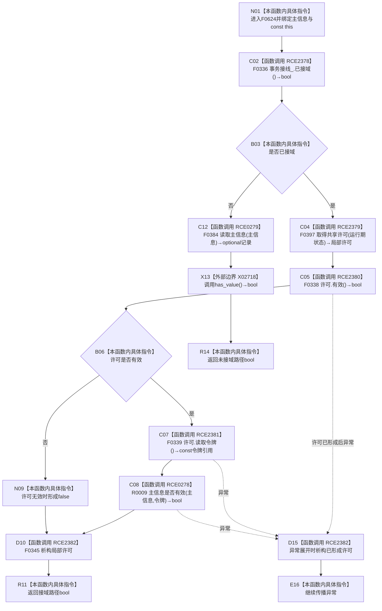

# CF-L6-0335 主信息仓库主信息是否有效现状流程图

图类型：现状流程图
代码版本：`3920a74638264f9f539d50f32f3c9fe5fb1982ab`
源码 blob：`11f8fa53ff961a8cbaac34cf75b69a22533ca907`
覆盖文件：`海中鱼巣/核心/主信息仓库.cpp:363-369`
唯一根函数：F0624
完整签名：`bool 海中鱼巣::主信息仓库::主信息是否有效(海中鱼巣::主信息句柄 主信息) const`
参数：主信息句柄按值传入；隐式 const `this` 为调用期间有效的非拥有借用
返回结果：接域时在共享许可内委托令牌重载判断；许可无效返回 false；未接域时读取记录并以 optional 是否有值判断
已登记调用方：F0332 经 E1682；F0365 经 RCE1712；F0366 经 RCE1717；F0367 经 RCE1719；F0368 经 RCE1728；R0611 经 RCE1732；F0516 经 RCE2208；R0731 经 RCE2248
直接项目函数：RCE2378→F0336、RCE2379→F0397、RCE2380→F0338、RCE2381→F0339、RCE0278→R0009、RCE2382→F0345、RCE0279→F0384
外部边界：X02718 `std::optional<主信息记录>::has_value`
未解析项目调用：0；取得共享许可函数指针按当前生产接线唯一解析到 F0397
调用图：`流程图/主程序可达调用关系/01_main可达项目调用边表.md`
逐行映射表：`流程图/代码流程图/L6/CF-L6-0335_主信息仓库主信息是否有效_逐行代码映射表.md`
偏差清单：无；本函数仍保留接域与未接域双路径
结构读取与写入：只读事务接线和主信息记录；零机器事实写入
逻辑内返回：许可无效、令牌重载拒绝或未接域读取为空均返回 false
内部错误：强前置已证明句柄应有效而本函数返回 false 时需追查接线、令牌或记录代次
生命周期与资源释放：接域路径局部许可经 RCE2382 析构；未接域读取产生的临时 optional 按当前粒度不单列析构边界
异常：未捕获；许可取得、令牌读取或仓库读取异常直接传播，已形成许可时先析构
并发 / 幂等：接域路径使用共享许可；未接域路径由 F0384 自行取得共享锁；只读且幂等于同一冻结状态
验证输出：363—369 行完整映射；8 条项目入边、7 条项目出边、1 个外部边界、0 个未解析调用
不得作为施工许可：是
不得宣称：false 唯一表示记录不存在、读取期间以外仍保持有效或本函数验证业务节点语义

## 流程图

## 调用与边界合同

| 稳定 ID | 目标 | 实参 / 条件 | 结果 |
| --- | --- | --- | --- |
| RCE2378 | F0336 `已接域` | `this=&事务接线_`；函数入口 | bool 分支 |
| RCE2379 | F0397 共享许可函数对象 | `事务接线_.运行期状态`；已接域 | 局部许可 |
| RCE2380 | F0338 `许可.有效` | `this=&许可` | bool 短路 |
| RCE2381 | F0339 `许可.读取令牌` | `this=&许可`；RCE2380=true | const 令牌引用 |
| RCE0278 | R0009 令牌重载 | `this,主信息,RCE2381结果` | 有效 bool |
| RCE2382 | F0345 许可析构 | `this=&许可`；正常或异常退出 | void |
| RCE0279 | F0384 无令牌读取 | `this,主信息`；未接域 | optional 记录 |
| X02718 | `optional::has_value` | RCE0279 返回值 | 是否有记录 |

## 当前边界

- 第 366 行按 `&&` 短路；许可无效时不读取令牌、不调用 R0009。
- RCE2382 在返回表达式求值后、函数实际返回前执行。
- 未接域路径的 true 只表示 F0384 返回了记录，不扩展为业务有效性证明。
