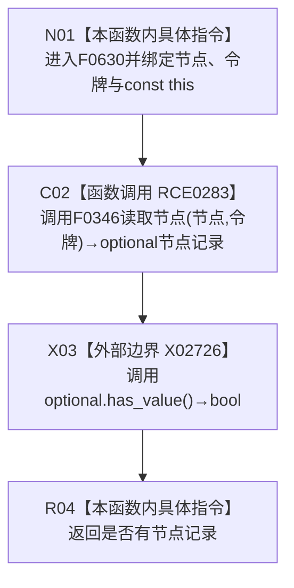

# CF-L6-0336 节点仓库节点是否有效带令牌重载现状流程图

图类型：现状流程图
代码版本：`3920a74638264f9f539d50f32f3c9fe5fb1982ab`
源码 blob：`f38b979a3f7cefd182a50e0b687c5a6fffebc91c`
覆盖文件：`海中鱼巣/核心/节点仓库.cpp:449-451`
唯一根函数：F0630
完整签名：`bool 海中鱼巣::节点仓库::节点是否有效(海中鱼巣::节点句柄 节点, const 海中鱼巣::结构事务令牌& 令牌) const`
参数：节点句柄按值传入；令牌为调用期间有效的 const 非拥有借用；隐式 const `this` 为非拥有借用
返回结果：带令牌读取节点所得 `optional` 是否有值
已登记调用方：F0343、F0376、F0377、F0441、R0066、R0068、R0069、R0076、R0119、R0123、R0125、R0723
直接项目函数：RCE0283→F0346 带令牌 `读取节点`
外部边界：X02726 `std::optional<节点记录>::has_value`
未解析项目调用：0
调用图：`流程图/主程序可达调用关系/01_main可达项目调用边表.md`
逐行映射表：`流程图/代码流程图/L6/CF-L6-0336_节点仓库节点是否有效带令牌重载_逐行代码映射表.md`
偏差清单：无；缺失边界已以 X02726 稳定登记
依据提交 / 结构化消息：当前源码、RCE0283、X02726 与函数身份表交叉复核
结构读取与写入：经 F0346 只读节点记录；无结构写入
逻辑内返回：读取结果为空时返回 `false`
内部错误：异常不转换
生命周期与资源释放：临时 `optional` 在完整表达式末析构
异常：函数本身未捕获异常
并发 / 幂等：依赖传入结构事务令牌提供读取语境；不保持令牌
验证输出：449—451 行完整映射；1 个项目出边、1 个外部边界、0 个未解析调用
不得作为施工许可：是
不得宣称：`false` 唯一证明句柄从未存在或令牌之外的当前状态

## 流程图

## 项目源码调用合同

| 调用边 | 被调函数 | 实参 / 条件 | 结果用途 |
| --- | --- | --- | --- |
| RCE0283 | F0346 带令牌 `读取节点` | `this=&节点仓库`；节点、令牌 | 返回 `optional<节点记录>` 供 X02726 判定 |

## 当前边界

- X02726 只检查 `optional` 是否承载节点记录，不读取记录字段。
- 本函数的有效性口径完全复用 F0346 在给定令牌下的读取结果。
