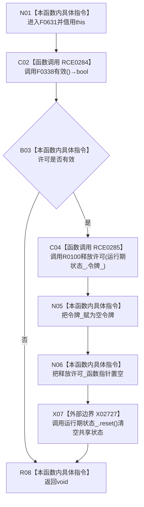

# CF-L6-0337 结构事务许可释放现状流程图

图类型：现状流程图
代码版本：`3920a74638264f9f539d50f32f3c9fe5fb1982ab`
源码 blob：`9d89cee25f00ba0f721d0b6c1bea517524e40663`
覆盖文件：`海中鱼巣/核心/结构事务接线.数据.h:59`
唯一根函数：F0631
完整签名：`void 海中鱼巣::结构事务许可::释放() noexcept`
参数：无显式参数；隐式 `this` 为调用期间有效的独占对象借用
返回结果：`void`；许可无效时不执行释放，许可有效时调用保存的释放函数并清空令牌、函数指针与运行期状态
已登记调用方：F0345、R0600
直接项目函数：RCE0284→F0338 `有效`；RCE0285→R0100 保存的许可释放目标
外部边界：X02727 `std::shared_ptr<void>::reset`
未解析项目调用：0；释放函数指针按当前接线唯一解析为 R0100
调用图：`流程图/主程序可达调用关系/01_main可达项目调用边表.md`
逐行映射表：`流程图/代码流程图/L6/CF-L6-0337_结构事务许可释放_逐行代码映射表.md`
偏差清单：无；缺失边界已以 X02727 稳定登记
依据提交 / 结构化消息：当前源码、RCE0284、RCE0285、X02727 与当前接线交叉复核
结构读取与写入：读取许可有效性；有效时修改事务协调器许可状态，并清空本对象三个承载字段
逻辑内返回：许可无效时直接完成 `void` 返回
内部错误：函数声明 `noexcept`；被调释放目标与 reset 均按当前合同不抛出
生命周期与资源释放：先释放协调器许可，再清空令牌和函数指针，最后 reset 运行期共享状态
异常：若实际发生异常将触发 `std::terminate`
并发 / 幂等：首次有效释放后本对象变无效，后续调用不重复释放
验证输出：第 59 行全部指令完整映射；2 个项目出边、1 个外部边界、0 个未解析调用
不得作为施工许可：是
不得宣称：无效许可被再次释放或 reset 本身完成事务状态更新

## 流程图

## 项目源码调用合同

| 调用边 | 被调函数 | 实参 / 条件 | 结果用途 |
| --- | --- | --- | --- |
| RCE0284 | F0338 `结构事务许可::有效() const` | `this` | 决定是否进入一次性释放序列 |
| RCE0285 | R0100 `结构事务内部::释放许可` | `运行期状态_`、`令牌_`；仅许可有效 | 释放协调器持有的许可状态 |

## 当前边界

- RCE0285 是已解析函数指针调用；当前生产接线唯一目标为 R0100。
- 字段清空严格发生在 R0100 调用之后，X02727 最后解除本对象对运行期状态的共享持有。
