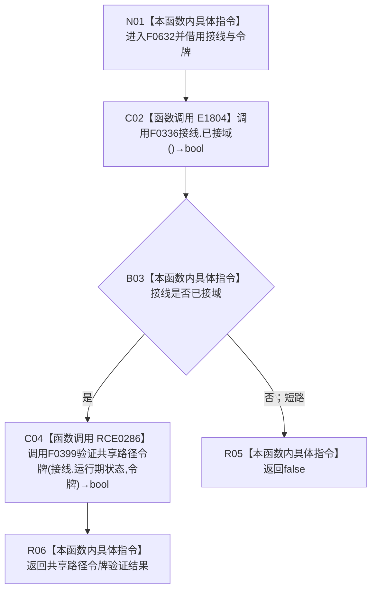

# CF-L6-0338 节点仓库验证共享令牌现状流程图

图类型：现状流程图
代码版本：`3920a74638264f9f539d50f32f3c9fe5fb1982ab`
源码 blob：`f38b979a3f7cefd182a50e0b687c5a6fffebc91c`
覆盖文件：`海中鱼巣/核心/节点仓库.cpp:23-25`
唯一根函数：F0632
完整签名：`bool 海中鱼巣::{匿名命名空间@节点仓库.cpp}::验证共享令牌(const 海中鱼巣::结构事务接线& 接线, const 海中鱼巣::结构事务令牌& 令牌)`
参数：接线与令牌均为调用期间有效的 const 非拥有借用
返回结果：接线已接域且当前生产接线的共享路径令牌验证通过时返回 `true`
已登记调用方：F0346、F0374、F0623、R0141、R0143
直接项目函数：E1804→F0336 `已接域`；RCE0286→F0399 当前共享路径令牌验证目标
外部边界：无
未解析项目调用：0；RCE0286 按当前接线唯一解析
调用图：`流程图/主程序可达调用关系/01_main可达项目调用边表.md`
逐行映射表：`流程图/代码流程图/L6/CF-L6-0338_节点仓库验证共享令牌_逐行代码映射表.md`
偏差清单：无；本文冻结短路求值与当前接线目标
依据提交 / 结构化消息：当前源码、E1804、RCE0286 与当前生产接线交叉复核
结构读取与写入：只读接线、运行期状态与令牌验证结果
逻辑内返回：未接域时短路返回 `false`；验证不通过时返回 `false`
内部错误：异常不转换
生命周期与资源释放：不持有输入引用
异常：被调函数异常直接传播
并发 / 幂等：只读验证；结果依赖调用时接线及运行期许可状态
验证输出：23—25 行完整映射；2 个项目出边、0 个外部边界、0 个未解析调用
不得作为施工许可：是
不得宣称：`false` 唯一证明令牌伪造或接线永久失效

## 流程图

## 项目源码调用合同

| 调用边 | 被调函数 | 实参 / 条件 | 结果用途 |
| --- | --- | --- | --- |
| E1804 | F0336 `结构事务接线::已接域() const` | `this=&接线` | `false` 时短路整个逻辑与表达式 |
| RCE0286 | F0399 当前共享路径令牌验证目标 | `接线.运行期状态`、`令牌`；仅已接域 | 返回值直接作为 F0632 结果 |

## 当前边界

- RCE0286 是当前生产接线唯一解析的函数指针目标，不是未解析动态调用。
- `&&` 保证未接域时不读取运行期状态进入共享令牌验证。
