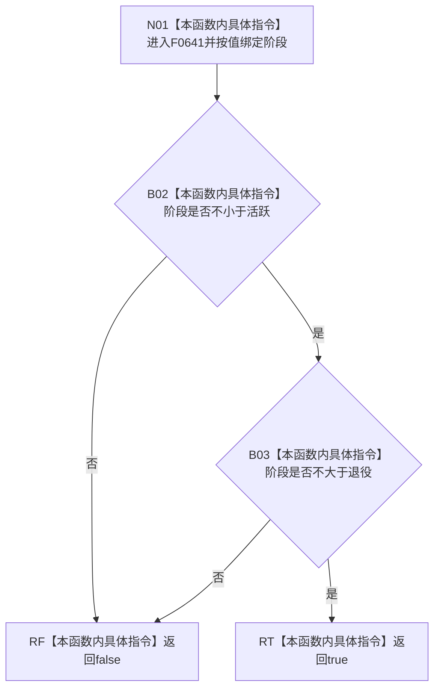

# CF-L6-0341 概念图服务生命周期阶段有效现状流程图

图类型：现状流程图
代码版本：`37feabb47bf83e25f33ce1e86fddd1b041c2c658`
源码事实提交：`3920a74638264f9f539d50f32f3c9fe5fb1982ab`
源码 blob：`dc4bd08f99622b3380c91dd15258fc8ab2e1b9c6`
覆盖文件：`海中鱼巣/领域/概念图服务.h:2824-2827`
唯一根函数：F0641
完整签名：`bool 海中鱼巣::概念图服务::生命周期阶段有效(海中鱼巣::概念生命周期阶段 阶段)`
参数：阶段按值传入
返回结果：阶段位于闭区间 `[活跃, 退役]` 时返回 true，否则返回 false
已登记调用方：F0354 经 E1857；F0357 经 RCE0114；F0359 经 RCE0120
直接项目函数：无
外部边界：无
逐行映射表：`流程图/代码流程图/L6/CF-L6-0341_概念图服务生命周期阶段有效_逐行代码映射表.md`
结构读取与写入：纯枚举值比较，零结构变化
验证输出：2824—2827 行完整映射；3 条入边、0 出边、0 外部边界
不得作为施工许可：是
不得宣称：阶段有效证明对应生命周期状态节点或关系存在

## 流程图

## 当前边界

- 本函数只检查枚举范围，不读取生命周期状态数组或概念关系。
