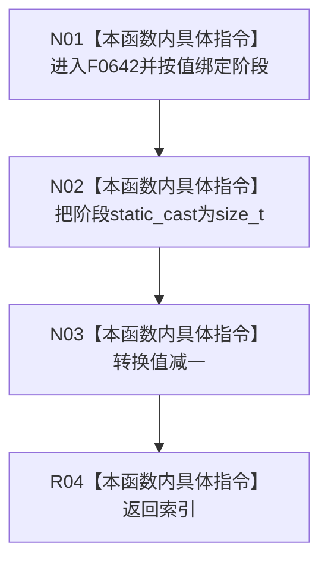

# CF-L6-0342 概念图服务生命周期阶段索引现状流程图

图类型：现状流程图
代码版本：`37feabb47bf83e25f33ce1e86fddd1b041c2c658`
源码事实提交：`3920a74638264f9f539d50f32f3c9fe5fb1982ab`
源码 blob：`dc4bd08f99622b3380c91dd15258fc8ab2e1b9c6`
覆盖文件：`海中鱼巣/领域/概念图服务.h:2829-2831`
唯一根函数：F0642
完整签名：`std::size_t 海中鱼巣::概念图服务::生命周期阶段索引(海中鱼巣::概念生命周期阶段 阶段)`
参数：阶段按值传入
返回结果：把阶段转换为 `size_t` 后减一并返回
已登记调用方：F0354 经 E1858；F0357 经 RCE0115
直接项目函数：无
外部边界：无
逐行映射表：`流程图/代码流程图/L6/CF-L6-0342_概念图服务生命周期阶段索引_逐行代码映射表.md`
结构读取与写入：纯数值转换，零结构变化
验证输出：2829—2831 行完整映射；2 条入边、0 出边、0 外部边界
不得作为施工许可：是
不得宣称：函数自行验证阶段有效或数组访问一定安全

## 流程图

## 当前边界

- 本函数不做范围检查；当前调用方在合法路径先经 F0641 验证阶段。
