# CF-L6-0343 关系仓库获取来源节点组现状流程图

图类型：现状流程图
代码版本：`7ad8cf5113162fe92b9f8d43f2b5b9f00d292d1a`
源码事实提交：`3920a74638264f9f539d50f32f3c9fe5fb1982ab`
源码 blob：`f7a9ea9a09d3065468208c16f9ea34f806b6e183`
覆盖文件：`海中鱼巣/核心/关系仓库.cpp:865-896`
唯一根函数：R0088
完整签名：`std::vector<海中鱼巣::节点句柄> 海中鱼巣::关系仓库::获取来源节点组(海中鱼巣::节点句柄 目标节点, 海中鱼巣::关系类型 类型) const`
参数：目标节点和类型按值传入；`this` 为 const 非拥有借用
返回结果：共享许可失败或输入无效时返回空节点向量；否则按顺序号、关系编号升序返回有效来源节点组
已登记调用方：F0356/F0372/R0214，经 RCE1656/RCE0157/RCE0764
直接项目函数：RCE2508→F0336、RCE2509→F0337、RCE2510→F0397、RCE2511→F0375、RCE2512→F0338、RCE2513→F0339、RCE2514→F0340、RCE2515→F0344、RCE2516→F0345、RCE0505→F0341、RCE0506→F0343、RCE0507→F0051、RCE0508→R0090
外部边界：X01516/X01517/X01518/X01520/X01521/X01522/X01523/X01524、X02926—X02945
X02933 调用点与计数：`海中鱼巣/核心/关系仓库.cpp:866,874,890`，`call_count=3`
已停用外部候选：X01519（与 X01518 的同一 `std::sort` 调用表达式重复记账）
未解析项目调用：0
逐行映射表：`流程图/代码流程图/L6/CF-L6-0343_关系仓库获取来源节点组_逐行代码映射表.md`
结构读取与写入：只读关系表与节点有效性，建立临时许可、令牌范围和局部候选组；零持久结构变化
验证输出：865—896 行完整映射；3 条项目入边、13 条项目出边、28 个当前外部边界
不得作为施工许可：是
不得宣称：空向量能够区分许可拒绝、输入拒绝与合法无来源节点，或返回结果已经改变关系结构

## 流程图

```mermaid
flowchart TD
    N01["N01【本函数内具体指令】进入R0088并绑定目标节点与关系类型"]
    X02["X02【外部边界 X02926】默认构造自动许可optional"]
    X03["X03【外部边界 X02927】默认构造自动令牌范围optional"]
    C04["C04【函数调用 RCE2508】F0336事务接线_.已接域()→bool"]
    B05{"B05【本函数内具体指令】事务接线是否已接域"}
    C06["C06【函数调用 RCE2509】F0337读取当前关系令牌(*this)→指针"]
    B07{"B07【本函数内具体指令】当前关系令牌是否为空"}
    C08["C08【函数调用 RCE2510】F0397取得共享许可(运行期状态)→许可"]
    X09["X09【外部边界 X02928】自动许可.emplace(许可临时值)"]
    C10["C10【函数调用 RCE2511】F0375移动构造optional内许可"]
    X11["X11【外部边界 X02929】自动许可.operator->()"]
    C12["C12【函数调用 RCE2512】F0338自动许可->有效()→bool"]
    B13{"B13【本函数内具体指令】自动许可是否有效"}
    X14["X14【外部边界 X02933】构造空节点vector失败返回对象"]
    X15["X15【外部边界 X02932】析构自动令牌范围optional"]
    X16["X16【外部边界 X02931】析构自动许可optional"]
    C17["C17【函数调用 RCE2516】F0345析构已持有结构事务许可"]
    RF["RF【本函数内具体指令】返回空节点vector"]
    X18["X18【外部边界 X02929】自动许可.operator->()"]
    C19["C19【函数调用 RCE2513】F0339自动许可->读取令牌()→const引用"]
    X20["X20【外部边界 X02930】自动令牌范围.emplace(*this,令牌)"]
    C21["C21【函数调用 RCE2514】F0340构造optional内关系令牌范围"]
    N22["N22【本函数内具体指令】声明来源候选局部结构类型"]
    X23["X23【外部边界 X02934】默认构造来源候选vector"]
    C24["C24【函数调用 RCE0506】F0343节点有效_(目标节点)→bool"]
    B25{"B25【本函数内具体指令】目标节点是否有效"}
    C26["C26【函数调用 RCE0505】F0341关系类型已定义(类型)→bool"]
    B27{"B27【本函数内具体指令】关系类型是否已定义"}
    X28["X28【外部边界 X02933】输入无效时构造空节点vector返回对象"]
    R28["R28【本函数内具体指令】返回空节点vector"]
    X29["X29【外部边界 X01516】构造shared_lock(仓库锁_)"]
    X30["X30【外部边界 X02935】关系表_.begin()"]
    X31["X31【外部边界 X02936】关系表_.end()"]
    X32["X32【外部边界 X02938】比较关系表const迭代器"]
    B33{"B33【本函数内具体指令】是否还有关系条目"}
    X34["X34【外部边界 X02939】解引用当前关系表const迭代器"]
    N35["N35【本函数内具体指令】绑定当前关系记录"]
    B36{"B36【本函数内具体指令】记录状态有效且类型匹配"}
    C37["C37【函数调用 RCE0507】F0051比较记录目标节点与目标节点参数"]
    B38{"B38【本函数内具体指令】记录目标节点是否匹配"}
    C39["C39【函数调用 RCE0506】F0343节点有效_(记录.源节点)→bool"]
    B40{"B40【本函数内具体指令】记录源节点是否有效"}
    X41["X41【外部边界 X01517】向候选组追加来源候选"]
    X42["X42【外部边界 X02937】递增关系表const迭代器"]
    X43["X43【外部边界 X02940】析构shared_lock并释放共享锁"]
    X44["X44【外部边界 X01520/X01521】取得候选组排序范围"]
    X45["X45【外部边界 X01518】std::sort候选组"]
    C46["C46【函数调用 RCE0508】R0090比较两个来源候选"]
    X47["X47【外部边界 X02933】默认构造来源节点组vector"]
    X48["X48【外部边界 X01522】读取候选组.size()"]
    X49["X49【外部边界 X01523】来源节点组.reserve(候选数量)"]
    X50["X50【外部边界 X01520/X01521】取得候选组范围遍历首尾"]
    X51["X51【外部边界 X02942】比较候选组迭代器"]
    B52{"B52【本函数内具体指令】是否还有已排序候选"}
    X53["X53【外部边界 X02943】解引用当前来源候选"]
    X54["X54【外部边界 X01524】追加候选.来源节点"]
    X55["X55【外部边界 X02941】递增候选组迭代器"]
    X56["X56【外部边界 X02945】来源节点组返回对象生命周期边界"]
    X57["X57【外部边界 X02944】析构来源候选vector"]
    X58["X58【外部边界 X02932】析构自动令牌范围optional"]
    C59["C59【函数调用 RCE2515】F0344析构已持有关系令牌范围"]
    X60["X60【外部边界 X02931】析构自动许可optional"]
    C61["C61【函数调用 RCE2516】F0345析构已持有结构事务许可"]
    RR["RR【本函数内具体指令】返回来源节点组或空输入结果"]
    N01 --> X02 --> X03 --> C04 --> B05
    B05 -- "否" --> N22
    B05 -- "是" --> C06 --> B07
    B07 -- "否（已有令牌语境）" --> N22
    B07 -- "是" --> C08 --> X09 --> C10 --> X11 --> C12 --> B13
    B13 -- "否" --> X14 --> X15 --> X16 --> C17 --> RF
    B13 -- "是" --> X18 --> C19 --> X20 --> C21 --> N22
    N22 --> X23 --> C24 --> B25
    B25 -- "否" --> X28
    B25 -- "是" --> C26 --> B27
    B27 -- "否" --> X28
    B27 -- "是" --> X29 --> X30 --> X31 --> X32 --> B33
    B33 -- "否" --> X43
    B33 -- "是" --> X34 --> N35 --> B36
    B36 -- "否" --> X42 --> X32
    B36 -- "是" --> C37 --> B38
    B38 -- "否" --> X42
    B38 -- "是" --> C39 --> B40
    B40 -- "否" --> X42
    B40 -- "是" --> X41 --> X42
    X43 --> X44 --> X45 --> C46 --> X47 --> X48 --> X49 --> X50 --> X51 --> B52
    B52 -- "是" --> X53 --> X54 --> X55 --> X51
    B52 -- "否" --> X56 --> X57
    X57 --> X58 --> C59 --> X60 --> C61 --> RR
    X28 --> R28 --> X57
```

## 当前边界

- F0336 为 false 或 F0337 返回非空指针时跳过自动许可；相应 optional 仍按 X02931/X02932 结束空生命周期。
- 自动许可无效时在候选组构造前返回；RCE2516 仍释放已经装入 optional 的许可。
- X01520/X01521 各有排序行 884 与范围遍历行 892 两个调用点；X01519 已停用。
- 排序只调用具名比较回调 R0090；候选顺序先按顺序号、再按关系编号升序。
- X02945 记录返回向量在正常返回或异常清理中的完整生命周期；正常返回对象不被解释为持久关系结构。
