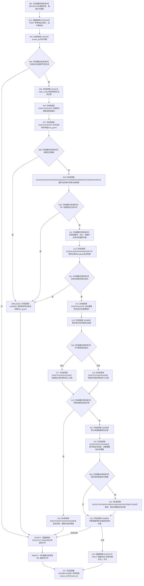

# CF-L6-0344 结构事务内部取得许可现状流程图

图类型：现状流程图
代码版本：`7ad8cf5113162fe92b9f8d43f2b5b9f00d292d1a`
源码事实提交：`3920a74638264f9f539d50f32f3c9fe5fb1982ab`
源码 blob：`946512e4b88d29bbf6d43eb07b02823471489dae`
覆盖文件：`海中鱼巣/核心/协调.结构事务.ixx:84-131`
唯一根函数：R0101
完整签名：`结构事务许可 海中鱼巣::结构事务内部::取得许可(const std::shared_ptr<void>& 状态, 结构许可类型 类型)`
参数：`状态` 为 const shared_ptr 借用；`类型` 为值式许可类型
返回结果：成功时返回持有共享锁或独占锁的结构事务许可；入口无效、域隔离、同线程重入、登记失败、锁构造异常或锁后隔离时返回默认空许可
已登记调用方：F0397/F0398，经 RCE0194/RCE0195
直接项目函数：RCE0518→R0097、RCE2517→R0599、RCE0517→R0137
外部边界：X01541/X01542/X01543/X01544/X01545/X01546/X01547/X01548/X01549/X01550/X01551/X01552/X01553/X01554/X01555/X01556/X01557/X01558/X01559/X01560；X02970/X02971/X02972/X02973/X02974/X02975/X02976/X02977/X02978/X02979/X02980/X02981/X02982/X02983/X02984/X02985/X02986
停用外部误分类：X01540、X01561
未解析项目调用：0
逐行映射表：`流程图/代码流程图/L6/CF-L6-0344_结构事务内部取得许可_逐行代码映射表.md`
结构读取与写入：读取运行期隔离状态和活动表；成功登记许可记录并持有结构锁；异常或锁后隔离时从活动表撤销记录
验证输出：84—131 行完整映射；2 条项目入边、3 条项目出边、37 个当前外部边界
不得作为施工许可：是

## 流程图

## 当前边界

- RCE2517 聚合六个 `return {}` 的 R0599 默认构造调用点：87、96、99、104、116、129。
- X01540/X01561 分别重复记账 R0097/R0137，当前图只引用 RCE0518/RCE0517。
- 活动表登记先于结构锁获取；锁构造异常或锁后发现隔离时，当前函数负责撤销活动表记录。
- X02983、X02985、X02986 只表达当前资源生命周期，不把许可形成宣称为业务能力完成。
