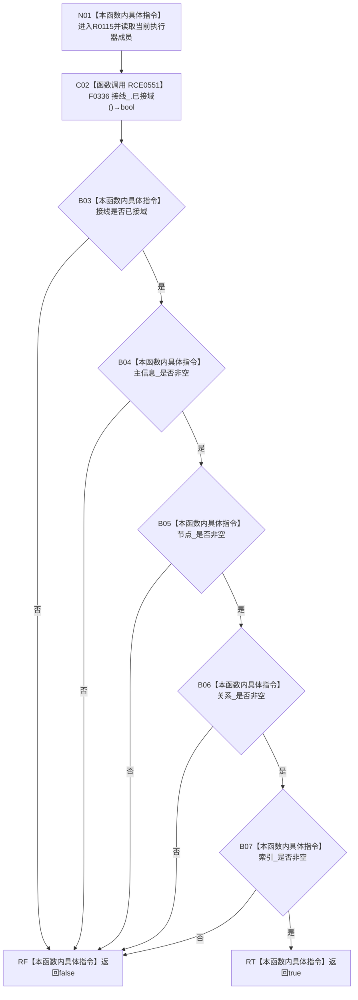

# CF-L6-0345 结构写入执行器有效现状流程图

图类型：现状流程图
代码版本：`73cc1af758e041519fa27c1dd57b9d5d07e3405a`
源码事实提交：`3920a74638264f9f539d50f32f3c9fe5fb1982ab`
源码 blob：`292e602cef1dd658ac2b507a3cc9ced7270a4a86`
覆盖文件：`海中鱼巣/核心/执行器.结构写入.ixx:69-72`
唯一根函数：R0115
完整签名：`bool 海中鱼巣::结构写入执行器::有效() const`
参数：无显式参数；`this` 为 const 非拥有对象上下文
返回结果：接线已接域且四个仓库指针均非空时返回 true，否则按 `&&` 短路返回 false
已登记调用方：R0102/R0116/F0442/F0443/F0444/F0445/F0446/F0447/F0448/F0449/F0450，经 RCE0520/RCE0554/RCE1849/RCE1850/RCE1851/RCE1852/RCE1853/RCE1854/RCE1855/RCE1858/RCE1860
直接项目函数：RCE0551→F0336
外部边界：无
未解析项目调用：0
逐行映射表：`流程图/代码流程图/L6/CF-L6-0345_结构写入执行器有效_逐行代码映射表.md`
结构读取与写入：只读事务接线域状态和四个成员指针，不写结构
验证输出：69—72 行完整映射；11 条项目入边、1 条项目出边、0 个外部边界
不得作为施工许可：是

## 流程图

## 当前边界

- `&&` 从 RCE0551 的接线域状态开始逐项短路；任一前项为 false 时不读取后续成员条件。
- 本函数只确认接线和非空指针，不验证仓库内部状态，也不证明任何写入能力完成。
