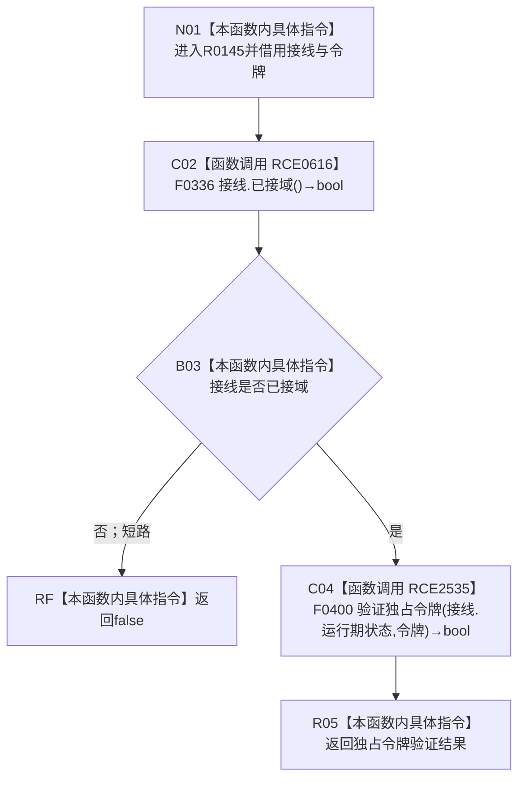

# CF-L6-0348 节点仓库验证独占令牌现状流程图

图类型：现状流程图
代码版本：`010784a906e8283644a63a742151f6457a847c38`
源码事实提交：`3920a74638264f9f539d50f32f3c9fe5fb1982ab`
源码 blob：`f38b979a3f7cefd182a50e0b687c5a6fffebc91c`
覆盖文件：`海中鱼巣/核心/节点仓库.cpp:27-29`
唯一根函数：R0145
完整签名：`bool 海中鱼巣::{匿名命名空间@节点仓库.cpp}::验证独占令牌(const 海中鱼巣::结构事务接线& 接线, const 海中鱼巣::结构事务令牌& 令牌)`
参数：`接线` 与 `令牌` 均为调用期间有效的 const 非拥有借用
返回结果：接线已接域且当前生产接线的独占令牌验证通过时返回 true，否则按 `&&` 短路返回 false
已登记调用方：R0142/R0144/R0147/R0745，经 RCE0607/RCE0613/RCE0618/RCE2438
直接项目函数：RCE0616→F0336；新增稳定 RCE2535→F0400
外部边界：无
未解析项目调用：0；RCE2535 按当前生产接线唯一解析
逐行映射表：`流程图/代码流程图/L6/CF-L6-0348_节点仓库验证独占令牌_逐行代码映射表.md`
结构读取与写入：只读接线域状态、运行期状态与传入令牌，不写结构
验证输出：27—29 行完整映射；4 条项目入边、2 条项目出边、0 个外部边界
不得作为施工许可：是
不得宣称：返回 false 唯一证明令牌伪造或接线永久失效

## 流程图

## 当前边界

- RCE2535 补齐第28行函数指针调用；F0400 是当前生产接线中 `验证独占令牌` 的唯一目标。
- `&&` 保证 RCE0616 返回 false 时不读取运行期状态，也不调用 F0400。
- 本函数只返回验证布尔值，不保存接线或令牌引用。
