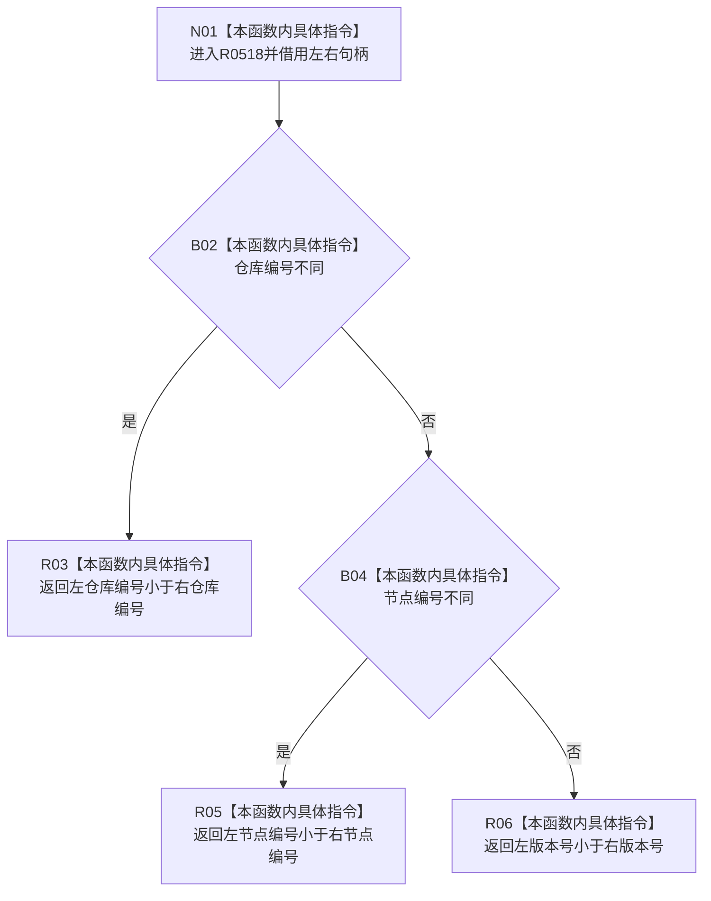

# CF-L6-0349 概念图服务节点句柄小于现状流程图

图类型：现状流程图
代码版本：`0a93526882cb33c61c2fbb04ecad1aeaddcfe225`
工作区复核基线：`c3939fcd2fe13b6a5ba69e5dcad6efc519bdf667`
源码 blob：`dc4bd08f99622b3380c91dd15258fc8ab2e1b9c6`
覆盖文件：`海中鱼巣/领域/概念图服务.h:2728-2736`
唯一根函数：R0518
完整签名：`static bool 海中鱼巣::概念图服务::节点句柄小于(const 海中鱼巣::节点句柄& 左, const 海中鱼巣::节点句柄& 右)`
参数：左右句柄均为调用期间有效的只读借用
返回结果：按仓库编号、节点编号、版本号的字典序返回严格小于结果
已登记调用方：F0358（RCE0118）、F0362（RCE1680）、R0525（RCE3259；`std::sort` 回调登记 RCB0053）
直接项目函数：无
外部边界：无
逐行映射表：`流程图/代码流程图/L6/CF-L6-0349_概念图服务节点句柄小于_逐行代码映射表.md`
结构读写：只读两个句柄的三个标量字段
不得作为施工许可：是
不得宣称：排序关系证明句柄当前有效或属于同一仓库版本

## 流程图

## 当前边界

- 本函数是纯比较器，不调用 `句柄有效`，也不校验仓库编号是否已登记。
- R0525 在 4383 行把本函数传给 `std::sort`，项目回调边已登记为 RCE3259，回调登记为 RCB0053。
