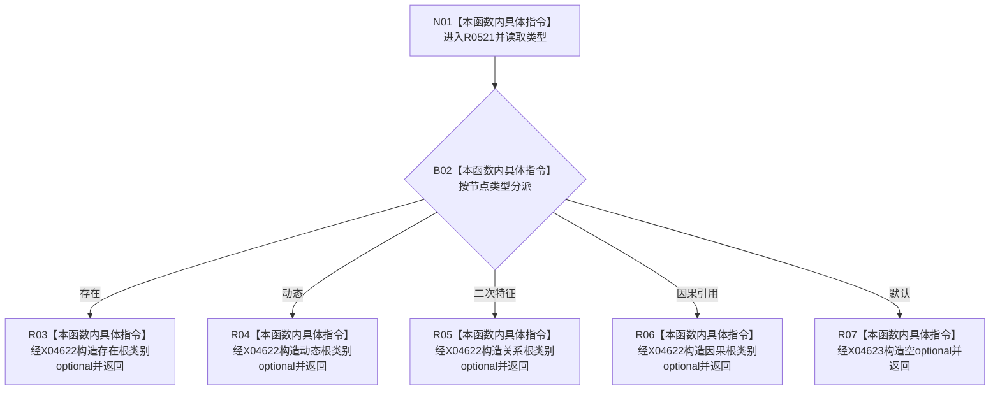

# CF-L6-0350 概念图服务节点类型对应根类别现状流程图

图类型：现状流程图
代码版本：`0a93526882cb33c61c2fbb04ecad1aeaddcfe225`
工作区复核基线：`c3939fcd2fe13b6a5ba69e5dcad6efc519bdf667`
源码 blob：`dc4bd08f99622b3380c91dd15258fc8ab2e1b9c6`
覆盖文件：`海中鱼巣/领域/概念图服务.h:3242-3255`
唯一根函数：R0521
完整签名：`static std::optional<海中鱼巣::概念根类别> 海中鱼巣::概念图服务::节点类型对应根类别(海中鱼巣::节点类型 类型)`
参数：节点类型按值
返回结果：四种根节点类型映射为对应概念根类别；其它类型返回空 optional
已登记调用方：F0356（RCE0110）、F0369（RCE0152）
直接项目函数：无
外部边界：X04622（optional 值构造）、X04623（空 optional 构造）
逐行映射表：`流程图/代码流程图/L6/CF-L6-0350_概念图服务节点类型对应根类别_逐行代码映射表.md`
结构读写：无，只进行枚举映射
不得作为施工许可：是
不得宣称：可映射类型对应的概念根已经存在或处于活动版本

## 流程图

## 当前边界

- `二次特征` 映射为关系根类别是当前实现事实，不据此扩展其它类型。
- 返回 optional 的值构造和空值构造已分别登记为 X04622、X04623。
