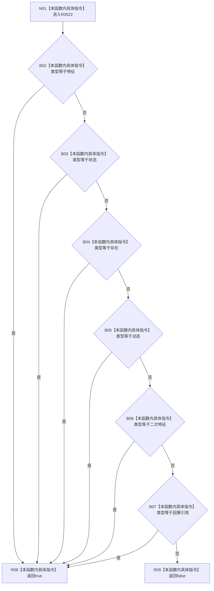

# CF-L6-0351 概念图服务定义材料类型允许现状流程图

图类型：现状流程图
代码版本：`0a93526882cb33c61c2fbb04ecad1aeaddcfe225`
工作区复核基线：`c3939fcd2fe13b6a5ba69e5dcad6efc519bdf667`
源码 blob：`dc4bd08f99622b3380c91dd15258fc8ab2e1b9c6`
覆盖文件：`海中鱼巣/领域/概念图服务.h:3257-3264`
唯一根函数：R0522
完整签名：`static bool 海中鱼巣::概念图服务::定义材料类型允许(海中鱼巣::节点类型 类型)`
参数：节点类型按值
返回结果：类型属于特征、状态、存在、动态、二次特征或因果引用时返回 `true`，否则返回 `false`
已登记调用方：F0362（RCE0134）
直接项目函数：无
外部边界：无
逐行映射表：`流程图/代码流程图/L6/CF-L6-0351_概念图服务定义材料类型允许_逐行代码映射表.md`
结构读写：无，只进行枚举短路比较
不得作为施工许可：是
不得宣称：允许的类型材料已经具备完整签名、关系或生命周期

## 流程图

## 当前边界

- 六项比较按源码从左到右短路，不调用任何服务或仓库。
