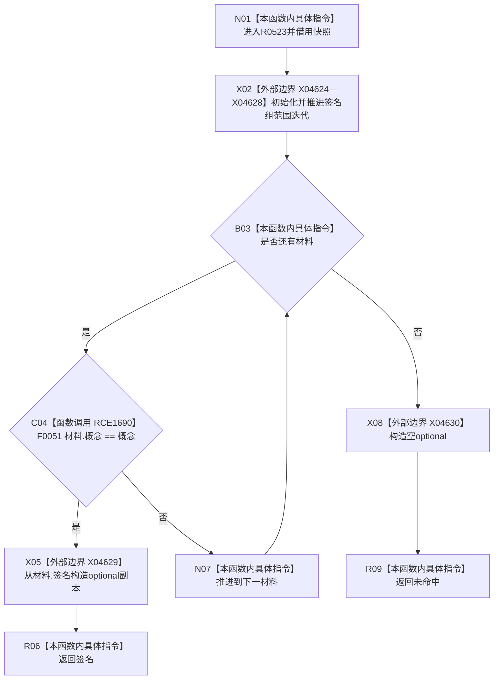

# CF-L6-0352 概念图服务从快照读取签名现状流程图

图类型：现状流程图
代码版本：`0a93526882cb33c61c2fbb04ecad1aeaddcfe225`
工作区复核基线：`c3939fcd2fe13b6a5ba69e5dcad6efc519bdf667`
源码 blob：`dc4bd08f99622b3380c91dd15258fc8ab2e1b9c6`
覆盖文件：`海中鱼巣/领域/概念图服务.h:3771-3780`
唯一根函数：R0523
完整签名：`static std::optional<海中鱼巣::概念签名材料> 海中鱼巣::概念图服务::从快照读取签名(const 海中鱼巣::概念活动快照& 快照, 海中鱼巣::节点句柄 概念)`
参数：快照为只读借用；概念句柄按值
返回结果：首个概念相等的签名材料副本；未命中返回空 optional
已登记调用方：F0362（RCE0132）、R0525（RCE1528）
直接项目函数：F0051（RCE1690）
外部边界：X04624—X04630（签名组范围迭代及 optional 构造）
逐行映射表：`流程图/代码流程图/L6/CF-L6-0352_概念图服务从快照读取签名_逐行代码映射表.md`
结构读写：顺序只读快照签名组
不得作为施工许可：是
不得宣称：命中的签名当前仍处于活动版本或满足完整性验证

## 流程图

## 当前边界

- 第一个匹配项立即返回；函数不检查签名重复项。
- 范围迭代与 optional 构造已登记为 X04624—X04630，不生成项目函数图。
